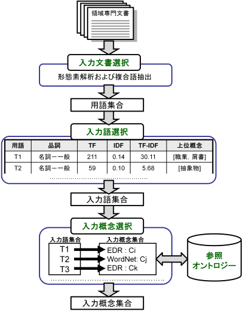

入力モジュールの設計
====================

.. contents:: コンテンツ 
   :depth: 3

入力モジュールは，領域専門文書集合を入力として，参照オントロジーを参照し，入力概念集合を出力する．入力モジュールは，入力文書選択モジュール，入力語選択モジュール，入力概念選択モジュールから構成される．:numref:`input_module` に入力モジュールのシステムフローを示す．以下では，各モジュールについて説明する．

.. _input_module:

   入力モジュールのシステムフロー

入力文書選択モジュール
----------------------

入力文書選択モジュールでは，英語または日本語で記述された領域に関する専門文書集合（入力文書集合）をユーザが選択し，入力文書集合の中から領域にとって重要な語（入力語）の候補となる用語集合を抽出する．入力文書選択モジュールでは，形態素解析器を用いて，専門文書中のユーザが指定した品詞（名詞，動詞，その他の品詞など）の語を抽出できる．また，専門用語自動抽出システム [Nakagawa03]_ や日本語係り受け解析器 Cabocha を用いて複合語の抽出を行うこともできる．テキスト文書だけでなく，PDF，Microsoft Word, Excel,PowerPoint など様々な形式のファイルからテキストを抽出することもできる．

入力文書選択モジュールのもう一つの役割として，入力文書中の1 文の区切りの同定がある．1 文の区切りの同定は，オントロジーにおけるその他の関係構築支援手法の一つである相関ルールを適用する際に必要となる．1 文の区切りを丸（。），ピリオド（．），改行などから自動的に入力文書選択モジュールは判別するが，丸やピリオドが入力文書に含まれない場合は，誤って1 文を判別してしまう．このことは，相関ルールを用いた関係構築の精度の低下をもたらす．上記の問題を解決するため入力文書選択モジュールでは，1文の区切りをユーザが手動で修正することができるようになっている．

入力語選択モジュール
--------------------

入力語選択モジュールでは，入力文書選択モジュールにより自動抽出された用語集合から，複合語，品詞，TF (Term Frequency), IDF(Inverse Document Frequency), TF-IDF,上位概念を考慮しながら，ユーザは入力語を選択する．ここで上位概念とは，参照オントロジーにおける概念階層の上位部分に存在する概念を表す．上位概念は，あらかじめユーザが手動で設定する．用語とその上位概念を同時に参照することにより，自動抽出された用語を抽象化してユーザは理解することができる．例えば，EDR を参照オントロジーとして，「具体物」を上位概念に設定した場合，「具体物」の下位概念の見出しと一致した自動抽出された用語については，その用語の上位概念として「具体物」を表示する．

入力文書中に入力語が含まれていない場合や，入力文書選択モジュールが自動抽出し損ねた入力語については，入力語選択モジュールでは，ユーザが手動で追加できるようになっている．また，入力文書からの入力語の選択漏れを防ぐために，抽出した入力語と入力文書中の出現箇所の対応関係がわかるようになっている．

入力概念選択モジュール
----------------------

入力概念選択モジュールでは，ユーザはオントロジー選択モジュールで選択した参照オントロジー中の概念と入力語を対応づけることによって，入力語の意味を同定する．用語は複数の意味を持つ場合があるため，ある用語を見出しとしてもつ概念が複数存在する．入力概念選択モジュールでは，入力語とそれに対応する概念の候補をユーザに提示する．ユーザはその中から入力語に対応する，領域にとって最も適切な概念（入力概念）を選択する．

大部分の複合語は，それを見出しとして持つ概念が参照オントロジー中に存在しない．入力概念選択モジュールでは部分照合を行うことによって，より多くの複合語の入力概念選択を可能にしている．入力概念選択モジュールの入力概念選択方法は完全照合と部分照合の2 種類がある．完全照合は，入力語と参照オントロジー中の概念の見出しが完全に一致することを意味する．部分照合は，入力語と参照オントロジー中の概念の見出しが部分的に一致することを意味する．完全照合しなかった入力語については，形態素解析を行い，先頭の形態素を順に除いて参照オントロジー中の概念と対応付けを試みる．ここで，先頭の形態素を順に除く理由は，複合名詞の語尾にあたる語のほうが，語頭にあたる語よりも重要（複合名詞の中心的な意味を表す）であると仮定しているためである．これは，複合名詞では一般的に，語尾にあたる語を，語尾以前の語が修飾することが多いという経験則を参考にしている．つまり，入力語中の語尾を含むように参照オントロジー中の概念の見出しと部分照合するようにしている．最終的に，最長一致した用語に対応する概念と対応付けを行う．部分照合した複合語については，対応する概念の下位概念または別見出し（同義語）として階層構築を行う．

例えば，「ロケット発射装置」という入力語について入力概念選択を行うことを考える．「ロケット発射装置」が完全照合しない場合，形態素解析を行い，「ロケット」と「発射」と「装置」に分解する．はじめに，「発射装置」について照合を試みる．次に「装置」について照合を試みる．この例では，「発射装置」を見出しとしてもつ概念は参照オントロジー中に存在せず，「装置」を見出しとして持つ概念が参照オントロジー中に存在する．よって，「ロケット発射装置」の意味として，「装置」を見出しとして持つ概念を候補としてユーザに提示する．その際に，「ロケット発射装置」を「装置」概念の下位概念とするか，「装置」概念の別見出しとするかをユーザは選択できる．

参照オントロジー中の概念に照合しなかった入力語は未定義語に分類され，オントロジー洗練モジュールにおいて階層中の適切な位置にユーザが手動で階層関係の定義を行う．また，参照オントロジー中の概念に照合はしたが，意味的に一致する概念が存在しない入力語が存在する．そのような入力語は，入力概念選択時に「該当なし」を選択することによって，未定義語に分類され，参照オントロジー中の概念に照合しなかった入力語と同様に，ユーザが階層中の適切な位置に手動で階層関係の定義を行う．

入力概念選択の半自動化
~~~~~~~~~~~~~~~~~~~~~~

入力語数が多い場合や入力語が多くの意味を持つ場合，入力概念選択はユーザの負担となる．入力概念選択モジュールでは，主に2 種類の自動概念選択方法を用いて入力概念選択の支援を行う．両手法共に入力語に対応する概念候補の評価値を求めてランキングを行い，評価値の高い概念から順番にユーザに提示することにより，ユーザが入力概念選択を行うことを支援する．

一つ目の評価値の計算方法は以下のとおりである．

対象とする概念からそのルート概念までの各パスに出現する概念のうち，入力語集合（入力語彙）を見出しとして持つ概念の総数の最大値
対象とする概念の全ての下位概念のうち，入力語彙を見出しとして持つ概念の総数
対象とする概念の兄弟概念のうち，入力語彙を見出しとして持つ概念の総数
以上，三つの中からユーザは一つ以上の指標を選択し，選択した指標により得られた評価値の総和を用いて，入力語に対応する概念候補をランキングする．
二つ目の方法における評価値の計算方法は以下のとおりである．

入力語に対応する概念候補となる概念集合を得る
概念集合から二つの組み合わせを求め，それぞれの概念間距離を求める
ある概念と組み合わせ関係にある概念集合との概念間距離の逆数の総和をその概念の評価値とする
多重継承している場合には，概念間距離の計算方法が複数考えられる．その場合には，最短，最長，平均のどれかをユーザは選択することができる．
部分照合する用語の入力概念選択を簡略化するために，ある部分照合した用語の入力概念選択結果を，同様に部分照合するすべての用語の入力概念選択結果に反映させることが，入力概念選択モジュールでは可能である．例えば，「バッテリ充電装置」，「ノイズ測定装置」，「バルブ作動点検装置」がそれぞれ，「装置」で部分照合していた場合，装置の入力概念選択結果を，上記三つの入力語の入力概念選択結果とすることができる．

参考文献
--------

.. [Nakagawa03] 中川裕志，森辰則，湯本紘彰，“出現頻度と連接頻度に基づく専門用語抽出，” 自然言語処理，vol.10，no.1，pp.29–35，2003，http://gensen.dl.itc.u-tokyo.ac.jp/.
