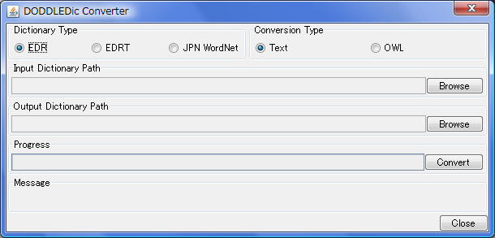

インストール
============

.. contents:: コンテンツ 
   :depth: 3

.. warning::
    一部，古いバージョンの内容が含まれています

動作環境
--------

DODDLE-OWLを実行するためには，以下の環境が必要です．

* JRE (Java Runtime Environment) 6以降
* OS: Javaが動作可能なOS（推奨 Windows XP）
* CPU: Pentium4 2GHz程度
* メモリ: 1GB以上
* ハードディスクの空き容量: 1GB以上
* ディスプレイ: 解像度1024×768 以上のカラーディスプレイ

DODDLE-OWLの開発および動作確認は以下の環境で行っています．

* JDK 6 Update1
* OS: Windows XP
* CPU: Pentium4 3.4GHz
* メモリ: 2GB
* ディスプレイ: 解像度1920×1200 のカラーディスプレイ

利用しているライブラリ
----------------------

DODDLE-OWLは以下のライブラリを利用しています．以下のライブラリについては，DODDLE-OWLに含まれているため別途ダウンロードする必要はありません．

* `Apache Jena <http://jena.apache.org/>`_

  * RDF, RDFS, OWLを扱うためのライブラリ
  * ライセンス: `Jena – License and Copyright <http://www.apache.org/licenses/LICENSE-2.0>`_

* `Lucene-Gosen <https://github.com/lucene-gosen/lucene-gosen>`_

  * Javaで実装された形態素解析器
  * ライセンス: `LGPL (Lesser General Public License) <http://www.gnu.org/licenses/lgpl.html>`_

* `extJWNL <http://extjwnl.sourceforge.net/>`_

  * Javaで実装されたWordNetを操作するためのライブラリ
  * ライセンス: `BSDライセンス <http://extjwnl.sourceforge.net/license.txt>`_

* `GNU getopt – javaport 1.0.13 <http://www.urbanophile.com/arenn/hacking/download.html>`_

  * Javaで実装されたコマンドラインオプションを解析するためのライブラリ
  * ライセンス: LGPL(Lesser General Public License)

* `Apache POI <http://poi.apache.org/>`_
  
  * Microsoft Officeのドキュメントを読み込むためのライブラリ
  * ライセンス: Apache

* `Apache PDFBox <https://pdfbox.apache.org/>`_

  * Javaで実装されたPDFファイルからテキストを抽出するためのライブラリ．
  * ライセンス: BSDライセンス

* `Lombok <http://projectlombok.org/>`_

  * ライセンス： `The MIT License <http://opensource.org/licenses/mit-license.php>`_

* `InfoNode Docking Windows <http://www.infonode.net/index.html?idw>`_

  * Javaで実装されたSwingをベースとしたドッキングウィンドウフレームワーク．
  * ライセンス: GPL (GNU General Public License)

* `MySQL Connector/J 5.1.7 <http://dev.mysql.com/downloads/>`_

  * MySQLのJDBC ドライバ
  * ライセンス: GPL (GNU General Public License)

* `SQLiteJDBC <https://bitbucket.org/xerial/sqlite-jdbc>`_

  * SQLiteのJDBCドライバ
  * ライセンス: Apache License version 2.0

* `Stanford Parser <http://nlp.stanford.edu/software/lex-parser.shtml>`_

  * 英語用のパーサー
  * ライセンス： GPL (GNU General Public License)

* `Silk Icons <http://www.famfamfam.com/>`_

  * アイコン
  * ライセンス: `Creative Commons Attribution 2.5 License <http://creativecommons.org/licenses/by/2.5/>`_.

利用しているソフトウェア
------------------------

DODDLE-OWLは，以下のソフトウェアを利用しています．以下の注意点に記述されていることを行いたい場合には，別途以下のソフトウェアのインストールが必要です．

* JRE 6以上 （必須）
* `形態素解析システム ChaSen <http://chasen-legacy.osdn.jp/>`_ （オプション）
* `形態素解析エンジン MeCab <http://mecab.googlecode.com/svn/trunk/mecab/doc/index.html>`_ （オプション）
* `日本語係り受け解析器 CaboCha <http://taku910.github.io/cabocha/>`_ （オプション）
* `ActivePerl <http://www.activestate.com/activeperl?mp=1>`_ （オプション）
* `TermExtract <http://gensen.dl.itc.u-tokyo.ac.jp/termextract.html>`_ （オプション）

注意点
~~~~~~
* Beta6からは，ChaSen, MeCab, CaboChaは，UTF-8のみに対応しています．

  * ChaSenでUTF-8を利用する方法は，ChaSen’s Wiki FAQを参照してください．
  * MeCabおよびCaboChaは，2008年11月現在の最新版は，UTF-8に対応しています．（Windows版ではインストール時に辞書の文字コードとして「UTF-8」を選択します．Unix，Macでは，configureのオプションとして「–with-charset=utf8」を指定します．）

* 日本語文書から複合語を抽出したい場合には，PerlとChaSen(またはMeCab)とCaboChaが必要です．
* 英語文書から複合語を抽出したい場合には，Perlが必要です．
* Windows以外のOSでPDFからテキストを抽出したい場合には，PDFBoxが必要です．
* WordNetから領域オントロジーを構築したい場合には，WordNet（ver2.0推奨．ver2.1は利用不可）が必要です．
* EDR電子化辞書から領域オントロジーを構築したい場合には，EDR電子化辞書の概念体系辞書(必須)，日本語単語辞書(必須)，英語単語辞書(オプション)，概念記述辞書(オプション)が必要です．

参照オントロジー
----------------

英語汎用オントロジー
~~~~~~~~~~~~~~~~~~~~

* `WordNet <http://wordnet.princeton.edu/>`_

日本語汎用オントロジー
~~~~~~~~~~~~~~~~~~~~~~

* `EDR電子化辞書 <https://www2.nict.go.jp/out-promotion/techtransfer/EDR/J_index.html>`_
* `日本語WordNet <http://compling.hss.ntu.edu.sg/wnja/>`_
* `日本語Wikipediaオントロジー <https://osdn.jp/projects/wikipedia-ont/>`_

インストール
------------

`ダウンロードページ <http://doddle-owl.org/ja/download.html>`_ からDODDLE-xxx.zipファイルを解凍し，適当なフォルダ（以下，インストールフォルダ）にコピーすればインストール完了です．

ファイル構成
~~~~~~~~~~~~

DODDLE/DODDLE.bat
    Windows用の実行ファイル
DODDLE/DODDLE_DIC_Converter.bat
    EDRのテキスト形式の辞書データや日本語WordNetのsqlite3 databaseをDODDLEで参照する辞書の形式に変換するプログラムを実行するファイル
DODDLE/build.xml
    antビルドファイル
DODDLE/src.zip
    DODDLE-OWLのソースファイル群をzip形式で圧縮したファイル
DODDLE/docs.zip
    DODDLE-OWLのjavadocをzip形式で圧縮したファイル
DODDLE/build/DODDLE.jar
    DODDLE-OWLに関連するクラスファイルをjar形式でまとめたファイル
DODDLE/build/classes/
    DODDLE-OWLに関連するクラスファイル群を格納するディレクトリ
DODDLE/build/lib/
    DODDLE-OWLが利用するライブラリ群を格納するディレクトリ
DODDLE/ontology_templates/
    OWL要素を抽出する際に利用するSPARQLで記述されたテンプレートファイル群
DODDLE/stop_word_list.txt
    単語抽出時に無視する単語を保存したファイル
DODDLE/resources/DODDLEComponent.owl
    DODDLE-OWLのユーザインタフェースで使用している語彙を管理するOWLオントロジー

アンインストール
----------------

インストールフォルダを削除すればアンインストール完了です．

実行方法
--------

Java Web Start版からの実行
~~~~~~~~~~~~~~~~~~~~~~~~~~

1. JRE 6以上をインストールし，java.exeの場所を環境変数PATHに追加する．
2. ダウンロードページにあるdoddle-owl.jnlpをクリック

DODDLE-xxx.zipファイルからの実行
~~~~~~~~~~~~~~~~~~~~~~~~~~~~~~~~

1. JRE 6以上をインストールし，java.exeの場所を環境変数PATHに追加．
2. DODDLEプログラム(DODDLE-xxxx.zip)を適当なフォルダ(インストールフォルダ)に解凍する．
3. 複合語を抽出したい場合には，TermExtractまたはCaboChaをインストールする．
4. DODDLE.batを実行．

  * 256MB程度のメモリがあれば動作可能．(JVMオプション -Xmx 256m)
  * DODDLE.batの初期設定では，JVMのオプションは，-Xms256m -Xmx512mとしている．
  * ただし，構築するオントロジーの概念数が多い場合には，上記以上のメモリが必要となる場合もある．

各種定
~~~~~~

各種設定は，オプションダイアログからGUIで行います．

オプションダイアログ: 基本タブ
""""""""""""""""""""""""""""""

* BASE_URI=http://www.yamaguti.comp.ae.keio.ac.jp/doddle#

  * オントロジー保存時のベースURIを設定します．
* BASE_PREFIX=keio

  * ユーザが定義した概念の接頭辞を設定します．
* LANG=ja

  * enまたはjaを指定することで，英語または日本語メニューを表示することができます．

オプションダイアログ: フォルダタブ
""""""""""""""""""""""""""""""""""

* 日本語形態素解析器

  * 初期パス: C:/Program Files/ChaSen/chasen.exe
  * 複合語抽出モジュール言選を利用する場合に必要です．（chasen21は不可）

* 日本語係り受け解析器

  * 初期パス: C:/Program Files/CaboCha/bin/cabocha.exe
  * 複合語抽出する場合に必要です．

* perl.exe

  * 初期パス: C:/Perl/bin/perl.exe
  * 言選(TermExtract)を利用する場合に必要です．

* EDR辞書フォルダ

  * 初期パス: C:/DODDLE-OWL/EDR_DIC
  * EDR一般辞書のテキストデータをDODDLE用に変換したファイルを置いたフォルダを設定します．

* EDRT辞書フォルダ

  * 初期パス: C:/DODDLE-OWL/EDRT_DIC
  * EDR専門辞書のテキストデータをDODDLE用に変換したファイルを置いたフォルダを設定します．

* プロジェクトフォルダ

  * 初期パス: C:/DODDLE-OWL/DODDLEProject
  * プロジェクトファイルを保存するフォルダを設定します．プロジェクトを保存・復元する際に このフォルダが基点となります．
      
* 上位概念リスト

  * 初期パス: C:/DODDLE-OWL/upperConceptList.txt
  * 上位概念のリストを設定します．ある単語がEDR上の指定した概念の下位にあるかどうかを提示するために利用します．

* ストップワードリスト

  * 初期パス: C:/DODDLE-OWL/stop_word_list.txt
  * 用語抽出時に無視する単語リストが保存されたファイルを設定します．

EDR電子化辞書の利用方法
-----------------------

DODDLE-OWLでEDR電子化辞書を汎用オントロジーとして参照するためには，EDR電子化辞書のテキストデータをDODDLE-OWLで参照する形式に変換する必要があります．以下では，その変換手順について説明します．

現状では，変換アルゴリズムが悪いため，辞書データの変換時間とメモリを大量に消費します．Intel Core2CPU T5600 1.83GHz，メモリ1GB程度の変換時間は以下のとおりです．

* EDR一般辞書: 約11分
* EDR専門辞書: 約3分

必要条件
--------

* 1GB以上のメモリ(推奨 2GB) (JVMオプション -Xmx1024mが指定可能な程度)
* EDR一般辞書またはEDR専門辞書のテキストデータ
* GoSenをインストールし，DODDLE-OWLのオプションダイアログでGoSen設定ファイルとEDR(T)辞書フォルダを設定．

EDR一般辞書
~~~~~~~~~~~

1. CPC.DIC, CPH.DIC, CPT.DIC, EWD.DIC, JWD.DICを任意のフォルダにコピーする．(例：C:/EDR_Text)．
2. DODDLE-OWLをインストールしたフォルダにある，DODDLE_DIC_Converter.batを実行する．図1のウィンドウが表示される．
3. 「Dictionary Type」として「EDR」を，「Convertion Type」として「Text」を選択する．
4. 「Browse」ボタンを押して，Input Dictionary PathにEDR一般辞書のテキストデータが保存されたフォルダを設定する．Output Dictionary Pathに，DODDLE-OWLが参照する変換後のEDR一般辞書データを保存するフォルダを設定する．
5. 「Convert」ボタンを押すと，concept.data, relation.data, tree.data, word.data, concept.index, relation.index, tree.index, word.indexファイルが設定したEDR_HOMEに保存される.
6. DODDLE-OWLのオプションダイアログのフォルダタブでEDR辞書フォルダを設定する．
7. 「Exit」ボタンでプログラムを終了する．

EDR専門辞書
~~~~~~~~~~~

1. TCPC.DIC, TCPH.DIC, TEWD.DIC, TJWD.DICを任意のフォルダにコピーする．(例： C:/EDRT_Text/).
2. DODDLE-OWLをインストールしたフォルダにある，DODDLE_DIC_Converter.batを実行する．図1のウィンドウが表示される．
3. 「Dictionary Type」として「EDRT」を，「Convertion Type」として「Text」を選択する．
4. 「Browse」ボタンを押して，Input Dictionary PathにEDR専門辞書のテキストデータが保存されたフォルダを設定する．Output Dictionary PathにDODDLE-OWLが参照する変換後のEDR専門辞書のデータを保存するフォルダを設定する．
5. 「Convert」ボタンを押すと，concept.data, tree.data, word.data, concept.index, tree.index, word.indexファイルが設定したフォルダに保存される．
6. DODDLE-OWLのオプションダイアログのフォルダタブでEDRT辞書フォルダを設定する．
7. 「Exit」ボタンでプログラムを終了する．

.. _doddle_dic_converter:

   DODDLE_Dic_Converter

起動時オプション
----------------

* –DEBUG: デバッグ情報をコンソールに表示
* –LANG=[en|ja]: 表示言語を切り替える

TODO
----
* 最新版の状況に書き換える
