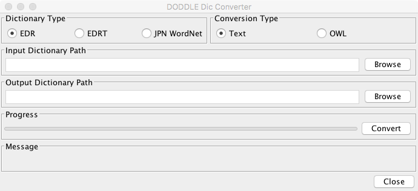

===============
インストール
===============

.. contents:: コンテンツ 
   :depth: 3

動作環境
==================
DODDLE-OWLを実行するためには，以下の環境が必要である．

* JRE (Java Runtime Environment) 11以降
* OS: Javaが動作可能なOS
* CPU: Pentium4 2GHz程度
* メモリ: 1GB以上
* ハードディスクの空き容量: 1GB以上
* ディスプレイ: 解像度1024×768 以上のカラーディスプレイ

DODDLE-OWLの開発および動作確認は以下の環境で行っている．

* JDK 11
* OS: macOS Mojava
* CPU: Intel Core i7 4GHz
* メモリ: 32GB
* ディスプレイ: 解像度1920×1200 のカラーディスプレイ

利用しているライブラリ
====================================
DODDLE-OWLは以下のライブラリを利用している．以下のライブラリについては，DODDLE-OWLに含まれているため別途ダウンロードする必要はない．

* `Apache Jena <http://jena.apache.org/>`_

  * RDF, RDFS, OWLを扱うためのライブラリ
  * ライセンス: `Jena – License and Copyright <http://www.apache.org/licenses/LICENSE-2.0>`_

* `Kuromoji <https://github.com/atilika/kuromoji>`_

  * Javaで実装された形態素解析器
  * ライセンス: `Apache License 2.0 <http://www.apache.org/licenses/LICENSE-2.0>`_

* `extJWNL <http://extjwnl.sourceforge.net/>`_

  * Javaで実装されたWordNetを操作するためのライブラリ
  * ライセンス: `BSDライセンス <http://extjwnl.sourceforge.net/license.txt>`_

* `Apache Commons CLI <https://commons.apache.org/proper/commons-cli/>`_

  * Javaで実装されたコマンドラインオプションを解析するためのライブラリ
  * ライセンス: `Apache License 2.0 <http://www.apache.org/licenses/LICENSE-2.0>`_

* `Apache POI <http://poi.apache.org/>`_
  
  * Microsoft Officeのドキュメントを読み込むためのライブラリ
  * ライセンス: `Apache License 2.0 <http://www.apache.org/licenses/LICENSE-2.0>`_

* `Apache PDFBox <https://pdfbox.apache.org/>`_

  * Javaで実装されたPDFファイルからテキストを抽出するためのライブラリ．
  * ライセンス: `Apache License 2.0 <http://www.apache.org/licenses/LICENSE-2.0>`_

* `Lombok <http://projectlombok.org/>`_

  * ライセンス： `The MIT License <http://opensource.org/licenses/mit-license.php>`_

* `SQLiteJDBC <https://bitbucket.org/xerial/sqlite-jdbc>`_

  * SQLiteのJDBCドライバ
  * ライセンス: `Apache License 2.0 <http://www.apache.org/licenses/LICENSE-2.0>`_

* `Stanford Parser <http://nlp.stanford.edu/software/lex-parser.shtml>`_

  * 英語用のパーサー
  * ライセンス： `GPL (GNU General Public License) <http://www.gnu.org/licenses/gpl-2.0.html>`_

* `Material Design icons by Google <https://github.com/google/material-design-icons>`_

  * アイコン
  * ライセンス: `Apache License 2.0 <http://www.apache.org/licenses/LICENSE-2.0>`_.

利用しているソフトウェア
=======================================
DODDLE-OWLは，以下のソフトウェアを利用している．以下の注意点に記述されていることを行いたい場合には，別途以下のソフトウェアのインストールが必要である．

* JRE 11以上 （必須）
* `形態素解析システム ChaSen <http://chasen-legacy.osdn.jp/>`_ （オプション）
* `形態素解析エンジン MeCab <https://github.com/taku910/mecab>`_ （オプション）
* `日本語係り受け解析器 CaboCha <https://github.com/taku910/cabocha>`_ （オプション）
* `ActivePerl <http://www.activestate.com/activeperl?mp=1>`_ （オプション）
* `TermExtract <http://gensen.dl.itc.u-tokyo.ac.jp/termextract.html>`_ （オプション）

.. warning::
	* Beta6からは，ChaSen, MeCab, CaboChaは，UTF-8のみに対応している．

	  * ChaSenでUTF-8を利用する方法は，ChaSen’s Wiki FAQを参照すること．
	  * MeCabおよびCaboChaは，2008年11月現在の最新版は，UTF-8に対応している．（Windows版ではインストール時に辞書の文字コードとして「UTF-8」を選択します．Unix，Macでは，configureのオプションとして「–with-charset=utf8」を指定する．）

	* 日本語文書から複合語を抽出したい場合には，PerlとChaSen(またはMeCab)とCaboChaが必要である．
	* 英語文書から複合語を抽出したい場合には，Perlが必要である．
	* EDR電子化辞書から領域オントロジーを構築したい場合には，EDR電子化辞書の概念体系辞書(必須)，日本語単語辞書(必須)，英語単語辞書(オプション)，概念記述辞書(オプション)が必要である．

参照オントロジー
===============================

英語汎用オントロジー
------------------------------
* `WordNet <http://wordnet.princeton.edu/>`_

日本語汎用オントロジー
-------------------------------------
* `EDR電子化辞書 <http://www2.nict.go.jp/ipp/EDR/JPN/J_indexTop.html>`_
* `日本語WordNet <http://compling.hss.ntu.edu.sg/wnja/>`_
* `日本語Wikipediaオントロジー <http://wikipediaontology.org/>`_

インストールと起動方法
=====================================

Windows OSの場合
--------------------------------
1. `ダウンロードページ <http://doddle-owl.org/download-ja.html>`_ から **doddle-owl-2019.03_1_win.zip** ファイルを任意のフォルダにダウンロードして展開する．
2. 展開したフォルダにある **bin/doddle-owl.bat** を実行する．

macosの場合
--------------------------------
1. `ダウンロードページ <http://doddle-owl.org/download-ja.html>`_ から **doddle-owl-2019.03_1_mac.zip** ファイルを任意のフォルダにダウンロードして展開する．
2. 展開したフォルダにある **bin/doddle-owl** を実行する．

アンインストール方法
========================================
* インストールしたフォルダを削除する．

設定
===============
各種設定は，オプションダイアログからGUIで行う．

オプションダイアログ: 基本タブ
--------------------------------------------------

言語
  enまたはjaを指定することで，英語または日本語メニューを表示することができる．
基本接頭辞
  ユーザが定義した概念の接頭辞を設定する．
基本URI
  オントロジー保存時のベースURIを設定する．

オプションダイアログ: フォルダタブ
-----------------------------------------------------------
プロジェクトフォルダ
  プロジェクトファイルを保存するフォルダを設定する．プロジェクトを保存・復元する際に このフォルダが基点となる．
ストップワードリスト
  用語抽出時に無視する単語リストが保存されたファイルを設定する．
JWOフォルダ
  日本語WikipediaオントロジーをDODDLE-OWL用に変換したファイルを置いたフォルダを設定する．
EDR辞書フォルダ
  EDR一般辞書のテキストデータをDODDLE-OWL用に変換したファイルを置いたフォルダを設定する．
EDRT辞書フォルダ
  EDR専門辞書のテキストデータをDODDLE-OWL用に変換したファイルを置いたフォルダを設定する．
日本語形態素解析器
  複合語抽出モジュール言選を利用する場合に必要である．（chasen21は不可）
日本語係り受け解析器
  複合語抽出する場合に必要である．
perl.exe
  言選(TermExtract)を利用する場合に必要である．
上位概念リスト
  上位概念のリストを設定する．ある単語がEDR上の指定した概念の下位にあるかどうかを提示するために利用する．
複合語抽出スクリプトフォルダ
  複合語抽出スクリプトを置くフォルダを設定する．

EDR電子化辞書の利用方法
===========================================
DODDLE-OWLでEDR電子化辞書を汎用オントロジーとして参照するためには，EDR電子化辞書のテキストデータをDODDLE-OWLで参照する形式に変換する必要があります．
以下では，その変換手順について説明します．

CPU: Intel Core i7 4GHz，メモリ: 32GBのiMacを用いてEDR一般辞書とEDR専門辞書をDODDLE-OWLで参照する形式に変換するためにかかる時間は以下の通りです．

* EDR一般辞書: 約3分
* EDR専門辞書: 約40秒

必要条件
--------
* 1GB以上のメモリ(推奨 2GB) (JVMオプション -Xmx1024mが指定可能な程度)
* EDR一般辞書またはEDR専門辞書のテキストデータ

EDR一般辞書
--------------------------
#. CPC.DIC, CPH.DIC, CPT.DIC, EWD.DIC, JWD.DICを任意のフォルダにコピーする．(例：C:/EDR_Text)．
#. DODDLE-OWLのツールメニューの「DODDLE Dic Converter」サブメニューを選択すると :numref:`doddle-dic-converter` のダイアログが表示される．
#. 「Dictionary Type」として「EDR」を，「Convertion Type」として「Text」を選択する．
#. 「Browse」ボタンを押して，Input Dictionary PathにEDR一般辞書のテキストデータが保存されたフォルダを設定する．Output Dictionary Pathに，DODDLE-OWLが参照する変換後のEDR一般辞書データを保存するフォルダを設定する．
#. 「Convert」ボタンを押すと，concept.data, relation.data, tree.data, word.data, concept.index, relation.index, tree.index, word.indexファイルがオプションダイアログで設定したEDR辞書フォルダに保存される.
#. DODDLE-OWLのオプションダイアログのフォルダタブでEDR辞書フォルダのパスを設定する．

EDR専門辞書
----------------------------
#. TCPC.DIC, TCPH.DIC, TEWD.DIC, TJWD.DICを任意のフォルダにコピーする．(例： C:/EDRT_Text/).
#. DODDLE-OWLのツールメニューの「DODDLE Dic Converter」サブメニューを選択すると :numref:`doddle-dic-converter` のダイアログが表示される．
#. 「Dictionary Type」として「EDRT」を，「Convertion Type」として「Text」を選択する．
#. 「Browse」ボタンを押して，Input Dictionary PathにEDR専門辞書のテキストデータが保存されたフォルダを設定する．Output Dictionary PathにDODDLE-OWLが参照する変換後のEDR専門辞書のデータを保存するフォルダを設定する．
#. 「Convert」ボタンを押すと，concept.data, tree.data, word.data, concept.index, tree.index, word.indexファイルがオプションダイアログで設定したEDRT辞書フォルダに保存される．
#. DODDLE-OWLのオプションダイアログのフォルダタブでEDRT辞書フォルダのパスを設定する．

.. _doddle-dic-converter:

   DODDLE_Dic_Converter
