===========================
モジュール一覧
===========================

.. contents:: コンテンツ 
   :depth: 3

システム構成
==========================
:numref:`system_flow` にDODDLE-OWLのシステム構成を示す．DODDLE-OWLは，オントロジー選択モジュール，入力モジュール，オントロジー構築モジュール，オントロジー洗練モジュール，変換モジュールの五つの主要なモジュールから構成される．

階層構築モジュールおよび階層洗練モジュールは階層関係構築を支援する目的で，DODDLE-I [Yamaguchi99]_ において提案された．また，関係構築モジュールおよび関係洗練モジュールは，階層関係以外の関係構築を支援する目的で，DODDLE-II [Kurematsu04]_ において提案された．一方，オントロジー選択モジュール，入力モジュール，変換モジュールは，DODDLE-OWL において新たに提案されたモジュールである．DODDLE-OWLは，DODDLE-I および DODDLE-II で提案された各モジュールを統合することにより，インタラクティブな領域オントロジー構築支援環境を実現している．

DODDLE-OWL は，一つ以上の領域における専門文書の存在を前提としている．また，ユーザは,
当該領域にとって重要な用語（入力語）を選択可能な知識を有しているものとする．

.. _system_flow:
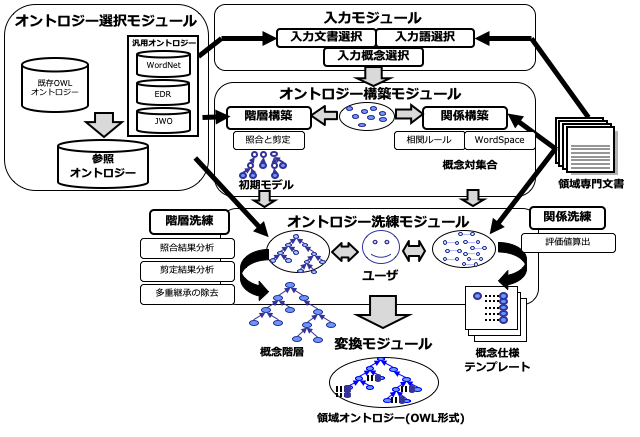

   DODDLE-OWLのシステム構成

.. index:: オントロジー選択モジュール

オントロジー選択モジュール
=======================================
オントロジー選択モジュールでは，ユーザが参照オントロジーを選択する．参照オントロジーは，領域オントロジー構築の基礎となるオントロジーであり，DODDLE-OWLの各モジュールから参照される．DODDLE-OWLでは，WordNet [Miller95]_ , 日本語WordNet [Isahara08]_，EDR [Yokoi95]_ ，および日本語Wikipediaオントロジー (JWO) [Tamagawa10]_ を参照オントロジーとして利用できる．さらに，OWL 形式で記述された既存オントロジーも，参照オントロジーとして利用可能である．

WordNet やEDR などの汎用オントロジーは，一般的かつ網羅的に定義がなされている．そのため，領域オントロジー構築に用いる際には，階層関係の修正や不要な概念の除去といった，領域に特化した構造への洗練が必要となる．この作業は，ユーザにとって負担となる．一方，構築対象に関連する領域オントロジーがすでに存在する場合には，それらを再利用することで，汎用オントロジーを参照オントロジーとして用いる場合と比べて，領域オントロジーの洗練に要するコストを軽減できると考えられる．また，DODDLE-OWL を用いて構築されたオントロジーはOWL形式であるため，それらも参照オントロジーとして利用可能である．以上より，DODDLE-OWLでは，既存の領域オントロジーが存在しない場合，または，既存の領域オントロジーが構築対象とする領域を十分に網羅していない場合には汎用オントロジーを利用ができる．一方で，既存の領域オントロジーが存在する場合には，それを参照オントロジーとして用いることで，対象とする領域オントロジーの構築をより容易に支援できる．

Web 上に存在する既存オントロジーを参照オントロジーとして再利用するために，オントロジー選択モジュールには，オントロジー検索エンジンを用いた既存領域オントロジー獲得機能を備えている．以下では，はじめに汎用オントロジーについて簡単に説明し，その後，オントロジー検索エンジンを用いた既存領域オントロジー獲得方法について述べる．

.. note::
   `2010年5月1日に，オントロジー検索エンジン Swoogle の提供が終了 <https://ebiquity.umbc.edu/project/html/id/53/Swoogle>`_ したため，Swoogle を用いた既存領域オントロジー獲得機能は現在，利用できない．

.. index:: 汎用オントロジー

汎用オントロジー
----------------------------
DODDLE-OWLでは，汎用オントロジーとしてWordNet, 日本語WordNet，EDR電子化辞書（一般辞書および専門辞書），日本語Wikipediaオントロジーを利用できる．以下では，各汎用オントロジーの概要を説明する．

.. index:: WordNet

WordNet
~~~~~~~~~~~~~~~~~~~~~~~~~~~
WordNet [Miller95]_ は， プリンストン大学で開発されている英語シソーラス（汎用オントロジー）である．WordNet は，名詞句辞書，動詞句辞書，形容詞句辞書，副詞句辞書，および見出し句辞書から構成されており，総計約10万の語彙を保持している．見出し句辞書は，見出し句，意味情報としての概念ID，辞書編集情報，品詞情報などから構成されている．概念IDは，見出し句辞書と各辞書を結ぶリンクとして機能している．名詞句辞書と動詞句辞書は，概念ID，辞書編集情報，対応する見出し句リストから構成されており，概念群は階層構造を有する．また，一部の概念IDには，反対概念の概念ID，part of，member of，substance of に対応する概念IDが付与されている．形容詞句辞書と副詞句辞書も，概念ID，辞書編集情報，対応する見出し句リストから構成されているが，階層構造は持たない．

.. index:: 日本語WordNet

日本語WordNet
~~~~~~~~~~~~~~~~~~~~~~~~~~~
日本語WordNet [Isahara08]_ は，WordNetの日本語版である．

.. index:: EDR電子化辞書

EDR電子化辞書
~~~~~~~~~~~~~~~~~~~~~~~~~~~
EDR電子化辞書 [Yokoi95]_ は， 独立行政法人 情報通信研究機構が提供している汎用オントロジーである．EDR電子化辞書は，日本語単語辞書，英語単語辞書，概念辞書，日英対訳辞書，英日対訳辞書，日本語共起辞書，英語共起辞書，日本語コーパス，英語コーパス，専門用語辞書（情報処理）から構成される．DODDLE-OWL では，これらの辞書のうち，日本語単語辞書，英語単語辞書，概念辞書，専門用語辞書（情報処理）を利用している．

.. index:: 日本語Wikipediaオントロジー

日本語Wikipediaオントロジー
~~~~~~~~~~~~~~~~~~~~~~~~~~~~~~~
日本語Wikipediaオントロジー [Tamagawa10]_ は，日本語Wikipedia における様々なリソース（カテゴリツリー，一覧記事，リダイレクトリンク，Infobox, Infoboxテンプレート）から構築した大規模な日本語汎用オントロジーである．

オントロジー検索エンジンを用いた既存領域オントロジーの獲得
------------------------------------------------------------------------
既存領域オントロジーを再利用するためには，対象領域に関連する既存オントロジーをWeb 上から検索する必要がある．既存のオントロジー検索エンジンとして，OntoSelect [Buitelaar04]_ やSwoogle [Ding05]_ が知られている．OntoSelect は，Web 上のオントロジーを対象として，検索，選択，閲覧を支援するシステムである．Swoogle には，2007年時点で1万以上のオントロジーが登録されており，クラス単位およびプロパティ単位での検索に加え，オントロジー内に明示的に記述されていない逆リンク関係の検索が可能である．

既存のオントロジー検索エンジンは，対象領域に関連する既存オントロジー検索に利用できるが，領域オントロジー構築の観点からはいくつかの課題がある．これらのオントロジー検索エンジンは，クラス単位やプロパティ単位での検索を支援している一方で，複数のクラスやプロパティを包含するオントロジーの検索や，対象領域との関連性が高いオントロジーの抽出を十分に支援していない．Swoogle には，Google の PageRank [Page98]_ に類似したオントロジー向けランキング手法である OntoRank や，クラスおよびプロパティを対象としたランキング手法である TermRank が導入されている．OntoRank およびTermRank では，多数のセマンティックWeb コンテンツから参照されているクラスやプロパティが高く評価される．しかし，領域オントロジー構築の観点では，多くのセマンティックWeb コンテンツから参照されているオントロジーが，必ずしも対象領域に適しているとは限らない．そのため，ユーザが構築対象とする領域に関連する既存オントロジーを適切に検索するための仕組みが必要である．さらに，既存オントロジーを修正せずに再利用できる場合は少ない．このことから，領域オントロジー構築支援環境とオントロジー検索エンジンが連携していることが望ましいと考えられる．

Swoogle は，オントロジーを検索するための19 種類のREST 形式のWeb サービス（Swoogle Web サービス）を提供している．DODDLE-OWL から既存オントロジーを再利用するためには，ソフトウェアからオントロジーを検索することが前提となる．このため，Webサービスを提供しているSwoogle を，既存領域オントロジーの獲得に利用する．

オントロジー選択モジュールでは，:numref:`ontology_ranking` に示す手順に従い，Swoogle を用いて既存オントロジーの獲得およびランキングを実施する．

1. 入力語をURI のローカル名またはrdfs:label プロパティの値として持つクラスおよびプロパティ（入力概念）を獲得する．
2. 手順1 で獲得したクラスを定義域または値域とするプロパティを獲得する．
3. 手順1 および手順2 で獲得したプロパティの定義域および値域に該当するクラスを獲得する．
4. 手順1 から手順3 で獲得したクラスおよびプロパティを定義しているオントロジーを獲得する．
5. 手順4 で獲得したオントロジーから要素を抽出する．
6. 手順4 で獲得したオントロジーに定義されたプロパティのうち，定義域および値域が入力概念または入力概念の上位概念でないものを削除する．
7. 手順4 で獲得した既存オントロジーをランキングする．

手順5 の詳細については「既存オントロジーからの要素抽出」で述べる．手順7 の詳細については「既存オントロジーのランキング」で述べる．

.. _ontology_ranking:
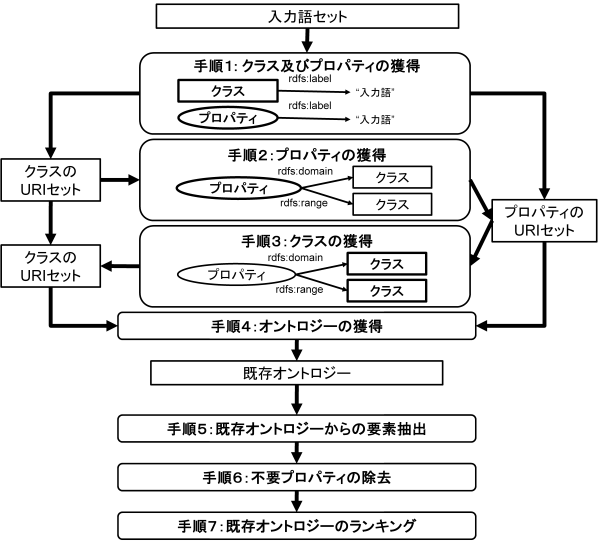

   Swoogleを用いた既存オントロジーの獲得およびランキング

表1: OWL 基本語彙，SKOS, WordNet RDF/OWL におけるオントロジーの要素を特定するクラスおよびプロパティ一覧   

=====================  =============================================================
オントロジーの要素     オントロジーの要素を特定するクラスおよびプロパティ一覧
=====================  =============================================================
概念                   | rdfs:Class, owl:Class, rdf:Property, owl:ObjectProperty, etc
                       | skos:Concept
                       | wn20schema:WordSense, wn20schema:NounWordSense, etc
概念の見出し           | rdfs:label
                       | skos:prefLabel, skos:altLabel, skos:hiddenLabel
                       | wn20schema:lexicalForm
概念の説明             | rdfs:comment
                       | skos:definition
                       | wn20schema:gloss
階層関係               | rdfs:subClassOf, rdfs:subPropertyOf
                       | skos:broader, skos:narrower
                       | wn20schema:hypernymOf, wn20schema:hyponymOf
その他の関係           | rdfs:domain, rdfs:range
                       | skos:related
                       | wn20schema:antonymOf, wn20schema:partMeronymOf, etc
=====================  =============================================================

既存オントロジーからの要素抽出
----------------------------------------------------
OWLオントロジーを参照オントロジーとして領域オントロジー構築支援で利用するためには，オントロジー構築支援に利用可能な要素をOWLオントロジーから抽出する必要がある．DODDLE-OWLでは，領域オントロジーにおける階層関係およびその他の関係の定義を支援する．概念関係およびその他の関係を定義するために必要なOWLオントロジーの要素は，概念（クラスおよびプロパティ），概念の見出し，概念の説明，階層関係，その他の関係である．

概念の抽出は，領域オントロジー構築において必須である．概念の見出しは，入力語と概念を対応づける入力概念選択のために必要である．概念の説明は，入力語に対応する概念が複数存在する場合に，ユーザが入力概念を選択する際の判断材料となる．階層関係は，クラス階層およびプロパティ階層を構築する際に必要である．その他の関係を定義するためには，プロパティの定義域および値域を抽出する必要がある．RDFS，DAML，OWL などのオントロジー記述言語は，上記のオントロジーの要素を定義するための基本的なクラスおよびプロパティを提供している．

Swoogle では，RDFS，DAML，OWLが提供する基本的なクラスおよびプロパティに基づいて，オントロジーを検索できる．例えば，Swoogle では，クラスを次の(X, Y, Z) というステートメントを満たすXとして定義している．

* X は匿名リソース（空白ノード）ではない
* Y はrdf:type プロパティである
* Zは以下のいずれかのクラスである- rdfs:Class, owl:Class, owl:Restriction, owl:DataRange, daml:Class, daml:Datatype, daml:Restriction

Swoogle が扱う範囲のクラスやプロパティのみをOWL オントロジーから抽出する場合には，Swoogle の定義に従ってオントロジーの要素を抽出すればよい．一方で，それ以外の形式で定義された汎用オントロジーやシソーラスも存在する．[Koide06]_ では，WordNetおよびEDR のOWL化について検討しており，それらはSwoogle で定義されているクラスやプロパティとは構造が異なっている．:numref:`label_extraction` に，OWL 基本語彙，SKOS (Simple Knowledge Organisation System) [Miles05]_ ，WordNet RDF/OWLにおける「概念の見出し」の表現方法を示す．

[Nakayama06]_ では，Wikipedia に対してWeb マイニングを適用する手法として Wikipediaマイニングを提案し，シソーラス辞書を構築している (wikipedia-lab)．構築されたWikipedia シソーラスを表現するための語彙としてSKOS を用いている．SKOS では，概念を表すクラスとしてskos:Concept，上位概念を表すプロパティとしてskos:broader などの語彙が定義されており，OWL基本語彙とは異なる．表1 にOWL基本語彙，SKOS, WordNet RDF/OWLにおけるオントロジーの要素を特定するクラスおよびプロパティ一覧を示す．

DODDLE-OWLでは，多様な形式のオントロジーからオントロジー要素を抽出するために，クラス抽出テンプレート，プロパティ抽出テンプレート，見出しおよび説明抽出テンプレート，階層関係抽出テンプレート，その他の関係抽出テンプレートの5種類のテンプレートを，RDF クエリー言語SPARQL [hommeaux08]_ を用いて記述し，OWL オントロジーと対応づけている．

.. _label_extraction:
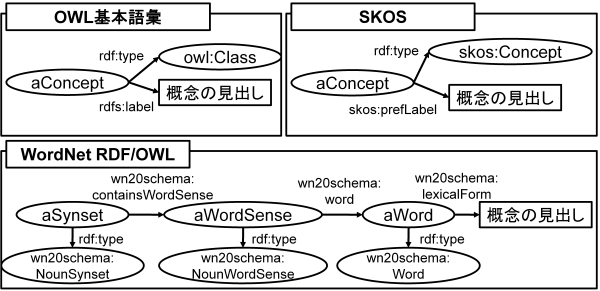

   OWL基本語彙，SKOS，WordNet RDF/OWLスキーマにおける“概念の見出し”の表現方法

既存オントロジーのランキング
----------------------------------------------------
DODDLE-OWLは，現状ではSwoogle のOntoRank，TermRank，オントロジー中に入力概念を含む割合，およびオントロジー中における入力概念に関するその他の関係数の四つをランキング指標として用いている．OntoRank およびTermRank は，[Ding05]_ で提案されている，オントロジーならびにクラスおよびプロパティをランキングするための指標である．

本研究では，入力概念をより多く含むオントロジーを，対象領域に関連するオントロジーであると仮定する．また，入力概念に関するその他の関係をより多く定義しているオントロジーも，対象領域に関連するオントロジーであると仮定する．入力概念を含む割合が同程度のオントロジーについては，OntoRank を参考にすることで，ユーザは，より多くのセマンティックWeb 文書から参照されているオントロジーを再利用できる．

語の多義性により入力概念の候補が複数存在する場合には，TermRank を参考にすることで，ユーザは，より多くのオントロジーから参照されている入力概念を再利用できる．

既存オントロジー再利用における課題
----------------------------------------------------
DODDLE-OWLでは，階層関係構築支援のために，参照オントロジーから入力概念に関連するパスを抽出し，それらを合成するとともに，不要概念を剪定する．Web 上に散在する異種オントロジーに由来するパスを合成する場合，上位概念階層の構造が異なるため，単純な合成は困難である．このため，オントロジーアライメントによる類似概念の同定が必要となる．

現状では，オントロジーアライメントを用いた階層関係構築支援は実現されていない．オントロジーアライメントについては，オントロジーアライメントのコンテストが活発に実施されており，多数のツールが公開されている．オントロジーアライメントツールとDODDLE-OW Lの連携は，今後の課題である．

.. index:: 入力モジュール

入力モジュール
========================
入力モジュールは，領域専門文書集合を入力として受け取り，参照オントロジーを参照して入力概念集合を出力する．入力モジュールは，入力文書選択モジュール，入力語選択モジュール，入力概念選択モジュールから構成される．:numref:`input_module` に，入力モジュールのシステムフローを示す．以下では，各モジュールについて説明する．

.. _input_module:
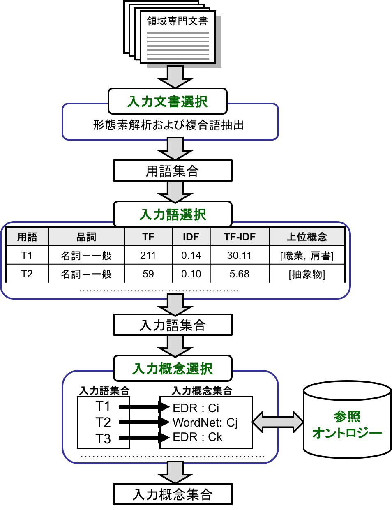

   入力モジュールのシステムフロー

.. index:: 入力文書選択モジュール

入力文書選択モジュール
--------------------------------
入力文書選択モジュールでは，英語または日本語で記述された領域に関する専門文書集合を入力文書集合としてユーザが選択し，当該入力文書集合から，領域にとって重要な語である入力語の候補となる用語集合を抽出する．本モジュールでは，形態素解析器を用いて，専門文書中からユーザが指定した品詞に該当する語を抽出できる．指定可能な品詞は，名詞，動詞，その他の品詞である．また，専門用語自動抽出システム [Nakagawa03]_ や日本語係り受け解析器 CaboCha を用いることで，複合語を抽出できる．さらに，テキスト文書に加えて，PDF，Microsoft Word, Excel,PowerPoint などの形式のファイルからもテキストを抽出できる．

入力文書選択モジュールのもう一つの役割は，入力文書中における1文の区切りを同定することである．1文の区切りの同定は，オントロジーにおけるその他の関係構築支援手法の一つである相関ルールを適用する際に必要となる．本モジュールは，丸（。），ピリオド（．），改行に基づいて1文の区切りを自動的に判別する．しかし，丸やピリオドが含まれない場合には，1文の区切りを誤って判別する可能性がある．この誤判別は，相関ルールを用いた関係構築の精度低下を招く．この問題に対処するため，本モジュールでは，1文の区切りをユーザが手動で修正できるようになっている．

.. index:: 入力語選択モジュール

入力語選択モジュール
--------------------------------
入力語選択モジュールでは，入力文書選択モジュールにより自動抽出された用語集合を対象として，複合語，品詞，TF (Term Frequency), IDF(Inverse Document Frequency), TF-IDF,上位概念を考慮しながら，ユーザが入力語を選択する．ここで上位概念とは，参照オントロジーにおける概念階層の上位部分に位置する概念を指す．上位概念は，あらかじめユーザが手動で設定する．用語とその上位概念を同時に参照することで，自動抽出された用語を抽象化して理解できる．

例えば，EDR を参照オントロジーとして上位概念に「具体物」を設定した場合，「具体物」の下位概念の見出しと一致する自動抽出語については，当該用語の上位概念として「具体物」を表示する．

入力文書中に入力語が含まれていない場合や，入力文書選択モジュールによる自動抽出で入力が取得できなかった場合には，入力語選択モジュールにおいて，ユーザが手動で入力語を追加できる．また，入力文書からの入力語の選択漏れを防ぐために，抽出された入力語と入力文書中における出現箇所との対応関係を確認できるようになっている．

.. index:: 入力概念選択モジュール

入力概念選択モジュール
--------------------------------
入力概念選択モジュールでは，ユーザがオントロジー選択モジュールで選択した参照オントロジー中の概念と入力語を対応づけることにより，入力語の意味を同定する．用語は複数の意味を持つ場合があるため，ある用語を見出しとして持つ概念が複数存在することがある．入力概念選択モジュールでは，入力語とそれに対応する概念の候補をユーザに提示する．ユーザは，その中から入力語に対応する，領域にとって適切な概念を入力概念として選択する．

多くの複合語については，それを見出しとして持つ概念が参照オントロジー中に存在しない．入力概念選択モジュールでは，部分照合を用いることにより，より多くの複合語に対する入力概念選択を可能にしている．入力概念選択の方法には，完全照合と部分照合の2種類がある．完全照合とは，入力語と参照オントロジー中の概念の見出しが完全に一致する場合を指す．部分照合とは，入力語と参照オントロジー中の概念の見出しが部分的に一致する場合を指す．

完全照合しなかった入力語については，形態素解析を適用し，先頭の形態素を順に除去しながら，参照オントロジー中の概念との対応付けを試みる．先頭の形態素を順に除去する理由は，複合名詞においては，語尾に位置する語のほうが語頭に位置する語よりも重要であり，複合名詞の中心的な意味を表と仮定しているためである．この仮定は，複合名詞では一般的に，語尾に位置する語を，それ以前の語が修飾することが多いという経験則に基づいている．そのため，入力語中の語尾を含むように，参照オントロジー中の概念の見出しと部分照合する．最終的に，最長一致した用語に対応する概念と対応づける．部分照合した複合語については，対応する概念の下位概念，または別見出し（同義語）として階層を構築する．

例えば，「ロケット発射装置」という入力語について入力概念選択を考える．「ロケット発射装置」が完全照合しない場合，形態素解析により，「ロケット」，「発射」，「装置」に分解する．まず，「発射装置」について照合を試みる．次に「装置」について照合を試みる．この例では，「発射装置」を見出しとして持つ概念は参照オントロジー中に存在せず，「装置」を見出しとして持つ概念が参照オントロジー中に存在する．したがって，「ロケット発射装置」の意味として，「装置」を見出しとして持つ概念を候補としてユーザに提示する．その際に，「ロケット発射装置」を「装置」概念の下位概念とするか，「装置」概念の別見出しとするかを，ユーザが選択する．

参照オントロジー中の概念と照合しなかった入力語は，未定義語に分類される．オントロジー洗練モジュールにおいて，ユーザが階層中の適切な位置に手動で階層関係を定義する．また，参照オントロジー中の概念と照合したものの，意味的に一致する概念が存在しない入力語も存在する．そのような入力語については，入力概念選択時に「該当なし」を選択することで未定義語に分類される．この場合も，参照オントロジー中の概念と照合しなかった入力語と同様に，ユーザが階層中の適切な位置に手動で階層関係を定義する．

入力概念選択の半自動化
~~~~~~~~~~~~~~~~~~~~~~~~~~~~~~~~~~~
入力語数が多い場合や，入力語が多義的である場合には，入力概念選択がユーザの負担となる．入力概念選択モジュールでは，主に2種類の自動概念選択方法を用いて，入力概念選択を支援する．いずれの手法においても，入力語に対応する概念候補の評価値を算出し，評価値に基づいて概念候補をランキングする．その上で，評価値の高い概念から順にユーザに提示することにより，入力概念選択を支援する．

一つ目の自動概念選択方法では，対象とする概念に対して3種類の指標を用いて評価値を算出する．第一に，対象概念からルート概念までの各パスに出現する概念のうち，入力語集合（入力語彙）を見出しとして持つ概念数の最大値を用いる．第二に，対象概念のすべての下位概念のうち，入力語彙を見出しとして持つ概念数を用いる．第三に，対象概念の兄弟概念のうち，入力語彙を見出しとして持つ概念数を用いる．ユーザは，これら三つの指標の中から一つ以上を選択し，選択した指標により得られた評価値の総和に基づいて，入力語に対応する概念候補をランキングする．

二つ目の自動概念選択方法では，まず入力語に対応する概念候補の集合を取得する．次に，その概念集合から2概念のすべての組合せを求め，各組合せについて概念間距離を算出する．ある概念について，組合せ関係にある他の概念集合との概念間距離の逆数の総和を，当該概念の評価値とする．多重継承が存在する場合には，概念間距離の算出方法が複数存在するため，ユーザは最短距離，最長距離，または平均距離のいずれかを選択する．

部分照合による入力概念選択を簡略化するために，ある部分照合した用語に対する入力概念選択結果を，同様に部分照合するすべての用語に適用できるようになっている．例えば，「バッテリ充電装置」，「ノイズ測定装置」，「バルブ作動点検装置」がいずれも「装置」で部分照合された場合，「装置」に対する入力概念選択結果を，これら三つの入力語の入力概念選択結果として用いることができる．

.. index:: オントロジー構築モジュール

オントロジー構築モジュール
=======================================
オントロジー構築モジュールは，階層構築モジュールおよび関係構築モジュールから構成される．階層構築モジュールでは，参照オントロジーの概念階層を参照して，概念階層の初期モデルを構築する．関係構築モジュールでは，入力文書および入力概念集合を用い，共起性に基づく手法により概念対集合を獲得する．概念階層初期モデルおよび概念対集合は，初期領域オントロジーを構成し，オントロジー洗練モジュールにおいて，ユーザインタラクションを通じて洗練される．

以下では，階層構築モジュールおよび関係構築モジュールについて説明する．

.. index:: 階層構築モジュール

階層構築モジュール
-----------------------------------
階層構築モジュールでは，参照オントロジーの概念階層を基に，領域オントロジーの基礎となる概念階層の初期モデルを構築する．入力モジュールでは，入力語と完全に一致する入力概念（完全照合概念）と，部分的に一致する入力概念（部分照合概念）を区別する．この区別に応じて，適用する階層構築方法は異なる．以下では，完全照合概念と部分照合概念について，それぞれの階層構築方法を説明する．

完全照合概念の階層構築
~~~~~~~~~~~~~~~~~~~~~~~~~~~~~~~~~~~

.. _process_of_perfectly_matched:
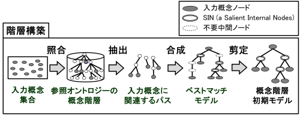

   完全照合概念の階層構築工程

:numref:`process_of_perfectly_matched` に完全照合概念の階層構築工程を示す．本工程では，参照オントロジーから，入力モジュールによって獲得した完全照合概念を末端ノードとし，ルート概念に至るまでのパスを抽出して合成する．この結果得られる概念階層をベストマッチモデルと呼ぶ．

:numref:`process_of_perfectly_matched` のベストマッチモデルは，3種類のノードから構成される．具体的には，1重線で囲まれた入力概念ノード，2重線で囲まれたSIN（Salient Internal Nodes），および点線で囲まれた不要中間ノードである．入力概念ノードは，ユーザが選択した入力語に対応する参照オントロジー中の概念であり，領域オントロジーにおいて必須の概念である．参照オントロジーから抽出されたノードのうち，入力概念ノード以外のノードは，SINまたは不要中間ノードに分類される．

SINは，一つ以上の入力概念ノードを子ノードとして持つノードである．SINは，各入力概念間の位相関係，すなわち祖先関係，親子関係，および兄弟関係を保持する役割を担う．一方，不要中間ノードは，入力概念ノードを子ノードとして持たないノードである．不要中間ノードは，各入力概念間の位相関係の保持に寄与しないため，階層構築モジュールでは，階層構築に不要な概念であると判断し，ベストマッチモデルから削除する．

不要中間ノードを削除する処理を剪定と呼ぶ．剪定によって得られる，入力概念ノードとSINのみから構成される概念階層を，概念階層初期モデルと呼ぶ．概念階層初期モデルは， **概念階層洗練手法** を用いて，ユーザとのインタラクションを通じて洗練され，最終的な領域オントロジーにおける概念階層となる．

部分照合概念の階層構築
~~~~~~~~~~~~~~~~~~~~~~~~~~~~~~~~~~~~

.. _process_of_partially_matched:
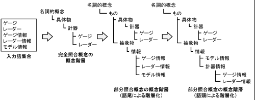

   部分照合概念の階層構築工程

階層構築モジュールでは，部分照合概念に対して，語尾および語頭に基づく階層化を適用する．図2に，部分照合概念の階層構築例を示す．部分照合概念とは，参照オントロジー中の概念の見出しと部分的に一致する入力語を概念化したものである．入力概念選択モジュールで述べたとおり，入力語が完全照合しなかった場合には，入力語を形態素解析し，語尾を含む形で部分照合を行う．このとき，部分照合概念の見出しについて，語尾を含む照合部分を語尾部分，それ以前の部分を語頭部分と定義する．例えば，「ゲージ情報」という入力語が，参照オントロジー中の「情報」概念と部分照合した場合，「ゲージ」を語頭部分，「情報」を語尾部分と呼ぶ．また，入力概念選択モジュールにおいて，ユーザは，部分照合した入力語を，照合先概念の別見出しとするか，下位概念とするかを選択する．以下では，下位概念とする選択がなされた場合について説明する．

:numref:`process_of_partially_matched` では，はじめに，ユーザが入力語として「ゲージ」，「レーダー」，「ゲージ情報」，「レーダー情報」，および「モデル情報」を選択した．「ゲージ」および「レーダー」は，参照オントロジー中に同一見出しを持つ概念が存在するため，図1に示した完全照合概念の階層構築工程に従って階層構築される．一方，「ゲージ情報」，「レーダー情報」，および「モデル情報」は，参照オントロジー中の「情報」概念と部分照合する．語尾による階層化では，まず，「情報」概念を完全照合概念の階層構築工程に従って階層構築し，次に，「ゲージ情報」，「レーダー情報」，および「モデル情報」を概念化し，「情報」概念の下位概念として定義する．

語頭による階層化では，部分照合概念の語頭部分に着目する．語頭部分を見出しとして持つ概念が，構築中の概念階層内に存在する場合には，当該概念の上位概念と，部分照合概念の語尾部分と照合した概念の見出しを組み合わせた新たな見出しを持つ概念を作成する．その後，語頭部分が一致する部分照合概念を，新たに作成した概念の下位概念として，階層関係を再定義する．部分照合概念の語頭部分は，語尾部分を修飾する役割を持つ場合が多い．このため，語頭による階層化を併用することで，語尾による階層化のみの場合に比べ，より詳細な概念階層を構築できると考えられる．

:numref:`process_of_partially_matched` に示す語尾による階層化によって構築された概念階層では，部分照合概念である「ゲージ情報」概念および「レーダー情報」概念の語頭部分に対応する「ゲージ」概念および「レーダー」概念が，「計器」概念の下位概念として定義されている．ここで，語頭による階層化を適用すると，「計器」概念と「情報」概念を組み合わせた「計器情報」概念が新たに作成され，「ゲージ情報」概念および「レーダー情報」概念の上位概念として定義される．「計器情報」概念を導入することで，「モデル情報」概念と，「ゲージ情報」概念および「レーダー情報」概念とを区別し，計器に関する情報を体系的に分類できる．

.. index:: 関係構築モジュール

関係構築モジュール
----------------------------------
その他の関係の定義を支援するために，関係構築モジュールでは，WordSpace および相関ルールという二つの共起性に基づく手法を用い，入力文書および入力語彙から，その他の関係の候補となる概念対を獲得する．

WordSpace による概念対の抽出
~~~~~~~~~~~~~~~~~~~~~~~~~~~~~~~~~~
共起統計の計算手法として，WordSpace [Hearst96]_ を利用する．WordSpaceとは，語彙の共起統計に基づき，大規模な単語集合の意味表現を誘導するコーパスベースの手法である．WordSpaceでは，出現語句を，共起情報を含むベクトルとして表現できる．これらの単語ベクトルの集合から構成される多次元ベクトル空間をWordSpaceと呼ぶ．この空間において，二つのベクトル間の内積は，出現語句間の文脈類似度を表す指標となる．

WordSpaceから得られる共起情報に基づき，入力文書から文脈類似概念対を獲得し，その他の関係定義に関与する可能性のある概念対として利用する．本研究では，「文脈が類似している語句の間には，何らかの概念関係が存在する」という仮定を置く．

以下では，WordSpace に基づく文脈類似概念対の獲得手順（ :numref:`wordspace` ）について説明する．

.. _wordspace:
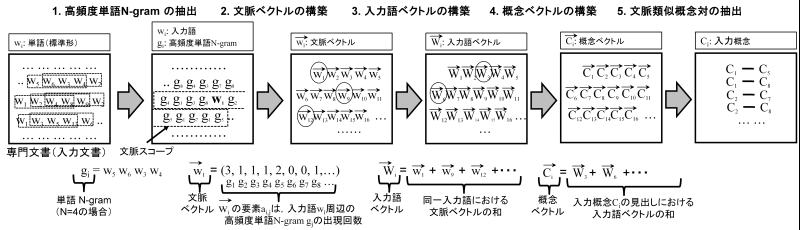

   文脈類似概念対の獲得手順

1. 高頻度単語N-gram の抽出
"""""""""""""""""""""""""""""""""""""""""
専門文書から，N 個の単語から構成される句，すなわち単語N-gramを抽出し，共起の最小単位として用いる．文字単位のN-gramに基づく統計と比較して，意味を持たない文字列の共起情報を除外できるため，専門文書の文脈表現に有用な情報を抽出できる．抽出された句は，標準形に変換した上で，同形の句を統合し，重複を排除する．

次に，抽出した単語N-gram集合の中から，専門文書における出現頻度が高い単語N-gramを高頻度単語N-gramとして選択し，WordSpaceの構築に用いる．この処理により，入力文書は，高頻度単語N-gramの配列として表現される．関係構築モジュールでは，高頻度単語N-gramを抽出する際に，単語N-gramを構成する単語数Nおよび出現数の閾値を，ユーザが設定できる．

.. note::
    [Hearst96]_ では，文字単位の共起を用いてWordSpace を構築する．一方，関係構築モジュールでは，単語単位のN-gramに基づく共起を最小単位として扱う．このため，通常のWordSpace構築において，文字単位の共起を一定のまとまりとして表現する目的で用いられる4-gramベクトルの構築工程は適用しない．

2. 文脈ベクトルの構築
"""""""""""""""""""""
次に，二つの入力語の文脈を比較するために，文脈ベクトル（context vector）を構築する．文脈ベクトルとは，ある入力語の周辺に出現する高頻度単語N-gramの出現回数を，ベクトルとして表現したものである．文脈ベクトル :math:`\overrightarrow{w_i}` の要素 :math:`a_{i,j}` は，入力語 :math:`w_i` の出現位置の周辺，すなわち **文脈スコープ** 内における高頻度単語 N-gram :math:`g_j` の出現回数を表す．

関係構築モジュールでは，文脈スコープとして，入力語 :math:`w_i` の前後何語以内に含まれる高頻度単語 N-gram を，文脈ベクトルの構築に用いるかを，ユーザが設定できる．

3. 入力語ベクトルの構築
"""""""""""""""""""""""
次に，文脈ベクトルから，入力語のベクトル表現である **入力語ベクトル(input term vector)** を導出する．入力語ベクトル :math:`\overrightarrow{W_i}` は，専門文書中における入力語 :math:`w_i` の全出現位置について得られる文脈ベクトル :math:`\overrightarrow{w_i}` の総和として定義される．

4. 概念ベクトルの構築
"""""""""""""""""""""
次に，入力語ベクトルから，入力概念のベクトル表現である **概念ベクトル(concept vector)** を導出する．入力概念選択モジュールにより，入力語に対応する参照オントロジー中の概念，すなわち入力概念は既に特定されている．概念ベクトルは，入力概念の見出しに対応する入力語について，それぞれの入力語ベクトルを加算することで定義される．

概念ベクトル :math:`\overrightarrow{C}` は， 式 :eq:`concept_vector` により表される． :math:`\mathcal{A}(w)` は，入力語 :math:`w` の専門文書における全出現位置の集合を表す．:math:`\overrightarrow{w}(i)` は，入力語 :math:`w` の専門文書中の位置 :math:`i` に出現した際の文脈ベクトルを表す．また，:math:`synset(C)` は，概念 :math:`C` に対応する見出し集合を表す．

.. math:: \overrightarrow{C} = \sum_{w \in {synset(C)}} (\sum_{i \in \mathcal{A}(w)}\overrightarrow{w}(i))
   :label: concept_vector

5. 文脈類似概念対の獲得
"""""""""""""""""""""""
以上の処理により，全ての入力概念について概念ベクトルを得ることができる．概念ベクトル間の内積は，概念間の文脈類似度を表す．関係構築モジュールでは，文脈類似度に対する閾値をユーザが設定できる．ユーザが指定した閾値を超える値を持つ概念対を，文脈類似概念対として獲得する．

概念ベクトル :math:`\overrightarrow{C_1}` と :math:`\overrightarrow{C_2}` の間の文脈類似度 :math:`sim(\overrightarrow{C_1}, \overrightarrow{C_2})` は， 式 :eq:`context_similarity` を用いて算出する．

.. math:: sim(\overrightarrow{C_1}, \overrightarrow{C_2}) = \frac{\sum_i c_{1,i}c_{2,i}}{\sqrt{\sum_i {c_{1,i}}^2 \sum_i {c_{2,i}}^2}}
   :label: context_similarity

概念間の関係を明示する概念関係子は，この段階では推定されていない．そのため，推定前の初期値として，概念関係子 **non-TAXONOMY** を割り当てる．獲得された文脈類似概念対には，階層関係が含まれる可能性がある．このため，概念階層において既に定義されている階層関係については，文脈類似概念対の集合から除外する．

相関ルールによる概念対の抽出
~~~~~~~~~~~~~~~~~~~~~~~~~~~~~~~~~~~~~~~~~~~
専門文書から，その他の関係定義の候補となる概念対を獲得する別の方法として，相関ルールを利用する．相関とは，ある事象が発生すると，別の事象が発生しやすくなるという共起性を指す．また， :math:`A \Rightarrow B` という相関ルールは， 事象 :math:`A` が発生した場合に，事象 :math:`B` 発生しやすいことを意味する．

相関ルールの抽出は，代表的なデータマイニング技術の一つであり，その他の関係定義にも利用されている [Agrawal94]_ ．本研究では，入力文書内の1文中に同時に出現する入力語の組み合わせを相関ルールとして抽出し，その他の関係定義の候補となる概念対として利用する．抽出された相関ルールに含まれる概念間には，何らかの概念関係が存在すると仮定する．

以下では，相関ルールの定義および相関ルール抽出アルゴリズムである Apriori について述べる．相関ルールおよび Apriori アルゴリズムの説明は，データマイニングの基礎 [Motoda06]_ 2.5節を参考にした．

相関ルールの定義
""""""""""""""""""""""""""""""
相関ルールは， 式 :eq:`transaction_set` に示す **トランザクション集合(transaction set)** :math:`T` から抽出される． **トランザクション(transaction)** :math:`t_i` は，データベース内におけるデータのまとまりを表す単位である．本研究では，入力文書内の1文をデータのまとまりの単位とする．このため，トランザクション集合の要素数 :math:`n` は，入力文書に含まれる文の数に対応する．

.. math:: T := \{t_i \mid i=1 \ldots n\}
   :label: transaction_set

:math:`T` の要素である :math:`t_i` は，アイテム集合(item set) である．本研究では，アイテムを入力語と定義する．したがって， :math:`t_i` は，入力文書の :math:`i` 番目の文に含まれる入力語の集合として表される． :math:`t_i` は， 式 :eq:`transaction` により定義される．また，式 :eq:`transaction` における :math:`C` は，入力文書に含まれる全入力語の集合を表す．

.. math:: t_i=\{a_{i,j} \mid j = 1 \ldots m, a_{i,j} \in C\}
   :label: transaction

:math:`k` 個のアイテムを含むアイテム集合 :math:`X_k` と :math:`Y_k` に対して，相関ルールは，:math:`X_k \Rightarrow Y_k (X_k,Y_k \subset C, X_k \cap Y_k = \emptyset)` と表される．ここで，:math:`X_k` を条件部， :math:`Y_k` を結論部と呼ぶ．条件部および結論部は，いずれも複数のアイテムを含んでもよい．

相関ルールの重要性を評価する指標として， **支持度** (support) と **確信度** (confidence) がある．支持度とは，相関ルールが全トランザクション中にどの程度出現するかを表す割合である．相関ルール :math:`X_k \Rightarrow Y_k` の支持度 :math:`support(X_k \Rightarrow Y_k)` は，全トランザクションのうち，に含むトランザクションの割合として，式 :eq:`support` により定義される．

.. math:: support(X_k \Rightarrow Y_k) = \frac{\mid \{t_i \mid X_k \cup Y_k \subseteq t_i \} \mid}{n}
   :label: support

確信度とは，条件部が成立したときに，結論部も成立する割合を表す指標である． 相関ルール :math:`X_k \Rightarrow Y_k` の確信度 :math:`confidence(X_k \Rightarrow Y_k)` は， トランザクション集合 :math:`T` において， :math:`X_k` を含むトランザクションのうち， :math:`Y_k` も含むトランザクションの割合として，式 :eq:`confidence` により定義される．

.. math:: confidence(X_k \Rightarrow Y_k) = \frac{\mid \{t_i \mid X_k \cup Y_k \subseteq t_i \} \mid}{\mid \{t_i \mid X_k \subseteq t_i\} \mid}
   :label: confidence

相関ルールの抽出において，支持度および確信度に閾値を設けない場合，組合せ爆発が生じ，多数の無意味なルールが生成される．このため，相関ルールの抽出では，支持度および確信度に閾値を設定し，それぞれが当該閾値以上である相関ルールのみを抽出する．ここで，支持度の閾値を **最小支持度** (minimum support)， 確信度の閾値を **最小確信度** (minimum confidence) と呼ぶ．また，ユーザから与えられた最小支持度以上の支持度を有するアイテム集合を **多頻度アイテム集合** (frequent item set) と呼ぶ．

通常，相関ルールの条件部には複数のアイテムを含めることができる．しかし，本研究では概念対の獲得を目的とするため，条件部および結論部の双方に，それぞれ一つずつのアイテム，すなわち入力語の対のみを用いる．WordSpace に基づく概念対の抽出と同様に，概念間の関係を明示する概念関係子はこの段階では推定されていない．そのため，初期値として概念関係子 **non-TAXONOMY** を割り当てる．

相関ルール抽出アルゴリズム Apriori
""""""""""""""""""""""""""""""""""

相関ルールは，次の二つのステップにより抽出される．

**ステップ1:** 多頻度アイテム集合を獲得する．
**ステップ2:** ステップ1で得られた多頻度アイテム集合から，最小確信度以上の確信度を有する相関ルールを導出する．

ステップ2は，ステップ1により求めた多頻度アイテム集合 :math:`F` からルールを導出する処理であり，計算負荷は比較的小さい．一方，ステップ1では，トランザクション集合 :math:`T` を繰り返し検索し，多数のアイテム集合について支持度を計算する必要があるため，計算負荷が大きい．このため，ステップ1を効率的に実行するアルゴリズムの設計が，実用的な相関ルール抽出につながると考えられてきた．この課題を初めて解決した手法が，IBM アルマデン研究所の Rakesh Agrawal らによって提案された Apriori アルゴリズム [Agrawal94]_ である．Apriori アルゴリズムは，現在，最も広く利用されている相関ルール抽出アルゴリズムの一つであり，本研究においても関係構築モジュールの実装に用いる．

以下では，Apriori アルゴリズムについて説明する．

Apriori アルゴリズムは，「アイテム集合 :math:`A` が多頻度アイテム集合である場合，そのすべての部分集合も多頻度アイテム集合である」という性質，およびその対偶である「アイテム集合 :math:`B` が多頻度アイテム集合でない場合， :math:`B` を含むいかなる集合 :math:`A` も多頻度アイテム集合ではない」という支持度の逆単調性を利用する．これらの性質用いることで，不要な候補集合を効率的に枝刈りし，多頻度アイテム集合を求めることができる．例えば，{1,2}が多頻度アイテム集合でない場合，{1,2}を含む任意のアイテム集合（{1,2,3}など）も多頻度アイテム集合ではないため，その支持度を計算する必要はない．

Apriori アルゴリズムでは，要素数の少ないアイテム集合から順に支持度を計算し，あるアイテム集合の支持度が最小支持度を下回った場合，逆単調性に基づいて，当該集合を含む上位のアイテム集合を多頻度アイテム集合の候補から除外する．

要素数 :math:`k` の多頻度アイテム集合を :math:`F_k` ，多頻度アイテム集合の候補集合を :math:`C_k` とすると，Apriori アルゴリズムの処理手順は次のとおりである．

1. :math:`F_k` から :math:`C_{k+1}` を生成する．この際に，:math:`C_{k+1}` のすべての部分集合が :math:`F_k` に含まれているかを確認し，含まれていない場合は，当該要素を:math:`C_{k+1}` から削除する．
2. トランザクション集合 :math:`T` を検索し， :math:`C_{k+1}` に含まれる各要素の支持度を計算する．
3. :math:`C_{k+1}` から，最小支持度以上の支持度を有する要素を抽出し， :math:`F_{k+1}` を得る．
4. 新たに得られる多頻度アイテム集合が空になるまで，手順1から3を繰り返す．

:numref:`apriori` に，最小支持度0.50 (2/4 = 0.50) における，Apriori アルゴリズムによる多頻度アイテム集合抽出の例を示す． :numref:`apriori` では，トランザクション集合 :math:`T` に四つのトランザクションが含まれているため， :math:`T` において2回以上出現するアイテム集合が多頻度アイテム集合となる．はじめに :math:`T`　を対象として，要素数1のアイテム集合が各トランザクションに含まれる回数を数え，候補集合  :math:`C_1` を作成する．次に，:math:`C_1` から最小支持度以上の支持度を有するアイテム集合を抽出し，多頻度アイテム集合 :math:`F_1` を得る．

続いて， :math:`F_1` から候補集合 :math:`C_2` を生成する．この場合， :math:`C_2` の各要素について，要素数1のすべての部分集合が多頻度アイテム集合であるため，候補の削除は行われない．その後， :math:`T` を検索して， :math:`C_2` の支持度を計算し，:math:`F_2` を得る．次に， :math:`F_2` から :math:`C_3` を生成する．この際， {1,2,3}および{1,3,5}といったアイテム集合も候補として生成されるが，これらの部分集合である{1,2}および{1,5}はいずれも多頻度アイテム集合ではない．したがって，{1,2,3}および{1,3,5}も多頻度アイテム集合ではなく， :math:`C_3` から削除される．その結果， :math:`C_3` は{2,3,5}のみとなる． :math:`T` を検索すると，{2,3,5}の出現数派2であり，支持度は0.50以上となる．よって， :math:`F_3` は{2,3,5}である．{2,3,5}からは新たに候補集合 :math:`C_4` を生成できないため，ここで処理は終了する．

.. _apriori:
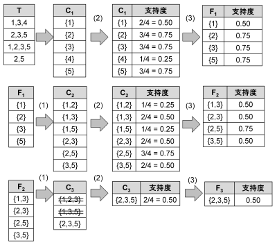

   Apriori アルゴリズムによる多頻度アイテム集合抽出の例

EDR概念記述辞書を用いたプロパティ階層の構築およびその他の関係定義
~~~~~~~~~~~~~~~~~~~~~~~~~~~~~~~~~~~~~~~~~~~~~~~~~~~~~~~~~~~~~~~~~~~~~~~~~~~~~~~
オントロジー構築モジュールは，EDR 概念記述辞書を用いて，プロパティ階層の構築およびその他の関係定義を行う．EDR 概念記述辞書には，動詞的概念が名詞的概念を支配する場合の格関係を中心として，agent，object， goal， implement，a-object，place， scene， cause の8種類の概念関係が定義されている．オントロジー構築モジュールでは，EDR 概念記述辞書に定義されている動詞的概念およびその下位概念を，OWLにおけるオブジェクトプロパティとみなし，名詞的概念階層，すなわちクラス階層とは分離して，プロパティ階層を構築する．

また，オントロジー構築モジュールは，8種類の概念関係のうち，agent 関係を持つ名詞的概念をプロパティの定義域とし，object 関係を持つ名詞的概念をプロパティの値域として定義する．

プロパティ階層構築には，クラス階層構築における完全照合概念および部分照合概念の階層化と同様のアルゴリズムを適用できる．完全照合概念を階層化する過程では，不要な概念の剪定が行われる．この剪定処理により，以下の場合に該当する場合，その他の関係定義の整合性が保持されない，または関係定義が欠落する問題が生じる．

1. クラス階層において剪定された概念が，agent またはobject の値として定義されている場合
2. プロパティ階層において剪定された概念に，agent またはobject 関係が定義されている場合

オントロジー構築モジュールでは，前者の場合には，agentまたはobjectの値を，剪定された概念の下位概念に置換することで，関係定義の整合性を保持する．後者の場合には，剪定されたプロパティの下位概念に対して定義域および値域を継承させることで，その他の関係定義が欠落しないようにしている．

.. index:: オントロジー洗練モジュール

オントロジー洗練モジュール
================================
オントロジー洗練モジュールは，階層洗練モジュールおよび関係洗練モジュールから構成される．オントロジー洗練モジュールでは，オントロジー構築モジュールで構築した **概念階層初期モデル** と，その他の関係定義のための **概念対集合** を基に，ユーザとのインタラクションを通してオントロジーの洗練を行う．

以下では，階層洗練モジュールおよび関係洗練モジュールについて説明する．

.. index:: 階層洗練モジュール

階層洗練モジュール
------------------
参照オントロジー，特に汎用オントロジーから半自動的に構築された初期概念階層には，一般的な階層関係が定義されている．このため，ユーザは概念変動，すなわち対象領域の変化に伴う概念の意味変化を考慮しながら，初期概念階層を特定の領域に適合させる必要がある．

概念変動を管理するために，階層洗練モジュールでは三つの戦略を適用する．具体的には，戦略1として照合結果分析，戦略2として剪定結果分析，戦略3として多重継承の除去を用いる．:numref:`process-tree-refinement` に，概念階層洗練工程を示す．戦略1 は入力概念集合と汎用オントロジーとの照合結果の観点から概念変動を同定する．戦略2は，剪定結果の観点から概念変動を同定する．戦略3は，多重継承の発生に基づいて概念変動を同定する．以下では，それぞれの戦略の詳細を説明する．

.. _process-tree-refinement:
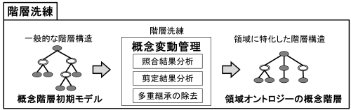

   概念階層洗練工程

戦略1: 照合結果分析
~~~~~~~~~~~~~~~~~~~
戦略1では，概念階層初期モデルにおいて，入力概念の位置関係に基づき，再利用可能な領域と，再利用不可能な領域，すなわち概念変動が発生していると推定される領域とに分割する．その上で，再利用不可能な領域を移動することにより，概念変動を解消する．ここで，移動とは，再利用不可能な領域に含まれる概念を，他の適切な概念の下位概念として再定義することを意味する．

入力概念，すなわちベストマッチノードは，問題領域の観点から概ね妥当であると判断された概念である．このため，入力概念が連続して現れるパスは，妥当な概念が集中的に配置されたパスであるとみなし，再利用可能なパスと判断できる．このようなパスを **PAB (PAths including only Bestmatches)** と呼ぶ．

一方，SINが含まれる領域は，概念構造の差異，すなわち概念変動が生じている可能性がある．そのため，当該領域は移動の対象とすべき領域と判断される．このような領域を **STM (SubTrees manually Moved)** と呼ぶ．以下に，PABおよびSTM の定義を示す．

PABの定義
    ルート概念から入力概念，すなわちベストマッチノードが複数個連続して構成されるパス．
STMの定義
    SIN をサブルートとし，下位ノードがすべてベストマッチノードから構成される部分木．

:numref:`matched-result-analysis` にPAB およびSTM の例を示す．実線で囲まれた部分木がPABであり，破線で囲まれた部分木がSTMである．ユーザは，STMを移動することで概念階層初期モデルを洗練し，領域概念階層を構築する．STM の移動先はユーザが決定する．移動の必要がないと判断した場合には，STM を移動しない．また，移動時にユーザが不必要であると判断したSTM のルートノードは，削除してもよい．戦略1 は，照合結果の分析に基づいて得られた戦略であるため，照合結果分析(Matched Result Analysis: MRA) と呼ぶ．

.. _matched-result-analysis:
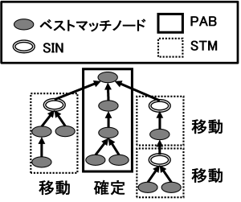
           
   戦略1：照合結果分析

戦略2: 剪定結果分析
~~~~~~~~~~~~~~~~~~~
戦略2では，概念階層初期モデルにおいて，同一の親ノード，すなわち上位概念を持つ兄弟ノード間で，剪定によって削除された中間概念数の差が大きい場合に，その階層関係の再構成を示唆する．

剪定工程において，中間概念およびそれに連なる，ベストマッチノード以外の概念を含む領域がすべて削除される場合，参照オントロジーにおける概念の分化方法が，問題領域における概念の分化方法と一致していないことを示していると解釈できる．そのような部分木に対して，分化の再構成をユーザに促す．具体的には，剪定時における削除数の差が，概念階層初期モデルにおけるルート概念から末端概念までの距離の3分の1以上である親子ノードに対し，再構成をユーザに示唆する．なお，ルート概念から末端概念までの剪定時の削除数の閾値は，ユーザが任意に設定できる．

戦略2は，剪定結果の分析に基づく戦略であるため， **剪定結果分析(Trimmed Result Analysis: TRA)**  と呼ぶ．

剪定結果分析の適用例を:numref:`trimmed-result-analysis` に示す．:numref:`trimmed-result-analysis` に示すベストマッチモデルを剪定した結果，概念Aと概念D間の領域がすべて削除された．この変化は，概念Aの分類属性が，対象とする問題領域では異なる形で分化に利用されている可能性を示しており，概念変動が発生していると推定される．本例では，対象とする問題領域において，概念Dは概念Aの下位概念ではなく，概念C の下位概念として，概念階層が再構成されている．

.. _trimmed-result-analysis:
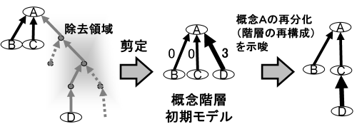
           
   戦略2：剪定結果分析

戦略3: 多重継承の除去
~~~~~~~~~~~~~~~~~~~~~
WordNet やEDR 電子化辞書などの汎用オントロジーでは，階層関係を網羅的に定義するため，多重継承が多用されている．汎用オントロジーにおける多重継承関係は，多様なコンテキストを考慮して定義されている．その結果，特定の領域においては，大部分の継承関係が不要となる場合がある．階層洗練モジュールでは，多重継承している概念の一覧を提示し，どの概念を上位概念として採用するかをユーザに選択させることで，多重継承の除去を容易にする．

:numref:`remove-multiple-inheritance` に，多重継承の除去の例を示す． :numref:`remove-multiple-inheritance` では，汎用オントロジーにおいて，概念Dが概念A，概念B，概念C の三つの概念を上位概念として多重継承している．この例では，概念A および概念C を上位概念として不要であると判断し，ユーザがこれらの継承関係を除去している．

.. _remove-multiple-inheritance:
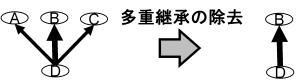
           
   戦略3：多重継承の除去

.. index:: 関係洗練モジュール

関係洗練モジュール
------------------
関係洗練モジュールでは，関係構築モジュールにおいて，WordSpaceおよび相関ルールにより獲得された概念対集合を基に，ユーザが概念間関係を定義することを支援する．関係洗練モジュールでは，WordSpaceおよび相関ルールにおけるパラメータの調整，結果の合成，正解概念対または不要概念対の選択，ならびに概念対間の関係の定義を行うことができる．

.. index:: 変換モジュール

変換モジュール
====================
DODDLE-OWLによって構築される領域オントロジーは，階層関係とその他の関係から構成される．クラスのis-a階層は，OWLが提供する owl:Class クラスおよび rdfs:subClassOf プロパティによって定義する．クラスの has-a 階層は，owl:Class クラスおよびdoddle:partOf プロパティによって定義する．プロパティの is-a 階層は，owl:ObjectProperty クラスおよび rdfs:subPropertyOf プロパティによって定義する．プロパティの has-a 階層は，owl:ObjectProperty クラスおよび doddle:partOf プロパティによって定義する．その他の関係は，概念対の間の関係を OWL におけるプロパティとして表現し，概念対をプロパティの定義域および値域として設定することで，owl:ObjectProperty クラス，rdfs:domain プロパティ，および rdfs:range プロパティを用いて定義する．

:numref:`translation_module` の上部には，概念関係の定義の例として，「act」クラスの下位クラスとして「aim」と「behavior」クラスが定義された状態を，OWL形式へ変換する方法を示す．:numref:`translation_module` の下部には，その他の関係の定義例として，「time」クラスと「offer」クラスの間に「attribute」プロパティによる関係が定義された状態を，OWL形式へ変換する方法を示す．

また，DODDLE-OWL では概念の見出しを rdfs:label プロパティ，概念の説明を rdfs:comment プロパティ，概念の表示見出しを skos:prefLabel プロパティによって定義する．概念の表示見出しとは，概念に複数の見出しが定義されている場合に，概念階層を表示する際に優先的に表示される見出しを指す．

.. _translation_module:
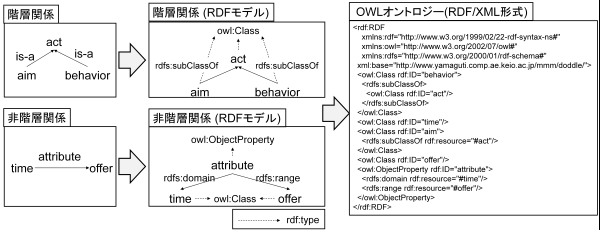

   変換モジュールによる領域オントロジーのOWL形式への変換例

