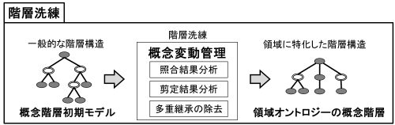
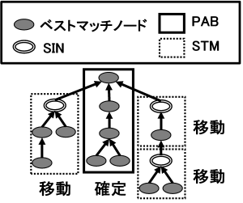
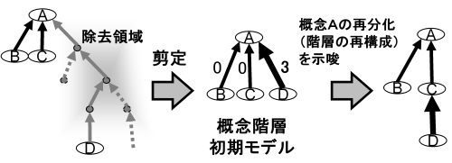
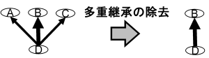

オントロジー洗練モジュール
================================

.. contents:: コンテンツ 
   :depth: 3

オントロジー洗練モジュールは，階層洗練モジュールおよび関係洗練モジュールから構成される．オントロジー洗練モジュールでは，オントロジー構築モジュールで構築した **概念階層初期モデル** と，その他の関係定義のための **概念対集合** を基に，ユーザとのインタラクションを通してオントロジーの洗練を行う．

以下では，階層洗練モジュールおよび関係洗練モジュールについて説明する．

階層洗練モジュール
------------------

参照オントロジー（特に汎用オントロジー）から半自動構築された初期概念階層は一般的な階層関係が定義されているため，ユーザは概念変動（対象領域の変化による概念の意味変化）と呼ばれる問題を考慮しながら，初期概念階層を特定の領域に調整する必要がある．概念変動管理のために，階層洗練モジュールは戦略1：照合結果分析，戦略2：剪定結果分析，戦略3：多重継承の除去の三つの戦略を適用する．:numref:`process-tree-refinement` に概念階層洗練工程を示す．戦略1 は入力概念集合と汎用オントロジーとの照合結果の観点から, 戦略2 は剪定結果の観点から，戦略3 は多重継承から概念変動を同定する戦略である．以下では，それぞれの戦略の詳細を説明する．

.. _process-tree-refinement:

   概念階層洗練工程

戦略1: 照合結果分析
~~~~~~~~~~~~~~~~~~~

戦略1 では，概念階層初期モデルにおいて，入力概念の位置関係から再利用可能な領域と不可能な（概念変動が発生していると推定される）領域に分割し，再利用不可能な領域を移動することによって概念変動を解消する．ここで，移動するとは，再利用不可能な領域に含まれる概念を，他の適切な概念の下位概念として再定義することを意味する．

入力概念（ベストマッチノード）は，問題領域から考えてほぼ妥当と考えられた概念のため，それらが連続するパスは，妥当な概念が集中していると考え，再利用可能なパスとみなせる．このパスを **PAB (PAths including only Bestmatches)** と呼ぶ．一方，SINが含まれる領域は，概念構造の差異（概念変動）が生じている可能性があるため，移動すべき領域とみなせる．この領域を **STM (SubTrees manually Moved)** と呼ぶ．PABとSTM の定義を以下に示す．

PABの定義
    ルート概念から入力概念（ベストマッチノード）が複数個連続しているパス．
STMの定義
    SIN をサブルートとし，その下位ノードがすべてベストマッチノードで構成される部分木．

:numref:`matched-result-analysis` にPAB とSTM の例を示す．実線で囲まれた部分木がPAB，破線で囲まれた部分木がSTMである．ユーザーはSTMを移動することで概念階層初期モデルを洗練し，領域概念階層を構築する．STM の移動先についてはユーザが決定し，移動する必要がないと判断した場合は移動しない．移動時にユーザーが不必要と判断したSTM のルートノードは削除してもよい．戦略1 は，照合結果を分析することによって得られた戦略のため，照合結果分析(Matched Result Analysis: MRA) と呼ぶ．

.. _matched-result-analysis:

           
   戦略1：照合結果分析

戦略2: 剪定結果分析
~~~~~~~~~~~~~~~~~~~

戦略2 では，概念階層初期モデルにおいて，同じ親ノード（上位概念）を持つ兄弟ノード間で，剪定において取り除かれた中間概念数の差が大きい場合，その階層関係を再構成するよう示唆する．

剪定工程で，削除された中間概念とそれにつながるベストマッチノード以外の概念を含む領域が全て削除されることは，参照オントロジーによる概念の分化の方法が問題領域の概念の分化の方法と異なっていることを示しているといえる．そのような部分木に対して分化の再構成をユーザに促す．剪定の際の削除数の差が概念階層初期モデルのルート概念から末端概念までの距離の1/3 以上であった親子ノードに対し，再構成をユーザに示唆する．ルート概念から末端概念までの剪定の際の削除数は，ユーザによって任意に設定することもできる．戦略2 は関連情報の剪定結果の分析によって行なわれる戦略のため， **剪定結果分析(Trimmed Result Analysis: TRA)**  と呼ぶ．

剪定結果分析の適用例を:numref:`trimmed-result-analysis` に示す．:numref:`trimmed-result-analysis` のベストマッチモデルを剪定した結果，概念Aと概念D間の領域が全て削除された．このような変化は概念Aの分類属性が，対象となる問題領域では異なった形で分化に利用されている可能性があることを意味し，ここに概念変動が発生していることが考えられる．この例では，対象となる問題領域では，概念Dは概念A の下位概念ではなく，概念C の下位概念として概念階層を再構成している．

.. _trimmed-result-analysis:

           
   戦略2：剪定結果分析

戦略3: 多重継承の除去
~~~~~~~~~~~~~~~~~~~~~
WordNet やEDR 電子化辞書などの汎用オントロジーは，網羅的に階層関係を定義するために，多重継承を多用している．汎用オントロジーにおける多重継承関係は，様々なコンテキストを考慮して定義されている．そのため，大部分の継承関係は特定の領域においては不要な継承関係となる．階層洗練モジュールでは，多重継承している概念の一覧を提示し，どの概念を上位概念として持つかをユーザに提示することにより，多重継承の除去を容易に行うことができる．

:numref:`remove-multiple-inheritance` に多重継承の除去の例を示す． :numref:`remove-multiple-inheritance` では，汎用オントロジー中で概念Dは概念A，概念B，概念C の3 つの概念を上位概念として多重継承している．ここでは，概念A と概念C は上位概念として不要であるとみなし，ユーザが継承関係を除去している．

.. _remove-multiple-inheritance:

           
   戦略3：多重継承の除去

関係洗練モジュール
------------------

関係洗練モジュールでは，関係構築モジュールでWordSpace および相関ルールにより獲得した概念対集合から，ユーザが概念間関係を定義するのを支援する．関係洗練モジュールでは，WordSpace と相関ルールにおけるパラメータの調節や，結果の合成，正解または不要概念対の選択，概念対間の関係の定義を行うことができる．
