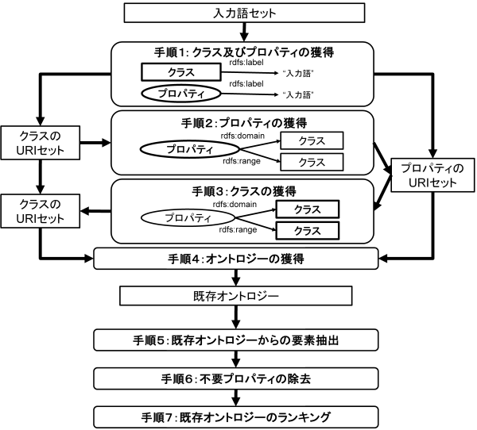

オントロジー選択モジュールの設計
================================

.. contents:: コンテンツ 
   :depth: 3

オントロジー選択モジュールでは，ユーザは参照オントロジーの選択を行う．参照オントロジーは領域オントロジーを構築するための基礎となるオントロジーであり，DODDLE-OWLの各モジュールから参照される．DODDLE-OWLでは，WordNet [Miller95]_ （英語汎用オントロジー）およびEDR [Yokoi95]_ （日本語汎用オントロジー）を参照オントロジーとして利用可能である．さらに，OWL 形式で記述された既存オントロジーもDODDLE-OWL は参照オントロジーとして利用可能である．WordNet やEDR などの汎用オントロジーは，一般的かつ網羅的に定義がなされているため，領域オントロジー構築に利用する際には，領域に特化した構造へ，階層関係の修正や不要概念の除去などの洗練を行う必要がある．このことはユーザの負担となる．構築対象に関連する領域オントロジーがすでに存在する場合は，それらを再利用するほうが汎用オントロジーを参照オントロジーとするよりも，領域オントロジーを洗練するコストを軽減できると考えられる．また，DODDLE-OWLを用いて構築されるオントロジーはOWL形式であるため，それらも参照オントロジーとして利用することができる．よって，DODDLE-OWLでは，既存領域オントロジーが存在しない，または，既存領域オントロジーが，ユーザが構築対象とする領域オントロジーを網羅できていない場合には，汎用オントロジーを利用することができ，既存領域オントロジーが存在する場合には，より容易に対象とする領域オントロジーの構築支援を行うことができる．

Web 上に存在する既存オントロジーを参照オントロジーとして再利用するために，オントロジー選択モジュールには，オントロジー検索エンジンを用いた既存領域オントロジーの獲得機能がある．以下では，はじめに汎用オントロジーについて簡単に説明した後，オントロジー検索エンジンを用いた既存領域オントロジー獲得方法について述べる．

汎用オントロジー
----------------
DODDLE-OWLでは，汎用オントロジーとしてWordNet, EDR電子化辞書（一般辞書および専門辞書）を利用可能である．以下では簡単にそれぞれの汎用オントロジーについて説明する．

EDR電子化辞書
~~~~~~~~~~~~~

EDR電子化辞書 [Yokoi95]_ は， 独立行政法人 情報通信研究機構が提供している汎用オントロジーである．EDR電子化辞書は，日本語単語辞書，英語単語辞書，概念辞書，日英対訳辞書，英日対訳辞書，日 本語共起辞書，英語共起辞書，日本語コーパス，英語コーパス，専門用語辞書（情報処理）から構成される．DODDLE-OWLでは，これらの辞書の中か ら，日本語単語辞書，英語単語辞書，概念辞書，専門用語辞書（情報処理）を利用している．

WordNet
~~~~~~~

WordNet [Miller95]_ は， プリンストン大学で開発されている英語シソーラス（汎用オントロジー）である．名詞句辞書，動詞句辞書，形容詞句辞書，副詞句辞書，および見出し句辞書か ら構成されており，総計約10万の語彙を保持している．見出し句辞書は，見出し句，意味情報としての概念ID，辞書編集情報，品詞情報などから構成されて いるが，概念IDが，見出し句辞書と各辞書の間のリンクとして機能している．名詞句辞書と動詞句辞書は，概念ID，辞書編集情報，対応する見出し句リスト から構成されているが，概念群は階層構造を有している．また，一部の概念IDには，反対概念の概念ID，part ofやmember ofやsubstance ofの概念IDなども与えられている．形容詞句辞書と副詞句辞書も，概念ID，辞書編集情報，対応する見出し句リストから構成されているが，階層構造は持 たない．

オントロジー検索エンジンを用いた既存領域オントロジーの獲得
----------------------------------------------------------

既存領域オントロジーを再利用するためには，対象領域に関連する既存オントロジーをWeb 上から検索する必要がある．既存のオントロジー検索エンジンとして，OntoSelect [Buitelaar04]_ やSwoogle [Ding05]_ がある．OntoSelect は，Web 上のオントロジーを検索，選択，閲覧することを支援している．Swoogle には，2007 年現在，1 万以上のオントロジーが登録されており，クラス単位，プロパティ単位の検索やオントロジー内に明示的に記述されていない逆リンクの関係を検索することができる．

既存のオントロジー検索エンジンは，対象領域に関連する既存オントロジー検索に利用可能であるが，領域オントロジー構築の観点からはいくつか問題がある．既存のオントロジー検索エンジンは，クラス単位やプロパティ単位での検索を支援しているが，複数のクラスやプロパティを含むオントロジーの検索や対象領域と関連の深いオントロジーの検索は支援していない．Swoogle には，google のページランク [Page98]_ に類似したオントロジーのためのランキングの仕組み(OntoRank) や，クラスおよびプロパティのためのランキングの仕組み(TermRank) が導入されている．OntoRank やTermRank では，より多くのセマンティックWeb コンテンツから参照されているクラスやプロパティを高くランキングしているが，領域オントロジー構築の観点からは，必ずしも多数のセマンティックWeb コンテンツから参照されているオントロジーが利用可能とは限らない．ユーザが構築の対象としている領域に関連する既存オントロジーを適切に検索するための仕組みが必要となる．また，既存オントロジーを修正することなく再利用できることは少ないため，領域オントロジー構築支援環境とオントロジー検索エンジンは連携できたほうが望ましいと考えられる．

Swoogle は，オントロジーを検索するための19 種類のREST 形式のWeb サービス（Swoogle Web サービス）を提供している．DODDLE-OWLから既存オントロジーを再利用するためには，ソフトウェアからオントロジーを検索することが必要となるため，Webサービスを提供しているSwoogle を，既存領域オントロジーの獲得に利用する．

オントロジー選択モジュールでは，:numref:`ontology_ranking` に示す手順で，Swoogle を用いて既存オントロジーの獲得およびランキングを行う．

1. 入力語をURI のローカル名またはrdfs:label プロパティの値として持つクラスおよびプロパティ（入力概念）の獲得
2. 手順1 で獲得したクラスを定義域または値域とするプロパティの獲得
3. 手順1 および2 で獲得したプロパティの定義域および値域（クラス）を獲得
4. 手順1 から3 で獲得したクラスおよびプロパティを定義しているオントロジーの獲得
5. 手順4 で獲得したオントロジーからの要素抽出
6. 手順4 で獲得したオントロジーに定義されたプロパティの中で，定義域および値域が入力概念または入力概念の上位概念でないものの削除
7. 手順4 で獲得した既存オントロジーのランキング

手順5については，既存オントロジーからの要素抽出 で述べる．手順7 については，既存オントロジーのランキング で述べる．

.. _ontology_ranking:

   Swoogleを用いた既存オントロジーの獲得およびランキング

表1: OWL 基本語彙，SKOS, WordNet RDF/OWL におけるオントロジーの要素を特定するクラスおよびプロパティ一覧   

=====================  =============================================================
オントロジーの要素     オントロジーの要素を特定するクラスおよびプロパティ一覧
=====================  =============================================================
概念                   | rdfs:Class, owl:Class, rdf:Property, owl:ObjectProperty, etc
                       | skos:Concept
                       | wn20schema:WordSense, wn20schema:NounWordSense, etc
概念の見出し           | rdfs:label
                       | skos:prefLabel, skos:altLabel, skos:hiddenLabel
                       | wn20schema:lexicalForm
概念の説明             | rdfs:comment
                       | skos:definition
                       | wn20schema:gloss
階層関係               | rdfs:subClassOf, rdfs:subPropertyOf
                       | skos:broader, skos:narrower
                       | wn20schema:hypernymOf, wn20schema:hyponymOf
その他の関係           | rdfs:domain, rdfs:range
                       | skos:related
                       | wn20schema:antonymOf, wn20schema:partMeronymOf, etc
=====================  =============================================================

既存オントロジーからの要素抽出
------------------------------

OWLオントロジーを参照オントロジーとして領域オントロジー構築支援で利用するためには，オントロジー構築支援に利用可能な要素をOWLオントロジーから抽出する必要がある．DODDLE-OWLでは，領域オントロジーにおける階層関係およびその他の関係の定義を支援している．概念関係およびその他の関係を定義するために必要なOWLオントロジーの要素は，概念（クラスおよびプロパティ），概念の見出し，概念の説明，階層関係，その他の関係である．概念の抽出は，領域オントロジー構築において必須である．概念の見出しは，入力語と概念を対応づける（入力概念選択）ために必要である．概念の説明は，入力語に対応する概念が複数ある場合に，入力概念をユーザが選択する際の参考となる．階層関係はクラスおよびプロパティ階層を構築する際に必要である．その他の関係を定義するために，プロパティの定義域および値域を抽出する必要がある．RDFS,DAML, OWL などのオントロジー記述言語は，上記のオントロジーの要素を定義するために基本的なクラスやプロパティを提供している．

Swoogle では，現状ではRDFS, DAML, OWLが提供している基本的なクラスおよびプロパティに基づいて，オントロジーの検索を行うことができるようになっている．例えば，Swoogle ではクラスを，次の(X, Y, Z) というステートメントを満たすXと定義している．

* X は匿名リソース（空白ノード）ではない
* Y はrdf:type プロパティである
* Zは以下のいずれかのクラスである- rdfs:Class, owl:Class, owl:Restriction, owl:DataRange, daml:Class, daml:Datatype, daml:Restriction

Swoogle が扱う範囲のクラスやプロパティのみをOWL オントロジーから抽出する場合には，Swoogle の定義に従ってオントロジーの要素を抽出すればよい．しかし，それ以外の形式で定義された汎用オントロジーやシソーラスが存在する．[Koide06]_ ではWordNetやEDR のOWL化について検討しており，それらはSwoogle で定義しているクラスやプロパティとは構造が異なっている．:numref:`label_extraction` にOWL 基本語彙，SKOS (Simple Knowledge Organisation System) [Miles05]_ ，WordNet RDF/OWLにおける“概念の見出し” の表現方法を示す． [Nakayama06]_ では，Wikipedia に対してWeb マイニングを行う手法であるWikipedia マイニングを提案し，シソーラス辞書を構築している (wikipedia-lab ) ．構築されたWikipedia シソーラスを表現するための語彙としてSKOS を用いている．SKOS では，概念を表すクラスとしてskos:Concept，上位概念を表すプロパティとしてskos:broader などの語彙が定義されており，OWL基本語彙とは異なっている．表1 にOWL基本語彙，SKOS, WordNet RDF/OWLにおけるオントロジーの要素を特定するクラスおよびプロパティ一覧を示す．

DODDLE-OWLでは，多用な形式のオントロジーからオントロジーの要素を抽出するために，クラス抽出テンプレート，プロパティ抽出テンプレート，見出しと説明抽出テンプレート，階層関係抽出テンプレート，その他の関係抽出テンプレートの5 種類のテンプレートをRDF クエリー言語SPARQL[hommeaux08]_ を用いて記述し，OWL オントロジーと対応づけている．

.. _label_extraction:
.. figure:: figures/label_extraction.png
   :scale: 80 %
   :alt: OWL基本語彙，SKOS，WordNet RDF/OWLスキーマにおける“概念の見出し”の表現方法
   :align: center

   OWL基本語彙，SKOS，WordNet RDF/OWLスキーマにおける“概念の見出し”の表現方法

既存オントロジーのランキング
----------------------------

DODDLE-OWLは，現状ではSwoogle のOntoRank およびTermRank，オントロジー中の入力概念を含む割合，オントロジー中の入力概念に関するその他の関係数の四つをランキングのための指標としている．OntoRank およびTermRank は，[Ding05]_ で提案されているオントロジーとクラスおよびプロパティをランキングするための指標である．本研究では，入力概念をより多く含むオントロジーを対象領域に関連するオントロジーと仮定する．また，入力概念に関するその他の関係をより多く定義しているオントロジーも対象領域に関連するオントロジーと仮定する．入力概念を含む割合が同程度のオントロジーについては，OntoRank を参考にすることで，ユーザはより多くのセマンティックWeb 文書で参照されているオントロジーを再利用することが可能となる．語の多義性により，入力概念の候補が複数ある場合には，TermRank を参考にすることで，ユーザはより多くのオントロジーで参照されている入力概念を再利用することが可能となる．

既存オントロジー再利用における課題
----------------------------------

DODDLE-OWLでは，階層関係構築支援を行うために，参照オントロジーから入力概念に関連するパスを抽出し，合成および不要概念の剪定を行う．Web 上に散在する異種のオントロジーのパスを合成する際には，上位概念階層の構造の違いにより単純に合成することは困難である．そのため，オントロジーアライメントによる類似概念の同定が必要となる．現状では，オントロジーアライメントを用いた階層関係構築支援は実現できていない．オントロジーアライメントについては，オントロジーアライメントのコンテスト が活発に行われており，ツールも多数公開されている．オントロジーアライメントツールとDODDLE-OWLの連携については，今後の課題である．

参考文献
--------
.. [Miller95] G.A.Miller, “WordNet: A Lexical Database for English,” Commun. ACM, vol.38, no.11, pp.39?41, 1995.
.. [Yokoi95] T. Yokoi, “The EDR Electronic Dictionary,” Commun. ACM, vol.38, no.11, pp.42-44, 1995, http://www2.nict.go.jp/r/r312/EDR/.
.. [Buitelaar04] P. Buitelaar, “OntoSelect: Towards the Integration of an Ontology Library, Ontology Selection and Knowledge Markup,” Proceedings of the Workshop on Knowledge Markup and Semantic Annotation (Semannot2004), 2004,http://olp.dfki.de/ontoselect.
.. [Ding05] L. Ding, R. Pan, T. Finin, A. Joshi, Y. Peng, and P. Kolari, “Finding and Ranking Knowledge on the Semantic Web,” Proceedings of the 4th International Semantic Web Conference, LNCS 3729, pp.156?170, 2005, http://swoogle.umbc.edu/.
.. [Page98] L. Page, S. Brin, R. Motwani, and T. Winograd, “The PageRank Citation Ranking: Bringing Order to the Web,” Technical report, Stanford Digital Library Technologies Project, 1998, http://citeseer.ist.psu.edu/page98pagerank.html.
.. [Koide06] 小出誠二，森田武史，山口高平，ムリアディヘンドリー，武田英明，“WordNet とEDR のOWL 表現，” 人工知能学会セマンティックWeb とオントロジー研究会SIGSWO-A601-03，2006.
.. [Miles05] A. Miles, and D. Brickley, “SKOS Core Guide,” , 2005, http://www.w3.org/TR/swbp-skos-core-guide/.
.. [Nakayama06] 中山浩太郎，原隆浩，西尾章治郎，“Wikipedia マイニングによるシソーラス辞書構築手法，” 情報処理学会論文誌，vol.47，no.10，pp.2917?2928，2006，http://wikipedialab.org/.
.. [hommeaux08] E. Prud’hommeaux, and A. Seaborne, “SPARQL Query Language for RDF,” W3C Recommendation, 2008, http://www.w3.org/TR/rdf-sparql-query/.
