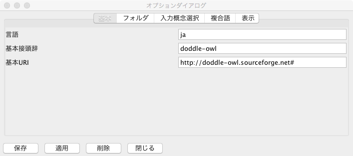
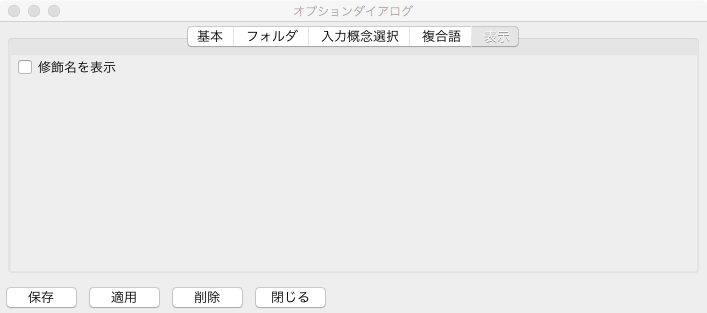

==========================
ユーザマニュアル
==========================

.. contents:: コンテンツ 
   :depth: 3

.. |MR3| replace:: MR\ :sup:`3` \

実装アーキテクチャ
=============================
:numref:`implementation_architecture` にDODDLE-OWLの実装アーキテクチャを示す．DODDLE-OWLは，GUI コンポーネントにJava Swing を用い，Java 言語で実装した．DODDLE-OWL は，オントロジー選択モジュール，入力モジュール，オントロジー構築・洗練モジュール，視覚化モジュール，および変換モジュールから構成される．操作性を考慮し，オントロジー構築およびオントロジー洗練は，同一パネル上で処理する仕様とした．

Web 上の既存オントロジーを獲得するために，オントロジー選択モジュールではSwoogle Web サービスを利用している．入力モジュールおよびオントロジー構築・洗練モジュールでは，WordNet を参照するために `extJWNL(Extended Java WordNet Library)  <http://extjwnl.sourceforge.net/Java>`_ を利用している．入力モジュールでは，日本語の形態素解析および品詞同定のために，日本語形態素解析器 `lucene-gosen <https://github.com/lucene-gosen/lucene-gosen>`_ を用いている．また，英語の品詞同定のために `The Stanford Parser <https://nlp.stanford.edu/software/lex-parser.shtml>`_ を用いている．英語および日本語の複合語を抽出するために，専門用語自動抽出システムである言選 [Nakagawa03]_ を用いている．さらに，日本語の複合語抽出においては，言選に加えて，日本語係り受け解析器 `CaboCha <http://taku910.github.io/cabocha/>`_ を用いることもできる． `Apache POI <http://poi.apache.org>`_ および `Apache PDFBox <https://pdfbox.apache.org>`_ を利用することにより，テキスト文書に加えて，PDF，Microsoft Word, Excel, PowerPoint など複数の形式のファイルからテキストを抽出できる．視覚化モジュールには |MR3| <http://mrcube.org>を用いている．変換モジュールでは，OWL 形式のオントロジーのインポートおよびエクスポートを支援するために， `Apache Jena <http://jena.apache.org>`_ を用いている． 

.. _implementation_architecture:
.. figure:: figures/implementation-architecture-of-doddle-owl.svg
   :scale: 100 %
   :alt: DODDLE-OWLの実装アーキテクチャ
   :align: center

   DODDLE-OWLの実装アーキテクチャ

オントロジー選択モジュール
======================================

Swoogle を用いた既存オントロジーの獲得
----------------------------------------------------
オントロジー検索エンジン Swoogle は19種類の REST 形式の Web サービス（Swoogle　Web サービス）を提供している．ユーザは URL を用いてクエリーを作成し，RDF/XML 形式の検索結果を取得できる．:numref:`swoogle-web-service-io` に，領域オントロジー構築支援に利用可能な Swoogle Web サービスとその入出力を示す．:numref:`swoogle-web-service-io` において，SWT (Semantic Web Term) はクラスまたはプロパティを表す．SWD (Semantic Web Document) は，RDF/XML，N-Triple，N3 形式で記述された RDF 文書を表す．SWO (Semantic Web Ontology) は，クラスおよびプロパティの定義の割合が8割以上である SWD を表す．

.. list-table:: 領域オントロジー構築支援に利用可能なSwoogle Webサービスとその入出力
   :name: swoogle-web-service-io

   * - タイプ
     - Swoogle Webサービス
     - 入力
     - 出力
   * - 1
     - Search ontology
     - 検索キーワード
     - 検索キーワードに関連するSWO のリスト
   * - 3
     - Search terms
     - 検索キーワード    
     - 検索キーワードに関連するSWT のリスト
   * - 4
     - Digest semantic web document
     - SWD
     - SWD のSwoogle メタデータ
   * - 13
     - List documents using term
     - SWT
     - SWT を定義，参照，populate しているSWD のリスト
   * - 16
     - ist domain classes of a property
     - プロパティ
     - 入力したプロパティの定義域のリスト
   * - 17
     - List properties of a domain class
     - クラス
     - 入力したクラスを定義域とするプロパティのリスト
   * - 18
     - List range classes of a property
     - プロパティ
     - 入力したプロパティの値域のリスト
   * - 19
     - List properties of a range class
     - クラス
     - 入力したクラスを値域とするプロパティのリスト

:numref:`swoogle-web-service-type-and-condition` は，:numref:`ontology_ranking` で示した既存オントロジー獲得の手順1から4の各段階で利用する Swoogle Web サービスのタイプおよび実行条件を示す．:numref:`swoogle-web-service-type-and-condition` に示す手順は，:numref:`ontology_ranking` に示す手順と一致している．また，各段階で利用する Swoogle Web サービスのタイプは，:numref:`swoogle-web-service-io` に示したタイプの番号と対応している．さらに，計算時間を削減するために，各段階において実行条件を設定している．
 
.. list-table:: 既存オントロジー獲得の各手順で利用するSwoogle Web サービスのタイプおよび実行条件
  :name: swoogle-web-service-type-and-condition

  * - 手順
    - 各手順で利用するSwoogle Web サービスのタイプ
    - 実行条件
  * - 1
    - 3
    - 各入力語について，獲得するクラスおよびプロパティ数は， TermRank によりランク付けされた上位5 個までとする．
  * - 2
    - 17, 19
    - 手順1 で獲得したクラスをrdfs:domain またはrdfs:range プロパティの値として持つプロパティの獲得数は，各クラスごとに上位100 個までとする．
  * - 3
    - 16, 18
    - 手順1 および2 で獲得したプロパティの定義域および値域の獲得数は，各プロパティごとに上位100 個までとする．
  * - 4
    - 1, 4, 13
    - 各入力語について獲得するオントロジー数は，OntoRank でランク付けされた上位10 個までとする．

.. _extracting-ontology-elements-using-sparql-template:

SPARQL テンプレートを用いたオントロジー要素抽出
---------------------------------------------------------------------
:numref:`sparql-template1` から :numref:`sparql-template5` にRDFS，DAML，OWL 語彙におけるオントロジー要素を抽出するための SPARQL で記述したテンプレートを示す．:numref:`sparql-template3` に示す見出しおよび説明抽出テンプレートをそのまま SPARQL クエリーとして用いた場合，OWL オントロジー中のすべての rdfs:label および rdfs:comment プロパティの値を抽出してしまう．そこで，オントロジー選択モジュールでは，?concept 変数の部分を取得対象となる概念（クラスまたはプロパティ）のURIに置換することにより，特定の概念に対応する見出しおよび説明のみを抽出できるようにしている．他のテンプレートについても同様に，テンプレートを直接 SPARQL クエリーとして用いるのではなく，変数部分をオントロジー選択モジュールが適切な URI に置換したものを最終的な SPARQL クエリーとしている．?concept, ?subConcept, ?class, ?property, ?label, ?description,?domain, ?range といった変数を用いて，各オントロジーの要素を抽出するためのトリプルのパターンをテンプレートとして記述し，これらを OWLオントロジーに対応付けることで，多様なクラス，プロパティ，および構造で表現されたオントロジー要素を抽出できる．

.. code-block:: sparql
   :caption: RDFS，DAML，OWL基本語彙におけるクラス抽出テンプレート
   :name: sparql-template1

     PREFIX rdf: <http://www.w3.org/1999/02/22-rdf-syntax-ns#>
     PREFIX rdfs: <http://www.w3.org/2000/01/rdf-schema#>
     PREFIX owl: <http://www.w3.org/2002/07/owl#>
     PREFIX daml03: <http://www.daml.org/2001/03/daml+oil#>
     PREFIX daml10: <http://www.w3.org/2001/10/daml+oil#>

     SELECT ?class WHERE {
          {?class rdf:type rdfs:Class} UNION {?class rdf:type owl:Class} UNION
          {?class rdf:type owl:Restriction} UNION {?class rdf:type owl:DataRange} UNION
          {?class rdf:type daml03:Class} UNION {?class rdf:type daml03:Datatype} UNION
          {?class rdf:type daml03:Restriction} UNION  {?class rdf:type daml10:Class} UNION
          {?class rdf:type daml10:Datatype} UNION {?class rdf:type daml10:Restriction}
     }

.. code-block:: sparql
   :caption: RDFS，DAML，OWL基本語彙におけるプロパティ抽出テンプレート
   :name: sparql-template2

     PREFIX rdf: <http://www.w3.org/1999/02/22-rdf-syntax-ns#>
     PREFIX rdfs: <http://www.w3.org/2000/01/rdf-schema#>
     PREFIX owl:  <http://www.w3.org/2002/07/owl#>
     PREFIX daml03: <http://www.daml.org/2001/03/daml+oil#>
     PREFIX daml10: <http://www.w3.org/2001/10/daml+oil#>

     SELECT ?property WHERE {
         {?property rdf:type rdf:Property} UNION {?property rdf:type owl:ObjectProperty} UNION
         {?property rdf:type owl:DatatypeProperty} UNION {?property rdf:type owl:AnnotationProperty} UNION
         {?property rdf:type owl:FunctionalProperty} UNION {?property rdf:type owl:InverseFunctionalProperty} UNION
         {?property rdf:type owl:SymmetricProperty} UNION {?property rdf:type owl:OntologyProperty} UNION
         {?property rdf:type owl:TransitiveProperty} UNION {?property rdf:type daml03:Property} UNION
         {?property rdf:type daml03:ObjectProperty} UNION {?property rdf:type daml03:DatatypeProperty} UNION
         {?property rdf:type daml03:TransitiveProperty} UNION {?property rdf:type daml03:DatatypeProperty} UNION
         {?property rdf:type daml03:UniqueProperty}  UNION {?property rdf:type daml10:Property} UNION
         {?property rdf:type daml10:ObjectProperty} UNION {?property rdf:type daml10:DatatypeProperty} UNION
         {?property rdf:type daml10:TransitiveProperty} UNION {?property rdf:type daml10:DatatypeProperty} UNION
         {?property rdf:type daml10:UniqueProperty}
     }

.. code-block:: sparql
   :caption: RDFS，DAML，OWL基本語彙における見出しおよび説明抽出テンプレート
   :name: sparql-template3

     PREFIX rdfs: <http://www.w3.org/2000/01/rdf-schema#>
     PREFIX daml03: <http://www.daml.org/2001/03/daml+oil#>
     PREFIX daml10: <http://www.w3.org/2001/10/daml+oil#>

     SELECT ?label ?description WHERE {
          {?concept rdfs:label ?label} UNION {?concept rdfs:comment ?description} UNION
          {?concept daml03:label ?label} UNION {?concept daml03:comment ?description} UNION
          {?concept daml10:label ?label} UNION  {?concept daml10:comment ?description}
     }
 
.. code-block:: sparql
   :caption: RDFS，DAML，OWL基本語彙における階層関係抽出テンプレート
   :name: sparql-template4

     PREFIX  rdfs: <http://www.w3.org/2000/01/rdf-schema#>
     PREFIX daml03: <http://www.daml.org/2001/03/daml+oil#>
     PREFIX daml10: <http://www.w3.org/2001/10/daml+oil#>

     SELECT ?subConcept WHERE {
         {?subConcept rdfs:subClassOf ?concept} UNION {?subConcept rdfs:subPropertyOf ?concept} UNION
         {?subConcept daml03:subClassOf ?concept} UNION {?subConcept daml03:subPropertyOf ?concept} UNION
         {?subConcept daml10:subClassOf ?concept} UNION {?subConcept daml10:subPropertyOf ?concept}
     }

.. code-block:: sparql
   :caption: RDFS，DAML，OWL基本語彙におけるその他の関係抽出テンプレート
   :name: sparql-template5

     PREFIX rdfs: <http://www.w3.org/2000/01/rdf-schema#>
     PREFIX daml03: <http://www.daml.org/2001/03/daml+oil#>
     PREFIX daml10: <http://www.w3.org/2001/10/daml+oil#>

     SELECT ?property ?domain ?range WHERE {
         {?property rdfs:domain ?domain} UNION  {?property rdfs:range ?range} UNION
         {?property daml03:domain ?domain} UNION {?property daml03:range ?range} UNION
         {?property daml10:domain ?domain} UNION {?property daml10:range ?range}
     }

汎用オントロジー選択パネル
-------------------------------------------
:numref:`ontology-selection-panel` に汎用オントロジー選択パネルを示す．:numref:`ontology-selection-panel` -1 に示すように，5種類の汎用オントロジーである WordNet，日本語WordNet，日本語Wikipediaオントロジー，EDR 一般辞書，EDR 専門辞書の中から参照オントロジーを選択する．WordNet については，ver.3.0 と ver.3.1 のいずれかを選択できる．チェックボックスで選択した汎用オントロジーを用いて，その後，領域オントロジーにおける概念階層を構築する．領域によっては，一つの汎用オントロジーのみでは語彙を網羅できない場合があるため，複数の汎用オントロジーを組み合わせて利用できるようにしている．:numref:`ontology-selection-panel` -2 に示す名前空間テーブルは，名前空間 URI とその名前空間接頭辞の対応関係を管理している．さらに，:numref:`ontology-selection-panel` -3 において接頭辞と名前空間を入力し，:numref:`ontology-selection-panel` -3 右側の「追加」ボタンを用いて登録することができる．

.. _ontology-selection-panel:
.. figure:: figures/ontology-selection-panel.png
   :scale: 50 %
   :alt: 汎用オントロジー選択パネル
   :align: center

   汎用オントロジー選択パネル

OWLオントロジー選択パネル
------------------------------------------
:numref:`owl-ontology-selection-panel` に OWL オントロジー選択パネルを示す．:numref:`owl-ontology-selection-panel` -1 に示す「追加（ファイル）」または「追加(URI)」ボタンにより，参照オントロジーとして用いる既存の OWL オントロジーを選択する．:numref:`owl-ontology-selection-panel` -3 には，:numref:`owl-ontology-selection-panel` -1 のオントロジーリストで選択したオントロジーの OWL メタデータが表示される．また，:numref:`owl-ontology-selection-panel` -2 において，OWL オントロジーから抽出する要素を決定するための SPARQL テンプレートを指定する．SPARQL テンプレートの種類としては， :ref:`extracting-ontology-elements-using-sparql-template` で述べた5種類を利用できる．

.. _owl-ontology-selection-panel:
.. figure:: figures/owl-ontology-selection-panel.png
   :scale: 50 %
   :alt: OWLオントロジー選択パネル
   :align: center

   OWLオントロジー選択パネル

入力文書選択パネル
=================================
:numref:`input-document-selection-panel` に入力文書選択パネルを示す．入力文書選択パネルでは，領域に関連する英語または日本語で記述された文書を選択する．また，Apache POI および Apache PDFBox を用いることにより，Word, Excel, PowerPoint, PDF などの複数の形式のファイルからテキストデータを抽出できる．単語を抽出する際には，抽出する単語の品詞を指定できるようにしている．具体的には，名詞，動詞，その他の品詞，または複合語を抽出できる．以下に， :numref:`input-document-selection-panel` の各構成要素について説明する．

.. _input-document-selection-panel:
.. figure:: figures/input-document-selection-panel.png
   :scale: 50 %
   :alt: 入力文書選択パネル
   :align: center

   入力文書選択パネル

#. 入力文書のリストを表示する．
#. 入力文書の記述言語として，日本語または英語を選択し，入力文書の追加および削除を行う．
#. 1文の区切り文字を設定する．
#. 入力文書リストの中から選択された文書の内容を表示する．
#. 抽出対象とする語の品詞，複合語を抽出するかどうか，および1文字の語を抽出するかどうかを選択する．
#. 入力文書リストで選択された文書中から，前項で指定した条件を満たす語を抽出する．

入力語選択パネル
=================================
入力語選択パネルは，入力文書ビューア，入力語情報テーブル，削除語情報テーブルから構成される．以下では，各構成要素について説明する．

入力文書ビューア
--------------------------
入力文書ビューアでは，入力文書の内容を確認しながら，ユーザが入力語を選択できる．:numref:`input-document-viewer` に入力文書ビューアのスクリーンショットを示す．以下では，入力文書ビューアを構成するの各要素について説明する．

.. _input-document-viewer:
.. figure:: figures/input-document-viewer.png
   :scale: 50 %
   :alt: 入力文書ビューア
   :align: center

   入力文書ビューア

#. 入力文書リストを表示する．
#. 1で選択した入力文書の内容を3に表示する際に，文書中の行範囲を選択する．
#. 1で選択した入力文書の内容を表示する．表示される行範囲は2で選択した範囲に基づく．入力文書中のハイパーリンクが張られた語をクリックすることにより，入力語または不要語を選択できる．青色のリンクは入力語を，灰色のリンクは不要語を表す．
#. 3のハイパーリンクにマウスカーソルを合わせた際に，当該語の用語名，品詞，TF，IDF，TF-IDF，および上位概念を表示する．
#. 1で選択した入力文書の内容を分割して3に表示する際の分割行数を設定する．
#. 自動用語抽出により抽出できなかった用語を，手動で追加できる．また，3において用語を範囲選択し，マウスを右クリックすることにより，同様に手動で用語を追加できる．追加された用語には，3において青色のハイパーリンクが張られる．
#. 3に表示される入力文書の内容に対して，ハイパーリンクを張る用語の種類として，複合語，名詞，動詞，またはその他の品詞を選択する．

入力語情報テーブル
---------------------------------
入力語情報テーブルでは，入力文書から自動抽出された語の中から入力語を選択できる．:numref:`input-term-table` に入力語情報テーブルのスクリーンショットを示す．以下では，入力語情報テーブルを構成する各要素について説明する．

.. _input-term-table:
.. figure:: figures/input-term-table.png
   :scale: 50 %
   :alt: 入力語情報テーブル
   :align: center

   入力語情報テーブル

#. ユーザが入力した用語に基づいて，3に表示する用語情報リストを絞り込む．
#. ユーザが入力した品詞に基づいて，3に表示する用語情報リストを絞り込む．
#. 入力文書から自動抽出された用語情報を表示する．用語情報には，用語名，品詞，TF，IDF，TF-IDF，上位概念が含まれており，各観点に基づいてリストをソートできる．抽出された語が，あらかじめユーザが用意した参照オントロジー中の概念の下位概念の見出しに含まれる場合，当該概念の見出しを上位概念として表示する．また，概念階層中の上位概念をあらかじめ設定することにより，抽出された語を「もの」「場所」「時間」などに分類して表示でき，入力語の選択を支援する．
#. 3の中で選択された用語情報について，当該用語の入力文書中の出現箇所を表示する．
#. 最終的にユーザが決定した入力語のリストを表示する．当該領域はテキストエリアとして構成されており，入力文書に出現しなかった入力語をユーザが追加できる．
#. 「入力語リストに追加」ボタンを押すと，3の中で選択された行の用語を5の入力語リストに追加する．また，「削除」ボタンを押すと，3の中で選択された用語情報の用語を「削除語テーブル」に移動する．
#. 5に入力された入力語を確定し，入力概念選択パネルに遷移する．「入力語彙をセット」ボタンを押した場合は，新規の入力語リストを入力概念選択パネルに設定する．一方，「入力語彙を追加」ボタンを押した場合は，設定済みの入力語リストに新たな入力語を追加する．

削除語情報テーブル
------------------------------------
削除語情報テーブルには，入力語情報テーブルから削除された用語情報のリストを表示する．:numref:`removed-term-table` に削除語情報テーブルのスクリーンショットを示す．削除語情報テーブルの各構成要素は，入力語情報テーブルと同様である．相違点は，「戻す」ボタンと「完全削除」ボタンの有無である．「戻す」ボタンを用いることにより，誤って削除語情報テーブルに移動した用語情報を入力語情報テーブルに戻セル．また，「完全削除」ボタンを用いることにより，用語情報をリストから完全に削除できる．

.. _removed-term-table:
.. figure:: figures/removed-term-table.png
   :scale: 50 %
   :alt: 削除語情報テーブル
   :align: center

   削除語情報テーブル

入力概念選択パネル
============================
:numref:`input-concept-selection-panel` に入力概念選択パネルを示す．入力概念選択パネルでは，入力語と参照オントロジー中の概念との対応付けを行う．語には多義性が存在するため，ある入力語を見出しとして持つ概念が複数存在する場合がある．入力概念選択パネルでは，対象領域にとって最も適切な入力語に対応する概念を選択する際の支援を行う．以下に，入力概念選択パネルを構成する各要素について説明する．

.. _input-concept-selection-panel:
.. figure:: figures/input-concept-selection-panel.png
   :scale: 50 %
   :alt: 入力概念選択パネル
   :align: center

   入力概念選択パネル

#. **用語リスト**: 入力語彙の中から，参照オントロジー中の概念見出しと完全照合または部分照合した用語のリストを表示する．
#. **概念リスト**: 1で選択された語を見出しとしてもつ参照オントロジー中の概念のリストを表示する．
#. **概念情報**: 	2で選択された概念の見出しおよび説明を，言語ごとに分類して表示する．
#. **未定義語リスト**: 参照オントロジー中の概念の見出しと照合しなかった入力語（未定義語）を表示する．
#. **概念階層**: 2で選択された概念について，参照オントロジー中の概念階層を表示する．
#. **入力文書**: 1で選択された語の入力文書中における出現箇所を表示する．
#. **階層構築オプション**: 階層構築の構築における条件を設定する．

用語リスト
-----------------------
:numref:`input-concept-selection-panel-term-list` は :numref:`input-concept-selection-panel` -1 用語リストを拡大した図である．以下では，入力概念選択パネルの用語リストを構成する各要素について説明する．

.. _input-concept-selection-panel-term-list:

   入力概念選択パネル: 用語リスト

#. テキストフィールドに検索キーワードを入力し，検索ボタンを押すと，2および3の完全照合語リストならびに部分照合語リストに，検索キーワードを含む入力語のみが表示される．
#. 完全照合語リストを表示する．1番目の括弧内には，入力語を見出しとする参照オントロジー中の概念の数が表示される．また，システムが自動的に追加した入力語については，2番目の括弧内に「自動追加」と表示される．
#. 部分照合語リストを表示する．1番目の括弧内には，部分照合語を形態素解析し，各形態素を「+」記号で結合した結果が表示される．2番目の括弧内には，参照オントロジー中の概念の見出しと照合した部分照合語内の語が表示される．3番目の括弧内には，2番目の括弧内に表示された語を見出しとする参照オントロジー中の概念の数が表示される．
#. 完全照合語リストに関する設定を行うことができる． 

    #. 「意味数」チェックボックスは，完全照合語リスト中の各語を見出しとする参照オントロジー中の概念数を表示するかどうかを設定するオプションである．
    #. 「システムが追加した入力語」チェックボックスは，完全照合語リスト中の語について，システムが自動的に追加した語であるかどうかを表示するかどうかを設定するオプションである．部分照合語のうち，参照オントロジー中の概念と照合した語をユーザが入力語として追加していない場合，システムは当該語を自動的に完全照合語として完全照合語リストに追加する．例えば「資格取得日」をユーザが入力語として選択した場合，「資格取得日」自体は参照オントロジー中の概念の見出しに存在しないため，部分照合語となる．このとき，「資格取得日」の「日」に対して部分照合が行われる．ユーザが「日」を入力語として選択している場合には問題は生じないが，選択していない場合には，「日」が自動的に完全照合語リストに追加される．システムが自動的に追加した語には，「（自動追加）」と表示される．
    #. 「入力概念選択結果を対応する部分照合語リストに適用」チェックボックスは，完全照合語に対する入力概念選択結果を，当該完全照合語に照合した部分照合語リストの入力概念選択に反映させるかどうかを設定するオプションである．例えば，完全照合語「日」に対して入力概念選択を行った結果を，部分照合語リスト中の「資格取得日」や「研究日」などに反映させるかどうかを設定できる．

#. 部分照合語リストに関する設定を行うことができる．

    #. 「意味数」チェックボックスは4の完全照合語リストのオプションにおける「意味数」と同様の機能である． 
    #. 「形態素リスト」チェックボックスは，部分照合語を形態素解析器により形態素に分割した際の分割結果を表示するかどうかを設定するオプションである．本オプションを有効にした場合，例えば，「資格取得日」に対して，「（資格+取得+日）」が表示される．ここで，「+」記号は形態素の区切りをあらわす． 
    #. 「照合結果」チェックボックスは，部分照合語の形態素リストの中で，参照オントロジー中の概念と照合した形態素リストを表示するかどうかを設定するオプションである．本オプションを有効にした場合，例えば，「資格取得日」は「日」で照合されるため，「（日）」と表示される． 
    #. 「選択中の完全照合語に対応する複合語のみ表示」チェックボックスは，完全照合語リストで選択した語を照合語とする部分照合語のみを表示するかどうかを設定するオプションである．本オプションを有効にした場合，例えば，完全照合語リスト中の「日」を選択すると，「資格取得日」や「研究日」など，「日」と照合した部分照合語のみが部分照合語リストに表示される．

#. 入力語の追加および削除を行うことができる．

概念リスト
-------------------
:numref:`input-concept-selection-panel-concept-list` は :numref:`input-concept-selection-panel` -2「概念リスト」を拡大した図である．

.. _input-concept-selection-panel-concept-list:
.. figure:: figures/input-concept-selection-panel-concept-list.png
   :scale: 50 %
   :alt: 入力概念選択パネル: 概念リスト
   :align: center

   入力概念選択パネル: 概念リスト

概念リストは，:numref:`input-concept-selection-panel-term-list` -2 または-3で選択した完全照合語もしくは部分照合語を見出しとして持つ，参照オントロジー中の概念のリストを表示する．:numref:`input-concept-selection-panel-concept-list` は，「エネルギー」を見出しとして持つ参照オントロジー中の概念リストを示している．本例では，参照オントロジーとして日本語 WordNetを用いている．リストの各項目は，三つの部分から構成されている．左側には，入力モジュールの設計で述べた自動概念選択方法により算出した，入力語に対応する概念候補の評価値を表示する．入力語に対応する概念候補は，評価値の降順で表示され．評価値が高い概念ほど，入力概念となる可能性が高い．中央は概念の ID を表示する．概念の ID は URI で表され，画面上には修飾名を表示する．jwn は日本語WordNet の名前空間接頭辞を示しており，ここで表示される接頭辞は，汎用オントロジー選択パネル ( :numref:`ontology-selection-panel` -2) に示した名前空間テーブルで設定したものを用いている．右側には，概念の見出しが複数存在する場合，そのうちのいずれか一つを表示する．

概念情報
--------------------
:numref:`input-concept-selection-panel-concept-info` は :numref:`input-concept-selection-panel` -3「概念情報」を拡大した図である．

.. _input-concept-selection-panel-concept-info:
.. figure:: figures/input-concept-selection-panel-concept-info.png
   :scale: 50 %
   :alt: 入力概念選択パネル: 概念情報
   :align: center

   入力概念選択パネル: 概念情報

「概念情報」には，:numref:`input-concept-selection-panel-concept-list` の「概念リスト」で選択された概念の見出しおよび説明を表示する．「言語」リストで選択した言語に対応する見出しおよび説明が，「見出し」リストおよび「説明」リストに表示される．:numref:`input-concept-selection-panel-concept-info` の下部に配置された「構築オプション」では，概念階層の構築方法を設定できる．「構築オプション」には，:numref:`input-concept-selection-panel-term-list` の「用語リスト」で選択する用語の種類に応じて，3種類の表示方法がある．:numref:`input-concept-selection-panel-term-list` -2で完全照合語を選択した場合には，:numref:`input-concept-selection-panel-concept-info` の左側に示すように，「構築オプション」には何も表示されない．:numref:`input-concept-selection-panel-term-list` -2でシステムが自動的に追加した完全照合語（「自動追加」が表示される完全照合語）を選択した場合には，:numref:`input-concept-selection-panel-concept-info` の中央に示すように，「構築オプション」に「下位概念に置換」するかどうかを選択するチェックボックスが表示される．さらに，:numref:`input-concept-selection-panel-term-list` -3で部分照合語を選択した場合には， :numref:`input-concept-selection-panel-concept-info` の右側に示すように，「構築オプション」に「同一概念」または「下位概念」を選択するためのラジオボタンが表示される．

.. note::
	部分照合語の照合部分に含まれる語をユーザが入力語として選択していない場合，システムは当該語を自動的に入力語として追加する．このように自動的に追加された語を完全照合語（自動追加）と呼ぶ．

:numref:`input-concept-selection-panel-concept-info` 中央の「構築オプション」の例として，「火力発電」のみを入力語とした場合を考える．この場合，「火力発電」は部分照合語となり，「発電」と照合されるため，「発電」はシステムにより自動的に完全照合語リストに追加される．「発電」に対して入力概念選択を行う際には，:numref:`input-concept-selection-panel-concept-info` 中央の「構築オプション」として，「下位概念に置換」というチェックボックスが表示される．ここでは，「発電」はシステムにより自動的に追加された語であることから，ユーザが意図的に「発電」を入力語としなかったのか，あるいは入力語として選択し忘れたかを確認している．ユーザが意図的に「発電」を入力語としなかった場合には，概念階層中に「発電」は含めるべきではない．このとき，「構築オプション」において「下位概念に置換」を選択と，「火力発電」は「発電」の下位概念とはならず，概念階層中にも表示されない．一方，ユーザが「発電」を入力語として選択し忘れた場合には，「構築オプション」の「下位概念に置換」を選択しなければ，「火力発電」は「発電」の下位概念として概念階層が構築される．

:numref:`input-concept-selection-panel-concept-info` 右側の「構築オプション」の例として，「発電」と「火力発電」を入力語とした場合を考える．この場合も，上記と同様に「火力発電」は「発電」で照合される部分照合語である．「火力発電」に対して入力概念選択を行う際には，:numref:`input-concept-selection-panel-concept-info` 右側の「構築オプション」が表示される．「同一概念」を選択した場合は，概念階層の構築時に，「火力発電」は「発電」と同一の概念として扱われる．すなわち，「火力発電」は，「発電」概念に対応する参照オントロジー中の概念の別見出しとして，概念階層が構築される．一方，「下位概念」を選択した場合には，「火力発電」は「発電」とは異なる概念として扱われ，ここでは，「発電」の下位概念として概念階層が構築される．なお，初期状態において，部分照合語を「同一概念」とみなすか，「下位概念」とみなすかは，オプションダイアログにより設定できる．

階層構築オプション
-------------------------------
:numref:`input-concept-selection-panel-construct-concept-tree-option` は :numref:`input-concept-selection-panel` -7に示す「階層構築オプション」を拡大した図である．

.. _input-concept-selection-panel-construct-concept-tree-option:
.. figure:: figures/input-concept-selection-panel-construct-concept-tree-option.png
   :scale: 50 %
   :alt: 入力概念選択パネル: 階層構築オプション
   :align: center

   入力概念選択パネル: 階層構築オプション

「階層構築オプション」では，クラスおよびプロパティ階層構築モジュールにおいて，クラスおよびプロパティ階層を構築する際のパラメータの設定を行う．「階層構築オプション」は，「完全照合オプション」および「部分照合オプション」から構成される．

:numref:`input-concept-selection-panel-construct-concept-tree-option` の「完全照合オプション」では，完全照合語リストから概念階層を構築する際の設定を行う．「構築」チェックボックスでは，完全照合語リストから概念階層を構築するかどうかを選択する．「剪定」チェックボックスでは，概念階層構築時に剪定を行うかどうかを選択する．「参照オントロジーの概念見出しを追加」チェックボックスでは，概念階層構築時に，各概念の見出しとして，入力語として与えた語のみを概念の見出しとするか，対応する参照オントロジー中の概念の見出しをすべて利用するかどうかを選択する．

:numref:`input-concept-selection-panel-construct-concept-tree-option` の「部分照合オプション」では，部分照合語リストから概念階層を構築する際の設定を行う．「構築」チェックボックスでは，部分照合語リストから概念階層を構築するかどうかを選択する．「剪定」チェックボックスでは，概念階層構築時に剪定を行うかどうかを選択する．「抽象概念を追加」チェックボックスでは，部分照合語リストから概念階層を構築する際に，語頭による階層化を行うかどうかを選択する．このチェックボックス右側のテキストフィールドには，いくつ以上グループ化できる場合に共通の上位概念を挿入するかを設定する．

:numref:`input-concept-selection-panel-construct-concept-tree-option` 右端にある「クラス階層構築」ボタンを押すと，上記の階層構築オプションに基づいて，クラス階層構築パネルにクラス階層のみが構築される．「クラスおよびプロパティ階層構築」ボタンを押すと，上記の階層構築オプションに基づいて，クラス階層構築パネルおよびプロパティ階層構築パネルに，クラス階層およびプロパティ階層が構築される．クラス階層とプロパティ階層の両方を構築するためには，参照オントロジーとしてEDR一般辞書またはプロパティ階層を含むOWLオントロジーを設定しなければならない．

クラス階層構築パネル
=================================================
:numref:`construct-class-tree-panel` にクラス階層構築パネルを示す．

.. _construct-class-tree-panel:

   クラス階層構築パネル

以下に各部分の説明を示す．

#. **未定義語リスト**: 参照オントロジー中の概念に照合しなかった入力語リスト．リストから語を選択し，「Is-a 階層パネル」にドラッグ＆ドロップすると，未定義語を概念としてIs-a 階層に追加できる．
#. **概念情報パネル**: 概念階層中の選択された概念のURI，優先見出し（階層中に表示する見出し），見出し，説明，概念変動管理情報を表示する．見出しと説明については，言語属性の付与と追加，編集，削除ができる．
#. **概念階層パネル**: Is-a 階層とHas-a 階層．概念の検索，追加，削除などを行うことができる．
#. **概念変動管理パネル**: 照合結果分析結果，剪定結果分析結果，多重継承している概念をリストで表示し，各項目を選択するとIs-a 階層中の修正候補箇所が選択される．

以下では， :numref:`construct-class-tree-panel` 2から4の詳細を説明する．

概念情報パネル
-------------------------------
:numref:`construct-class-tree-panel-concept-info` は :numref:`construct-class-tree-panel` -2. 概念情報パネルを拡大した図である．

.. _construct-class-tree-panel-concept-info:

   クラス階層構築パネル: 概念情報パネル

以下では，概念情報パネルを構成する各要素について説明する．

#. 名前空間接頭辞をコンボボックスから選択し，ローカル名をテキストフィールドに入力した後，「URI の設定」ボタンを押すことで，選択した概念の URI を変更できる．選択可能な名前空間接頭辞は，汎用オントロジー選択パネル ( :numref:`ontology-selection-panel` -2) に示した名前空間テーブルに定義されたものである． 
#. 概念の見出しを編集するための領域である．「言語」リストから項目を選択すると，対応する言語の見出しが「見出し」リストに表示される．:numref:`construct-class-tree-panel-concept-info` -2 では，日本語見出しとして「発電」が表示されている．同図下部の「言語」および「テキスト」テキストフィールドに，追加したい見出しの言語とテキストを入力し，「追加」ボタンを押すことで，概念の見出しを追加できる．既存の見出しを編集する場合は「編集」ボタンを，削除する場合は「削除」ボタンを押す．また，「優先見出しの設定」ボタンを押すことで，選択した見出しを Is-a 階層および Has-a 階層パネルにおける概念の表示用の見出しとして設定できる． 
#. 概念の説明を編集するための領域である．見出しの場合と同様に「言語」リストから項目を選択すると，対応する言語の説明が「説明」リストに表示される． 
#. 概念変動管理情報を表示および編集するための領域である．「ノードのタイプ」は，編集対象のノードが SIN（参照オントロジーから抽出した概念）であるか，ベストマッチノード（入力概念）であるかを示す．SIN の中でベストマッチノードとしたいノードについては，ここでノードのタイプをSIN からベストマッチに変更できる．「剪定概念数」は，階層構築時の剪定により，選択された概念とその上位概念との間に存在していた概念が，いくつ削除されたかを示す．「多重継承」は，編集対象のノードが多重継承を行なっているかどうかを示し，多重継承を行なっている場合は「true」，行なっていない場合は「false」と表示される． 
#. 項目3 の「追加」または「編集」ボタンを押すと，本画面が表示される．「言語」と「説明」を入力し，「OK」ボタンを押すことで，概念の説明を追加または編集できる．また，「削除」ボタンを押すことで，選択した概念の説明を削除できる．

Is-a 階層および Has-a 階層パネル
----------------------------------------
:numref:`construct-class-tree-panel-isa-hasa-tree-panel` は :numref:`construct-class-tree-panel` -3を拡大した図である．:numref:`construct-class-tree-panel-isa-hasa-tree-panel` の左側が Is-a 階層パネルを，右側が Has-a 階層パネルを示している．

.. _construct-class-tree-panel-isa-hasa-tree-panel:

   クラス階層構築パネル: Is-a階層パネルとHas-a階層パネル

#. 概念階層中の概念を検索するための領域である．テキストフィールドに検索キーワードを入力し，「検索」ボタンを押すと，検索オプションを満たす概念が選択される．候補が複数存在する場合は，「次」ボタンまたは「前」ボタンを押すことで，別の概念候補に移動できる．検索オプションとして，言語，概念の見出し，概念の説明を指定できる．「完全一致検索」チェックボックスにチェックをいれると，入力した検索キーワードと完全に一致する見出しまたは説明を含む概念のみが検索対象となる．チェックが入っていない場合は部分一致検索となり，検索キーワードを見出しまたは説明の一部に含む概念が検索対象となる．「URI 検索」チェックボックスにチェックをいれると，概念の URI も検索対象に含まれる．「大文字と小文字の区別」チェックボックスにチェックをいれると，英語見出しまたは説明を検索する際に，大文字と小文字を区別して検索する．
#. Is-a 階層および Has-a 階層の編集に利用するツールバーである．本ツールバーは，階層中の概念をマウスで右クリックした際に表示される， :numref:`construct-class-tree-panel-popup-menu` のポップアップメニューと同等の機能を有する．
#. Is-a 階層と Has-a 階層を表示および編集するためのパネルである．項目2のツールバー，または概念を選択してマウスを右クリックした際に表示されるポップアップメニューを用いることで，概念の追加や削除を行うことができる．

.. _construct-class-tree-panel-popup-menu:
.. figure:: figures/construct-class-tree-panel-popup-menu.png
   :scale: 50 %
   :alt: クラス階層構築パネル: ポップアップメニュー
   :align: center

   クラス階層構築パネル: ポップアップメニュー

:numref:`construct-class-tree-panel-popup-menu`  は，Is-a 階層パネルにおけるポップアップメニューを示している．Is-a 階層パネルと Has-a 階層パネルの主な違いは，Has-a 階層パネルでは，Is-a 階層パネルで定義された概念を用いて Has-a 関係を定義する点にある．また，Has-a 階層では，以下で説明する「概念の削除」は実行できない．

DODDLE-OWL における概念の削除は3種類に分類される．「概念の削除」は，削除対象のノードと同一の URI を持つノード，およびその下位ノードをすべて削除する操作である．「上位概念へのリンクを削除」は，多重継承が存在する場合に，削除対象のノードとその上位ノードとの間の関係のみを削除する操作である．「中間概念の削除」は，削除対象のノードを削除し，その下位ノードを，削除対象のノードの上位ノードの下位ノードとして再定義する操作である．

.. _construct-class-tree-panel-node-icon:
.. figure:: figures/construct-class-tree-panel-node-icon.png
   :scale: 50 %
   :alt: クラス階層構築パネル: ノードのアイコン
   :align: center

   クラス階層構築パネル: ノードのアイコン

クラス階層構築パネルにおける Is-a 階層パネルおよび Has-a 階層パネルのクラスには， :numref:`construct-class-tree-panel-node-icon` に示す4種類がある．

概念変動管理パネル
-------------------------------
:numref:`construct-class-tree-panel-concept-drift-management-panel` は :numref:`construct-class-tree-panel` -4 概念変動管理パネルの各タブを展開し，拡大した図である．

.. _construct-class-tree-panel-concept-drift-management-panel:

   クラス階層構築パネル: 概念変動管理パネル

以下では，概念変動管理パネルを構成する各要素について説明する．

#. 照合結果分析の結果をリスト形式で表示する．リストの各項目は SIN ノードであり，項目を選択すると Is-a 階層中の該当する部分木が選択される．また，照合結果分析結果を確認した結果，修正が不要である場合，または修正後に「照合結果分析結果の確認」ボタンを押すことで，選択した項目をリストから削除できる．
#. 剪定結果分析の結果をリスト形式で表示する．項目2下部の「剪定概念リスト」には，概念階層構築時に剪定された，選択した概念とその上位概念との間に存在していた概念が表示される．「剪定結果分析」ボタンを押すと，ボタン左側のテキストフィールドに指定した数よりも多くの中間概念が削除された概念をリストに表示される．また，剪定結果分析結果を確認した結果，修正が不要である場合，または修正後に「剪定結果分析結果の確認」ボタンを押すことで，選択した項目をリストから削除できる．この操作により，当該概念の剪定概念数はゼロとなる．
#. 多重継承している概念のリストを表示する．リストの項目を選択すると，項目3下部に，多重継承しているノードのリストが表示される．このノードを選択すると，Is-a 階層パネル中の該当する概念に移動し，当該ノードが選択される．「上位概念へのリンクを削除」ボタンを押すことで，選択した概念と上位概念との間の関係が削除される．

プロパティ階層構築パネル
========================================================
:numref:`construct-property-tree-panel` にプロパティ階層構築パネルを示す．

.. _construct-property-tree-panel:

   プロパティ階層構築パネル

プロパティ階層構築パネルの構成要素の大部分は，クラス階層構築パネルと同様である．相違点は， :numref:`construct-property-tree-panel` -1に示す概念定義パネルが存在する点である．概念定義パネルは，汎用オントロジーとして EDR 一般辞書を指定してプロパティ階層を構築した場合，EDR 概念記述辞書における agent および object の関係にある概念を，定義域および値域として自動的に定義する．また，クラス階層を参照し，定義域および値域を追加することも可能である．

.. _construct-property-tree-panel-node-icon:
.. figure:: figures/construct-property-tree-panel-node-icon.png
   :scale: 50 %
   :alt: プロパティ階層構築パネル: ノードのアイコン
   :align: center

   プロパティ階層構築パネル: ノードのアイコン

プロパティ階層構築パネルにおける Is-a 階層パネルと Has-a 階層パネルのプロパティには， :numref:`construct-property-tree-panel-node-icon`  に示す4種類がある．

関係構築パネル
=============================================
:numref:`construct-relationship-panel` に，関係構築パネルのスクリーンショットを示す．

.. _construct-relationship-panel:
.. figure:: figures/construct-relationship-panel.png
   :scale: 50 %
   :alt: 関係構築パネル
   :align: center

   関係構築パネル

以下では，関係構築パネルを構成する各要素について説明する．

#. WordSpace パラメータを設定するための領域である．WordSpace のパラメータとしては，N-gram，N-gram 出現頻度，文脈スコープ（前，後N 語），および文脈類似度の閾値を設定できる．「WordSpace の実行」ボタンを押すと，結果が項目5に表示される．
#. Apriori パラメータを設定するための領域である．Apriori のパラメータとして，最小支持度および最小確信度を設定できる．「Aprioriの実行」ボタンを押すと，結果が項目5に表示される．
#. 入力語選択パネルで選択した入力語を表示する．
#. 入力文書選択パネルで選択した入力文書を表示する．
#. 項目3で選択した入力語と関連のある入力語を，関係値と共に表示する．表示順は関係値の高い順である．WordSpace，Apriori，およびWordSpace と Apriori を組み合わせたアルゴリズムの関係値は，タブを切り替えることで表示できる．
#. 項目3で選択した入力語と，項目5で選択した関連語を表示し，正解概念対または不正解概念対として，項目7または項目8に追加する．矢印の向きに応じて，定義域と値域が変化する．
#. 定義域，プロパティ，および値域を表示する．プロパティは，プロパティ階層構築パネルから選択できる．
#. 不要な概念対を表示する．不要な概念対は，概念定義の候補となる概念対集合から除外されるため，残りの概念定義を容易に行える．

オプションダイアログ
================================
「ツール」→「オプションダイアログを表示」メニューを選択すると，オプションダイアログが表示される．オプションダイアログでは，DODDLE- OWL における各種設定を行うことができる．オプションダイアログは，「基本」，「フォルダ」，「入力概念選択」，「複合語」，「表示」の各タブから構成されている．

オプションダイアログの下部には四つのボタンが配置されており，それぞれ，設定の保存，設定の適用，設定の削除，およびオプションダイアログを閉じるために用意されている．「保存」ボタンを押すと，オプションダイアログで設定した内容が Windows のレジストリに保存される．Unix 系 OSの場合は，XML 形式 などでユーザごとのフォルダに保存される．ここで保存した設定は，DODDLE-OWL を再起動した後も有効である．「削除」ボタンを押すと，レジストリに保存された設定が削除される．以下では，各タブの内容について説明する．

基本タブ
---------------------
:numref:`option-dialog-basic` に，オプションダイアログの基本タブを示す．基本タブでは，「言語」，「基本接頭辞」，「基本 URI」を設定できる．「言語」は DODDLE-OWL のユーザインタフェースにおけるメニューなどの表示言語や，概念の見出しが複数言語で用意されている場合のデフォルト言語を設定するために用いる．「基本接頭辞」では，OWL 形式で領域オントロジーを保存する際に用いる基本 URI の接頭辞を設定する．「基本URI」では，OWL 形式で領域オントロジーを保存する際の基本 URI を設定する．

.. _option-dialog-basic:

   オプションダイアログ：基本

フォルダタブ
---------------------
:numref:`option-dialog-folder` にオプションダイアログのフォルダタブを示す．フォルダタブでは，DODDLE-OWL が参照する外部プログラムや辞書データなどのパスを設定する．以下に，フォルダタブで設定する項目を示す．

プロジェクトフォルダ
  DODDLE-OWL のプロジェクトファイルを保存する際に，最初に開かれるフォルダのパスを設定する．
ストップワードリスト
  ストップワードリストを保存したファイルのパスを設定する．ストップワードリストは，入力文書から単語を抽出する際に，抽出対象としない単語集合を保存したファイルである．
EDR 辞書フォルダ
  EDR 概念体系辞書および EDR 概念記述辞書を，DODDLE-OWL が参照する形式に変換したファイルを配置したフォルダを設定する．
EDRT 辞書フォルダ
  EDR 専門辞書を，DODDLE-OWL が参照する形式に変換したファイルを配置したフォルダを設定する．
日本語形態素解析器
  Chasen または Mecab の実行ファイルのパスを設定する．
日本語係り受け解析器
  Cabocha の実行ファイルのパスを設定する．
perl.exe
  Perl の実行ファイルのパスを設定する．
上位概念リスト
  上位概念リストを保存したファイルのパスを設定する．上位概念リストは，入力単語を選択する際に参照される．ある入力単語が，設定した上位概念の下位概念の見出しとして存在する場合に，当該入力単語が入力単語テーブルに表示される．
  
.. Swoogleクエリー結果フォルダ
.. 	（実装中のため現バージョンでは使用しない）オントロジー検索エンジンSwoogleからオントロジーを獲得する際に実行したクエリー結果をローカルにキャッシュする際に用いるフォルダを設定．
.. OWLオントロジーフォルダ
.. 	（実装中のため現バージョンでは使用しない）オントロジー検索エンジンSwoogleから獲得したオントロジーを保存するフォルダを設定．

.. _option-dialog-folder:
.. figure:: figures/option-dialog-folder.png
   :scale: 50 %
   :alt: オプションダイアログ：フォルダ
   :align: center

   オプションダイアログ：フォルダ

入力概念選択タブ
--------------------------------
:numref:`option-dialog-input-concept-selection` に，オプションダイアログの多義性解消タブを示す．入力概念選択タブでは，入力概念を半自動的に行う際のオプションを設定する．詳細については，入力概念選択の半自動化を参照されたい．

.. _option-dialog-input-concept-selection:
.. figure:: figures/option-dialog-input-concept-selection.png
   :scale: 50 %
   :alt: オプションダイアログ：入力概念選択
   :align: center

   オプションダイアログ：入力概念選択

複合語タブ
---------------------------------
:numref:`option-dialog-compound-word` に，オプションダイアログの複合語タブを示す．複合語タブでは，多義性解消パネルにおける部分照合単語のオプションを設定する．本オプションを選択しない場合のデフォルト状態として，部分照合単語を，階層構築時に照合した概念の「下位概念」とするか，「同一概念」とするかを，ラジオボタンにより設定できる．

.. _option-dialog-compound-word:
.. figure:: figures/option-dialog-compound-word.png
   :scale: 50 %
   :alt: オプションダイアログ：複合語
   :align: center

   オプションダイアログ：複合語

表示タブ
-------------------------
:numref:`option-dialog-display` に，オプションダイアログの表示タブを示す．表示タブでは，クラス階層構築パネルおよびプロパティ階層構築パネルにおいて，クラスまたはプロパティのノードを表示する際に，接頭辞を表示するかどうかを設定する．「修飾名を表示」にチェックをいれた場合，クラスまたはプロパティの名前空間接頭辞が，各パネルに表示される．

.. _option-dialog-display:

   オプションダイアログ：表示

メニュー
===================

ファイルメニュー
----------------------

新規プロジェクト
  新規に DODDLE-OWL プロジェクトを作成する．
プロジェクトを開く
  DODDLE-OWL のプロジェクトフォルダ，またはプロジェクトファイルを開く．
最近のプロジェクトを開く
  DODDLE-OWL で最近開いたプロジェクトのリストを表示する．
開く → 用語リストを開く
  用語選択パネルに入力する用語リストを開く．
開く → 用語テーブルを開く
  用語選択パネルにおける用語情報テーブルを復元するためのファイルを開く．
開く → 概念記述を開く
  プロパティ階層構築パネルにおける定義域および値域の定義ファイルを開く．
開く → 概念選択結果を開く
  概念選択パネルにおける概念選択を復元するためのファイルを開く．
開く → 用語と概念の対応を開く
  概念選択パネルにおいて選択した用語と概念の対応関係を復元するためのファイルを開く．
開く → OWLオントロジーを開く
  OWLファイルからクラス階層およびプロパティ階層を復元する．
開く → FreeMind オントロジーを開く
  FreeMind オントロジーからクラス階層を復元する．
開く → 概念と優先見出しの対応を開く
  クラスおよびプロパティ階層構築パネルで定義した概念と優先見出しの対応を復元するためのファイルを開く．
プロジェクトを上書き保存
  現在開いているプロジェクトファイルを上書き保存する．
プロジェクトを名前を付けて保存
  DODDLE-OWL のプロジェクトを名前をつけて保存する．処理途中の中間結果ファイルを確認したい場合は，ファイル形式として DODDLE プロジェクトフォルダを選択する．一つのファイルにまとめて保存したい場合は，DODDLE プロジェクトファイル(.ddl)を選択する．
保存 → 用語リストを保存
  用語選択パネルで選択した用語リストをファイルに保存する．
保存 → 用語テーブルを保存
  用語選択パネルにおける用語情報テーブルをファイルに保存する．
保存 → 概念選択結果を保存
  概念選択パネルにおいて選択した概念リストをファイルに保存する．
保存 → 用語と概念の対応を保存
  概念選択パネルにおいて選択した用語と概念の対応関係をファイルに保存する．
保存 → 完全照合語リストを保存
  概念選択パネルにおける完全照合語リストをファイルに保存する．
保存 → 完全照合語と対応する複合語を保存
  概念選択パネルにおける完全照合語と対応する複合語をファイルに保存する．
保存 → OWLオントロジーを保存
  クラスおよびプロパティ階層構築パネルで構築したオントロジーを OWL 形式で保存する．
保存 → FreeMindオントロジーを保存
  クラスおよびプロパティ階層構築パネルで構築したオントロジーを FreeMind 形式で保存する．
保存 → 概念と優先見出しの対応を保存
  クラスおよびプロパティ階層パネルで定義した概念と優先見出しの対応をファイルに保存する．
DODDLE-OWL を終了
  DODDLE-OWL を終了する．

ツールメニュー
-----------------------
すべての用語を表示
  用語選択パネルで入力されたすべての用語を表示する．
自動入力概念選択
  入力語集合から自動的に入力語に対応する汎用オントロジー中の概念をランキングする．入力概念選択パネル中で入力語を選択した際に，ランキング順に対応する概念を表示する．
クラス階層構築
  概念選択パネルにおける[**クラス階層構築**]ボタンと同様．
クラス及びプロパティ階層構築
  概念選択パネルにおける[**クラス及びプロパティ階層構築**]ボタンと同様．
DODDLE Dic Converter
  EDR 電子化辞書と日本語 WordNet の辞書ファイルをを DODDLE-OWL で利用可能な形式に変換するためのダイアログを表示する．
ログコンソールを表示
  標準出力と標準エラー出力を画面上に表示する．
オプションダイアログを表示
  オプションダイアログを表示する．

ヘルプメニュー
----------------------------
バージョン
  バージョン番号や利用ライブラリなどを確認するためのダイアログを表示する．
DODDLE-OWL マニュアル
  DODDLE-OWL のマニュアルの Web ページを Web ブラウザに表示する．

ツールバー
==========================

.. csv-table:: DODDLE-OWLにおけるツールバーのアイコンと機能
  :name: toolbar-icons
  :header: アイコン, 機能
  :align: center
  :widths: 3, 10 

  .. figure:: figures/toolbar/new_project.png, 新規プロジェクト
  .. figure:: figures/toolbar/open_project.png, プロジェクトを開く
  .. figure:: figures/toolbar/save_project.png, プロジェクトを上書き保存
  .. figure:: figures/toolbar/saveas_project.png, プロジェクトを名前を付けて保存
  .. figure:: figures/toolbar/option_dialog.png, オプションダイアログを表示
  .. figure:: figures/toolbar/help.png, バージョンダイアログを表示        

ショートカットキー
==============================

.. csv-table::
  :header: ショートカットキー, 説明
  :align: center
  :widths: 5, 10 

  Ctrl + N | Command + N, 新規プロジェクト
  Ctrl + O | Command + O, プロジェクトを開く
  Ctrl + S | Command + S, プロジェクトを上書き保存
  Ctrl + Shift + S | Command + Shift + S, プロジェクトを名前を付けて保存
  Ctrl + Q | Command + Q, 終了
  F1, バージョンダイアログを表示
