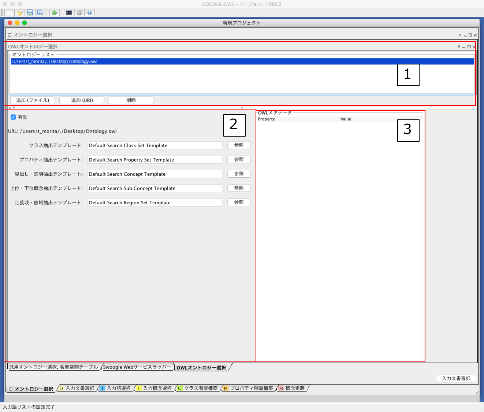
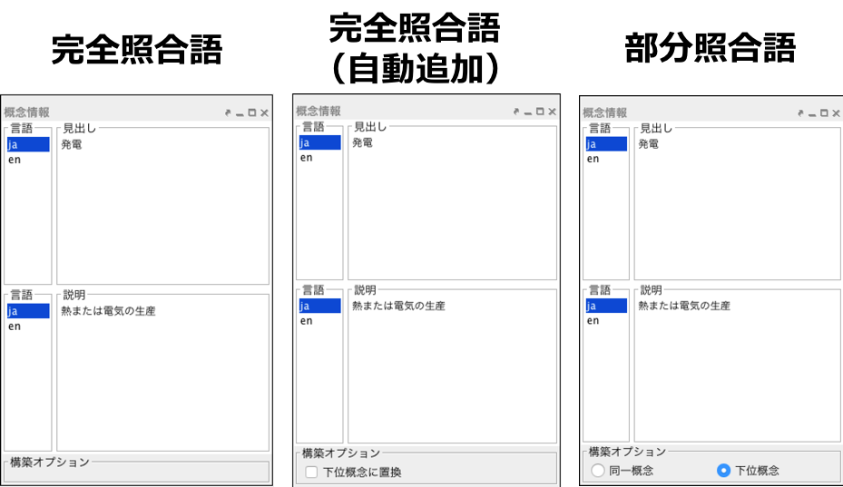
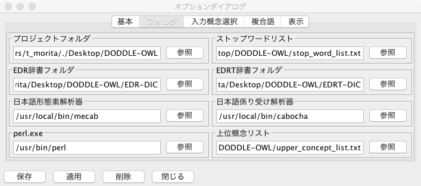
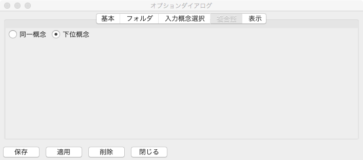

==========================
ユーザマニュアル
==========================

.. contents:: コンテンツ 
   :depth: 3

.. |MR3| replace:: MR\ :sup:`3` \

実装アーキテクチャ
=============================
:numref:`implementation_architecture` にDODDLE-OWLの実装アーキテクチャを示す．DODDLE-OWLは，GUI コンポーネントとしてJava Swing を用いて，Java 言語で実装した．DODDLE-OWL は，オントロジー選択モジュール，入力モジュール，オントロジー構築・洗練モジュール，視覚化モジュール，変換モジュールから構成される．実装上は，オントロジー構築およびオントロジー洗練は，同一パネル上で操作できるようにしている．

Web 上の既存オントロジーを獲得するために，オントロジー選択モジュールではSwoogle Web サービスを利用している．入力モジュール，オントロジー構築・洗練モジュールでは，WordNet を参照するために `extJWNL(Extended Java WordNet Library)  <http://extjwnl.sourceforge.net/Java>`_ を利用している．入力モジュールでは，日本語の形態素解析および品詞同定を行うために，日本語形態素解析器 `lucene-gosen <https://github.com/lucene-gosen/lucene-gosen>`_ を用いている．英語の品詞同定を行うために `The Stanford Parser <https://nlp.stanford.edu/software/lex-parser.shtml>`_ を用いている．英語および日本語の複合語を抽出するために専門用語自動抽出システム言選 [Nakagawa03]_ を用いている．日本語の複合語抽出には，言選以外に日本語係り受け解析器 `CaboCha <http://taku910.github.io/cabocha/>`_ を用いることもできる． `Apache POI <http://poi.apache.org>`_ と `Apache PDFBox <https://pdfbox.apache.org>`_ を利用することにより，テキスト文書のみでなく，PDF，Microsoft Word, Excel, PowerPoint など様々な形式のファイルからテキストを抽出することができる．視覚化モジュールには |MR3| <http://mrcube.org>を用いている．変換モジュールでは，OWL形式のオントロジーのインポートおよびエクスポートを支援するために， `Apache Jena <http://jena.apache.org>`_ を用いている． 

.. _implementation_architecture:

   DODDLE-OWLの実装アーキテクチャ

オントロジー選択モジュール
======================================

Swoogle を用いた既存オントロジーの獲得
----------------------------------------------------
オントロジー検索エンジンSwoogle は19 種類のREST 形式のWeb サービス（Swoogle　Web サービス）を提供している．ユーザはURL を用いてクエリーを作成し，RDF/XML形式の検索結果を得ることができる．:numref:`swoogle-web-service-io` に領域オントロジー構築支援に利用可能なSwoogle Web サービスとその入出力を示す．:numref:`swoogle-web-service-io` のSWT (Semantic Web Term) はクラスまたはプロパティを表す．SWD (Semantic Web Document) はRDF/XML，N-Triple，N3 形式で記述されたRDF 文書を表す．SWO (Semantic Web Ontology) はクラスおよびプロパティの定義の割合が8 割以上のSWD を表す．

.. list-table:: 領域オントロジー構築支援に利用可能なSwoogle Webサービスとその入出力
   :name: swoogle-web-service-io

   * - タイプ
     - Swoogle Webサービス
     - 入力
     - 出力
   * - 1
     - Search ontology
     - 検索キーワード
     - 検索キーワードに関連するSWO のリスト
   * - 3
     - Search terms
     - 検索キーワード    
     - 検索キーワードに関連するSWT のリスト
   * - 4
     - Digest semantic web document
     - SWD
     - SWD のSwoogle メタデータ
   * - 13
     - List documents using term
     - SWT
     - SWT を定義，参照，populate しているSWD のリスト
   * - 16
     - ist domain classes of a property
     - プロパティ
     - 入力したプロパティの定義域のリスト
   * - 17
     - List properties of a domain class
     - クラス
     - 入力したクラスを定義域とするプロパティのリスト
   * - 18
     - List range classes of a property
     - プロパティ
     - 入力したプロパティの値域のリスト
   * - 19
     - List properties of a range class
     - クラス
     - 入力したクラスを値域とするプロパティのリスト

:numref:`swoogle-web-service-type-and-condition` は，:numref:`ontology_ranking` で示した既存オントロジー獲得の手順1 から4 の各手順で利用するSwoogle Web サービスのタイプおよび実行条件を示す．:numref:`swoogle-web-service-type-and-condition` の手順は，:numref:`ontology_ranking` の手順と一致している．:numref:`swoogle-web-service-type-and-condition` の各手順で利用するSwoogle Web サービスのタイプは，:numref:`swoogle-web-service-io` のタイプの番号と一致している．また，計算時間を削減するために，各手順において実行条件を設定している．
 
.. list-table:: 既存オントロジー獲得の各手順で利用するSwoogle Web サービスのタイプおよび実行条件
  :name: swoogle-web-service-type-and-condition

  * - 手順
    - 各手順で利用するSwoogle Web サービスのタイプ
    - 実行条件
  * - 1
    - 3
    - 各入力語について，獲得するクラスおよびプロパティ数は， TermRank によりランク付けされた上位5 個までとする．
  * - 2
    - 17, 19
    - 手順1 で獲得したクラスをrdfs:domain またはrdfs:range プロパティの値として持つプロパティの獲得数は，各クラスごとに上位100 個までとする．
  * - 3
    - 16, 18
    - 手順1 および2 で獲得したプロパティの定義域および値域の獲得数は，各プロパティごとに上位100 個までとする．
  * - 4
    - 1, 4, 13
    - 各入力語について獲得するオントロジー数は，OntoRank でランク付けされた上位10 個までとする．

.. _extracting-ontology-elements-using-sparql-template:

SPARQL テンプレートを用いたオントロジー要素抽出
---------------------------------------------------------------------
:numref:`sparql-template1` から :numref:`sparql-template5` にRDFS，DAML，OWL語彙におけるオントロジーの要素を抽出するためのSPARQLで記述したテンプレートを示す．:numref:`sparql-template3` の見出しと説明抽出テンプレートを直接SPARQL のクエリーとした場合，OWLオントロジー中のすべてのrdfs:labelおよびrdfs:comment プロパティの値を抽出してしまう．オントロジー選択モジュールでは?concept 変数の部分を取得したい概念（クラスまたはプロパティ）のURIに置換することにより，特定の概念の見出しおよび説明のみを抽出できるようにしている．他のテンプレートも同様にテンプレートを直接SPARQLのクエリーとして用いるのではなく，変数部分をオントロジー選択モジュールが適切なURIに置換したものを最終的なSPARQLのクエリーとしている．?concept, ?subConcept, ?class, ?property, ?label, ?description,?domain, ?range 変数を用いてトリプルのパターンを各オントロジーの要素を抽出するテンプレートに記述し，テンプレートをOWLオントロジーに対応づけることで，様々なクラス，プロパティ，構造により表現されたオントロジーの要素を抽出することが可能となる．

.. code-block:: sparql
   :caption: RDFS，DAML，OWL基本語彙におけるクラス抽出テンプレート
   :name: sparql-template1

     PREFIX rdf: <http://www.w3.org/1999/02/22-rdf-syntax-ns#>
     PREFIX rdfs: <http://www.w3.org/2000/01/rdf-schema#>
     PREFIX owl: <http://www.w3.org/2002/07/owl#>
     PREFIX daml03: <http://www.daml.org/2001/03/daml+oil#>
     PREFIX daml10: <http://www.w3.org/2001/10/daml+oil#>

     SELECT ?class WHERE {
          {?class rdf:type rdfs:Class} UNION {?class rdf:type owl:Class} UNION
          {?class rdf:type owl:Restriction} UNION {?class rdf:type owl:DataRange} UNION
          {?class rdf:type daml03:Class} UNION {?class rdf:type daml03:Datatype} UNION
          {?class rdf:type daml03:Restriction} UNION  {?class rdf:type daml10:Class} UNION
          {?class rdf:type daml10:Datatype} UNION {?class rdf:type daml10:Restriction}
     }

.. code-block:: sparql
   :caption: RDFS，DAML，OWL基本語彙におけるプロパティ抽出テンプレート
   :name: sparql-template2

     PREFIX rdf: <http://www.w3.org/1999/02/22-rdf-syntax-ns#>
     PREFIX rdfs: <http://www.w3.org/2000/01/rdf-schema#>
     PREFIX owl:  <http://www.w3.org/2002/07/owl#>
     PREFIX daml03: <http://www.daml.org/2001/03/daml+oil#>
     PREFIX daml10: <http://www.w3.org/2001/10/daml+oil#>

     SELECT ?property WHERE {
         {?property rdf:type rdf:Property} UNION {?property rdf:type owl:ObjectProperty} UNION
         {?property rdf:type owl:DatatypeProperty} UNION {?property rdf:type owl:AnnotationProperty} UNION
         {?property rdf:type owl:FunctionalProperty} UNION {?property rdf:type owl:InverseFunctionalProperty} UNION
         {?property rdf:type owl:SymmetricProperty} UNION {?property rdf:type owl:OntologyProperty} UNION
         {?property rdf:type owl:TransitiveProperty} UNION {?property rdf:type daml03:Property} UNION
         {?property rdf:type daml03:ObjectProperty} UNION {?property rdf:type daml03:DatatypeProperty} UNION
         {?property rdf:type daml03:TransitiveProperty} UNION {?property rdf:type daml03:DatatypeProperty} UNION
         {?property rdf:type daml03:UniqueProperty}  UNION {?property rdf:type daml10:Property} UNION
         {?property rdf:type daml10:ObjectProperty} UNION {?property rdf:type daml10:DatatypeProperty} UNION
         {?property rdf:type daml10:TransitiveProperty} UNION {?property rdf:type daml10:DatatypeProperty} UNION
         {?property rdf:type daml10:UniqueProperty}
     }

.. code-block:: sparql
   :caption: RDFS，DAML，OWL基本語彙における見出しおよび説明抽出テンプレート
   :name: sparql-template3

     PREFIX rdfs: <http://www.w3.org/2000/01/rdf-schema#>
     PREFIX daml03: <http://www.daml.org/2001/03/daml+oil#>
     PREFIX daml10: <http://www.w3.org/2001/10/daml+oil#>

     SELECT ?label ?description WHERE {
          {?concept rdfs:label ?label} UNION {?concept rdfs:comment ?description} UNION
          {?concept daml03:label ?label} UNION {?concept daml03:comment ?description} UNION
          {?concept daml10:label ?label} UNION  {?concept daml10:comment ?description}
     }
 
.. code-block:: sparql
   :caption: RDFS，DAML，OWL基本語彙における階層関係抽出テンプレート
   :name: sparql-template4

     PREFIX  rdfs: <http://www.w3.org/2000/01/rdf-schema#>
     PREFIX daml03: <http://www.daml.org/2001/03/daml+oil#>
     PREFIX daml10: <http://www.w3.org/2001/10/daml+oil#>

     SELECT ?subConcept WHERE {
         {?subConcept rdfs:subClassOf ?concept} UNION {?subConcept rdfs:subPropertyOf ?concept} UNION
         {?subConcept daml03:subClassOf ?concept} UNION {?subConcept daml03:subPropertyOf ?concept} UNION
         {?subConcept daml10:subClassOf ?concept} UNION {?subConcept daml10:subPropertyOf ?concept}
     }

.. code-block:: sparql
   :caption: RDFS，DAML，OWL基本語彙におけるその他の関係抽出テンプレート
   :name: sparql-template5

     PREFIX rdfs: <http://www.w3.org/2000/01/rdf-schema#>
     PREFIX daml03: <http://www.daml.org/2001/03/daml+oil#>
     PREFIX daml10: <http://www.w3.org/2001/10/daml+oil#>

     SELECT ?property ?domain ?range WHERE {
         {?property rdfs:domain ?domain} UNION  {?property rdfs:range ?range} UNION
         {?property daml03:domain ?domain} UNION {?property daml03:range ?range} UNION
         {?property daml10:domain ?domain} UNION {?property daml10:range ?range}
     }

汎用オントロジー選択パネル
-------------------------------------------
:numref:`ontology-selection-panel` に汎用オントロジー選択パネルを示す．:numref:`ontology-selection-panel` -1 に示す，5 種類の汎用オントロジー（WordNet，日本語WordNet，日本語Wikipediaオントロジー，EDR 一般辞書，EDR 専門辞書）の中から参照オントロジーを選択する．WordNetについては，ver.3.0とver.3.1のいずれかを選択できる．チェックボックスにチェックをつけた汎用オントロジーを用いて，その後，領域オントロジーにおける概念階層を構築する．領域によっては，一つの汎用オントロジーだけでは語彙を網羅しきれない場合があるため，複数の汎用オントロジーを組み合わせて利用できるようにしている．:numref:`ontology-selection-panel` -2 の名前空間テーブルは，名前空間URI とその名前空間接頭辞の対応関係を管理している．:numref:`ontology-selection-panel` -3 に接頭辞と名前空間を入力し，:numref:`ontology-selection-panel` -3 右側の「追加」ボタンで追加することができる．

.. _ontology-selection-panel:
.. figure:: figures/ontology-selection-panel.png
   :scale: 50 %
   :alt: 汎用オントロジー選択パネル
   :align: center

   汎用オントロジー選択パネル

OWLオントロジー選択パネル
------------------------------------------
:numref:`owl-ontology-selection-panel` にOWL オントロジー選択パネルを示す．:numref:`owl-ontology-selection-panel` -1 の「追加（ファイル）」または「追加(URI)」ボタンにより，参照オントロジーとする既存OWLオントロジーを選択する．:numref:`owl-ontology-selection-panel` -3 には，:numref:`owl-ontology-selection-panel` -1 のオントロジーリスト中で選択したオントロジーのOWLメタデータが表示される．また，:numref:`owl-ontology-selection-panel` -2 において，OWLオントロジー中から抽出する要素を決定するためのSPARQL テンプレートを指定する．SPARQL テンプレートの種類として， :ref:`extracting-ontology-elements-using-sparql-template` で述べた5 種類が利用できる．

.. _owl-ontology-selection-panel:

   OWLオントロジー選択パネル

入力文書選択パネル
=================================
:numref:`input-document-selection-panel` に入力文書選択パネルを示す．入力文書選択パネルでは，領域に関連する英語または日本語で記述された文書を選択する．入力文書選択パネルでは，Apache POIとApache PDFBoxを用いて，様々な形式（Word, Excel, PowerPoint, PDF など）のファイルからテキストデータを抽出できる．単語を抽出する際には，抽出する単語の品詞を指定できるようにしている．名詞，動詞，その他の品詞，複合語のいずれかを抽出することができる．以下に :numref:`input-document-selection-panel` の各部分について説明する．

.. _input-document-selection-panel:
.. figure:: figures/input-document-selection-panel.png
   :scale: 50 %
   :alt: 入力文書選択パネル
   :align: center

   入力文書選択パネル

#. 入力文書のリストを表示する．
#. 入力文書の記述言語（日本語または英語）の選択と入力文書の追加および削除を行う．
#. 1文の区切り文字を設定する．
#. 1の入力文書リストの中から選択された文書の内容を表示する．
#. 抽出する語の品詞，複合語を抽出するかどうか，1文字の語を抽出するかどうかを選択する．
#. 1の入力文書リストで選択された文書中から5で指定した条件の語を抽出する．

入力語選択パネル
=================================
入力語選択パネルは，入力文書ビューア，入力語情報テーブル，削除語情報テーブルから構成される．以下では，各構成要素について説明する．

入力文書ビューア
--------------------------
入力文書ビューアでは，入力文書の内容を見ながらユーザは入力語の選択を行うことができる．:numref:`input-document-viewer` に入力文書ビューアのスクリーンショットを示す．以下では，入力文書ビューアの各部分について説明する．

.. _input-document-viewer:
.. figure:: figures/input-document-viewer.png
   :scale: 50 %
   :alt: 入力文書ビューア
   :align: center

   入力文書ビューア

#. 入力文書リストを表示する．
#. 1で選択した入力文書の内容を3に表示する際に，文書中の行範囲を選択する．
#. 1で選択した入力文書の内容を表示する．表示される行範囲は2で選択される．入力文書中のハイパーリンクが張られている語をクリックすることで，入力語か不要語かを選択することができる．青色リンクは入力語を，灰色リンクは不要語を表している．
#. 3のハイパーリンクにマウスカーソルを合わせた際に，ハイパーリンクが張られている語の用語名，品詞，TF，IDF，TF-IDF，上位概念が表示される．
#. 1で選択した入力文書の内容を分割して3に表示する際の分割行数を設定する．
#. 自動用語抽出により，抽出できなかった用語を手動で追加することができる．3において用語を範囲選択し，マウスを右クリックすることでも，同様に手動で用語を追加することができる．追加された用語は，3において青色のハイパーリンクが張られる．
#. 3に表示される入力文書の内容にハイパーリンクを張る用語の種類（複合語，名詞，動詞，その他の品詞）を選択する．

入力語情報テーブル
---------------------------------
入力語情報テーブルでは，入力文書から自動抽出された語から入力語を選択することができる．:numref:`input-term-table` に入力語情報テーブルのスクリーンショットを示す．以下では，入力語情報テーブルの各部分について説明する．

.. _input-term-table:
.. figure:: figures/input-term-table.png
   :scale: 50 %
   :alt: 入力語情報テーブル
   :align: center

   入力語情報テーブル

#. ユーザが入力した用語で3に表示する用語情報リストを絞り込む．
#. ユーザが入力した品詞で3に表示する用語情報リストを絞り込む．
#. 入力文書から自動抽出された用語情報を表示する．用語情報には，用語名，品詞，TF，IDF，TF-IDF，上位概念があり，それぞれの観点からリストをソートすることができる．抽出された語が，あらかじめユーザが用意した参照オントロジー中の概念の下位概念の見出しに含まれる場合，その概念の見出しを上位概念に表示する．概念階層中の上位概念を設定しておくことで，抽出された語を「もの」「場所」「時間」などに分類して表示することができ，入力語選択を支援することができる．
#. 3の中で選択された用語情報の用語の入力文書中の出現箇所を表示する．
#. 最終的にユーザが決定した入力語のリスト．テキストエリアになっているため，入力文書に出現しなかった入力語の追加をユーザは行うことができる．
#. 「入力語リストに追加」ボタンを押すと，3の中で選択された行の用語を5の入力語リストに追加する．「削除」ボタンを押すと，3の中で選択された用語情報の用語を「削除語テーブル」に移す．
#. 5に入力された入力語を設定し，入力概念選択パネルに移る．「入力語彙をセット」ボタンを押した場合は，新規に入力語リストを入力概念選択パネルに設定する．「入力語彙を追加」ボタンを押した場合は，設定済みの入力語リストに新たに入力語を追加する．

削除語情報テーブル
------------------------------------
削除語情報テーブルには，入力語情報テーブルから削除された用語情報のリストが表示される．:numref:`removed-term-table` に削除語情報テーブルのスクリーンショットを示す．削除語情報テーブルの各部分は，入力語情報テーブルと同様である．異なる点は，「戻す」ボタンと「完全削除」ボタンである．「戻す」ボタンにより，誤って削除語情報テーブルに移動させてしまった用語情報を入力語情報テーブルに戻すことができる．「完全削除」ボタンにより，用語情報をリストから完全に削除することができる．

.. _removed-term-table:

   削除語情報テーブル

入力概念選択パネル
============================
:numref:`input-concept-selection-panel` に入力概念選択パネルを示す．入力概念選択パネルでは，入力語と参照オントロジー中の概念との対応付けを行う．語には多義性があり，ある入力語を見出しとして持つ概念が複数存在する可能性がある．入力概念選択パネルでは，対象領域にとって最も適切な入力語に対応する概念を選択する際の支援を行う．以下に入力概念選択パネルの構成要素の説明を示す．

.. _input-concept-selection-panel:
.. figure:: figures/input-concept-selection-panel.png
   :scale: 50 %
   :alt: 入力概念選択パネル
   :align: center

   入力概念選択パネル

#. **用語リスト**: 入力語彙の中で参照オントロジー中の概念見出しと完全照合または部分照合した用語のリストを表示する．
#. **概念リスト**: 1で選択された語を見出しとしてもつ参照オントロジー中の概念のリストを表示する．
#. **概念情報**: 	2で選択された概念の見出しおよび説明を言語ごとに分類して表示する．
#. **未定義語リスト**: 参照オントロジー中の概念の見出しと照合しなかった入力語（未定義語）を表示する．
#. **概念階層**: 2で選択された概念の参照オントロジー中の概念階層を表示する．
#. **入力文書**: 1で選択された語の入力文書中の出現箇所を表示する．
#. **階層構築オプション**: 階層構築における条件を設定する．

用語リスト
-----------------------
:numref:`input-concept-selection-panel-term-list` は :numref:`input-concept-selection-panel` -1 用語リストを拡大した図である．以下では，入力概念選択パネルの用語リストの各部分について説明する．

.. _input-concept-selection-panel-term-list:
.. figure:: figures/input-concept-selection-panel-term-list.png
   :scale: 50 %
   :alt: 入力概念選択パネル: 用語リスト
   :align: center

   入力概念選択パネル: 用語リスト

#. テキストフィールドに検索キーワードを入力し，検索ボタンを押すと2および3の完全照合語リストおよび部分照合語リストに検索キーワードを含む入力語のみが表示される．
#. 完全照合語リストを表示する．1番目の括弧内には，入力語を見出しとする参照オントロジー中の概念の数が表示される．システムが自動的に追加した入力語は，2番目の括弧内に「自動追加」と表示される．
#. 部分照合語リストを表示する．1 番目の括弧内には，部分照合語を形態素解析し，各形態素を「+」記号で結合した結果が表示される．2 番目の括弧内には，参照オントロジー中の概念の見出しと照合した部分照合語内の語が表示される．3 番目の括弧内には，2 番目の括弧内に表示された語を見出しとする参照オントロジー中の概念の数が表示される．
#. 完全照合語リストに関する設定を行うことができる． 

    #. 「意味数」チェックボックスは，完全照合語リスト中の各語を見出しとする参照オントロジー中の概念の数を表示するかどうかを設定するオプションである．
    #. 「システムが追加した入力語」チェックボックスは，システムが自動的に追加した語かどうかを完全照合語リスト中の語に提示するかどうかを設定するオプションである．部分照合語の中で参照オントロジー中の概念と照合した語を，ユーザが入力語として追加していなかった場合に，システムはその語を自動的に完全照合語として完全照合語リストに追加する．例えば，「資格取得日」をユーザが入力語として選択した場合，「資格取得日」自体は参照オントロジー中の概念の見出しに存在しないため，部分照合語となる．「資格取得日」の「日」に対して部分照合したとする．ここで，ユーザが「日」を入力語として選択している場合には問題ない．しかし，「日」をユーザが入力語として選択していなかった場合には，「日」が自動的に完全照合語リストに追加される．システムが自動的に追加した語には，「（自動追加）」と表示される．
    #. 「入力概念選択結果を対応する部分照合語リストに適用」チェックボックスは，完全照合語の入力概念選択結果を，その完全照合語に照合した部分照合語リストの入力概念選択に反映させるかどうかを設定するためのオプションである．例えば，完全照合語「日」に対して入力概念選択を行った結果を，部分照合語リスト中の「資格取得日」や「研究日」などにも反映させるかどうかを設定することができる．

#. 部分照合語リストに関する設定を行うことができる．

    #. 「意味数」チェックボックスは4の完全照合語リストのオプションにおける「意味数」と同様である． 
    #. 「形態素リスト」チェックボックスは，部分照合語を形態素解析器で形態素に分割したときの分割のされ方を表示するか否かを設定するためのオプションである．このオプションを有効にした場合，例えば，「資格取得日」に対して，「（資格+取得+日）」が表示される．「+」記号は形態素の区切りをあらわす． 
    #. 「照合結果」チェックボックスは，部分照合語の形態素リストの中で，参照オントロジー中の概念と照合した形態素リストを表示するか否かを設定するオプションである．このオプションを有効にした場合，例えば，「資格取得日」は，「日」で照合しているため，「（日）」と表示される． 
    #. 「選択中の完全照合語に対応する複合語のみ表示」チェックボックスは，完全照合語リストで選択した語を照合語とする部分照合語のみを表示するか否かを設定するためのオプションである．このオプションを有効にした場合，例えば，完全照合語リスト中の「日」を選択した場合，「資格取得日」や「研究日」など「日」と照合した部分照合語のみが部分照合語リストに表示される．

#. 入力語の追加および削除を行うことができる．

概念リスト
-------------------
:numref:`input-concept-selection-panel-concept-list` は :numref:`input-concept-selection-panel` -2「概念リスト」を拡大した図である．

.. _input-concept-selection-panel-concept-list:
.. figure:: figures/input-concept-selection-panel-concept-list.png
   :scale: 50 %
   :alt: 入力概念選択パネル: 概念リスト
   :align: center

   入力概念選択パネル: 概念リスト

概念リストは，:numref:`input-concept-selection-panel-term-list` -2 または-3で選択した完全照合語または部分照合語を見出しとして持つ参照オントロジー中の概念のリストを表示する．:numref:`input-concept-selection-panel-concept-list` は，「エネルギー」を見出しとして持つ参照オントロジー（この例では日本語WordNetを参照オントロジーとしている）中の概念リストを示している．リストの項目は，三つの部分から構成されている．左側は，入力モジュールの設計で述べた，自動概念選択方法により求めた，入力語に対応する概念候補の評価値を示す．入力語に対応する概念候補は，評価値の降順に並び替えて表示される．評価値が高い概念ほど，より入力概念となる可能性が高い概念となる．中央は概念のID をあらわす．概念のID はURIで表され，画面上には修飾名が表示される．jwn は日本語WordNet の名前空間接頭辞を示しており，ここで表示される接頭辞は，汎用オントロジー選択パネル ( :numref:`ontology-selection-panel` -2) で示した名前空間テーブルで設定した名前空間接頭辞となる．右側には，概念の見出しが複数ある場合，そのうちのいずれか一つが表示される．

概念情報
--------------------
:numref:`input-concept-selection-panel-concept-info` は :numref:`input-concept-selection-panel` -3「概念情報」を拡大した図である．

.. _input-concept-selection-panel-concept-info:

   入力概念選択パネル: 概念情報

「概念情報」には，:numref:`input-concept-selection-panel-concept-list` の「概念リスト」で選択された概念の見出しと説明が表示される．「言語」リストで選択した言語の見出しおよび説明が「見出し」リストおよび「説明」リストに表示される．:numref:`input-concept-selection-panel-concept-info` 下部の「構築オプション」では，概念階層の構築方法を設定することができる．「構築オプション」には，:numref:`input-concept-selection-panel-term-list` 「用語リスト」で選択する用語の種類に応じて3 種類の表示方法がある．:numref:`input-concept-selection-panel-term-list` -2で完全照合語を選択した場合，:numref:`input-concept-selection-panel-concept-info` 左側のように「構築オプション」には何も表示されない．:numref:`input-concept-selection-panel-term-list` -2でシステムが自動的に追加した完全照合語（「自動追加」が表示される完全照合語）を選択した場合には，:numref:`input-concept-selection-panel-concept-info` 中央のように「構築オプション」には「下位概念に置換」するかどうかを選択するチェックボックスが表示される．:numref:`input-concept-selection-panel-term-list` -3で部分照合語を選択した場合には :numref:`input-concept-selection-panel-concept-info` 右側のように「構築オプション」には，「同一概念」か「下位概念」かの選択をするためのラジオボタンが表示される．

.. note::
	部分照合語の照合部分の語をユーザが入力語としていない場合には，システムは自動的にその語を入力語として追加する．これを完全照合語（自動追加）と呼ぶ．

:numref:`input-concept-selection-panel-concept-info` 中央の「構築オプション」の例として，「火力発電」のみを入力語とした場合を考える．この場合，「火力発電」は部分照合語となり，「発電」と照合するため，「発電」はシステムにより自動的に完全照合語リストに追加される．「発電」の入力概念選択を行う際に，:numref:`input-concept-selection-panel-concept-info` 中央の「構築オプション」として「下位概念に置換」というチェックボックスが表示される．ここでは，「発電」はシステムが自動的に追加した語であるため，ユーザがあえて「発電」を入力語としなかったのか，入力語にし忘れたかの確認をしている．ユーザがあえて「発電」を入力語にしなかった場合，概念階層中に「発電」は含まれるべきではない．「構築オプション」の「下位概念に置換」をチェックすることにより，「火力発電」は「発電」の下位概念とはならず，概念階層中に表示されない．ユーザが「発電」を入力語に追加し忘れた場合には，「構築オプション」の「下位概念に置換」にチェックをいれなければ，「火力発電」は「発電」の下位概念として概念階層が構築される．

:numref:`input-concept-selection-panel-concept-info` 右側の「構築オプション」の例として，「発電」と「火力発電」を入力語とした場合を考える．上記と同様に「火力発電」は「発電」で照合する部分照合語である．「火力発電」の入力概念選択を行う際に，:numref:`input-concept-selection-panel-concept-info` 右側の「構築オプション」が表示される．「同一概念」のほうを選択した場合は，概念階層構築時に「火力発電」は「発電」と同一概念として扱われる．つまり，「火力発電」は「発電」概念に対応する参照オントロジー中の概念の別見出しとして概念階層が構築される．一方，「下位概念」のほうを選択した場合は，「火力発電」は「発電」とは異なる概念，ここでは，「発電」の下位概念として概念階層が構築される．初期状態において，部分照合語を「同一概念」とみなすか，「下位概念」とみなすかは，オプションダイアログにより設定することができる．

階層構築オプション
-------------------------------
:numref:`input-concept-selection-panel-construct-concept-tree-option` は :numref:`input-concept-selection-panel` -7「階層構築オプション」を拡大した図である．

.. _input-concept-selection-panel-construct-concept-tree-option:

   入力概念選択パネル: 階層構築オプション

「階層構築オプション」では，クラスおよびプロパティ階層構築モジュールにおいて，クラスおよびプロパティ階層を構築する際のパラメータの設定を行う．「階層構築オプション」は，「完全照合オプション」および「部分照合オプション」から構成される．

:numref:`input-concept-selection-panel-construct-concept-tree-option` の「完全照合オプション」では，完全照合語リストから概念階層を構築する際の設定を行う．「構築」チェックボックスでは，完全照合語リストから概念階層を構築するかどうかを選択する．「剪定」チェックボックスでは，概念階層構築時に剪定を行うかどうかを選択する．「参照オントロジーの概念見出しを追加」チェックボックスでは，概念階層構築時に，各概念の見出しとして，入力語として与えた語のみを概念の見出しとするか，対応する参照オントロジー中の概念の見出しをすべて利用するかどうかを選択する．

:numref:`input-concept-selection-panel-construct-concept-tree-option` の「部分照合オプション」では，部分照合語リストから概念階層を構築する際の設定を行う．「構築」チェックボックスでは，部分照合語リストから概念階層を構築するかどうかを選択する．「剪定」チェックボックスでは，概念階層構築時に剪定を行うかどうかを選択する．「抽象概念を追加」チェックボックスでは，部分照合語リストから概念階層を構築する際に，語頭による階層化を行うかどうかを選択する．このチェックボックス右側のテキストフィールドには，いくつ以上グループ化できる場合に共通の上位概念を挿入するかを設定する．

:numref:`input-concept-selection-panel-construct-concept-tree-option` 右端にある「クラス階層構築」ボタンを押すと，上記の階層構築オプションに基づいて，クラス階層構築パネルにクラス階層のみが構築される．「クラスおよびプロパティ階層構築」ボタンを押すと，上記の階層構築オプションに基づいて，クラス階層構築パネルおよびプロパティ階層構築パネルに，クラス階層およびプロパティ階層が構築される．クラス階層とプロパティ階層の両方を構築するためには，参照オントロジーとしてEDR一般辞書またはプロパティ階層を含むOWLオントロジーを設定しなければならない．

クラス階層構築パネル
=================================================
:numref:`construct-class-tree-panel` にクラス階層構築パネルを示す．

.. _construct-class-tree-panel:
.. figure:: figures/construct-class-tree-panel.png
   :scale: 50 %
   :alt: クラス階層構築パネル
   :align: center

   クラス階層構築パネル

以下に各部分の説明を示す．

#. **未定義語リスト**: 参照オントロジー中の概念に照合しなかった入力語リスト．リストから語を選択し，「Is-a 階層パネル」にドラッグ＆ドロップすると，未定義語を概念としてIs-a 階層に追加できる．
#. **概念情報パネル**: 概念階層中の選択された概念のURI，優先見出し（階層中に表示する見出し），見出し，説明，概念変動管理情報を表示する．見出しと説明については，言語属性の付与と追加，編集，削除ができる．
#. **概念階層パネル**: Is-a 階層とHas-a 階層．概念の検索，追加，削除などを行うことができる．
#. **概念変動管理パネル**: 照合結果分析結果，剪定結果分析結果，多重継承している概念をリストで表示し，各項目を選択するとIs-a 階層中の修正候補箇所が選択される．

以下では， :numref:`construct-class-tree-panel` 2から4の詳細を説明する．

概念情報パネル
-------------------------------
:numref:`construct-class-tree-panel-concept-info` は :numref:`construct-class-tree-panel` -2. 概念情報パネルを拡大した図である．

.. _construct-class-tree-panel-concept-info:
.. figure:: figures/construct-class-tree-panel-concept-info.png
   :scale: 50 %
   :alt: クラス階層構築パネル: 概念情報パネル
   :align: center

   クラス階層構築パネル: 概念情報パネル

以下では，概念情報パネルの各部分について説明する．

#. 名前空間接頭辞をコンボボックスから選択し，ローカル名をテキストフィールドに入力し，「URI の設定」ボタンを押すことで，選択した概念のURI を変更することができる．汎用オントロジー選択パネル ( :numref:`ontology-selection-panel` -2) で示した名前空間テーブルに定義された名前空間接頭辞が選択可能である． 
#. 概念の見出しを編集するための領域である．「言語」リストの項目を選択することで，選択した言語の見出しが「見出し」リストに表示される．:numref:`construct-class-tree-panel-concept-info` -2 では，日本語見出しとして「発電」が表示されている．:numref:`construct-class-tree-panel-concept-info` -2 下部の「言語」と「テキスト」テキストフィールドに追加したい見出しの言語とテキストを入力し，「追加」ボタンを押すことで概念の見出しを追加することができる．また，選択した見出しを編集したい場合には「編集」ボタンを，削除したい場合には「削除」ボタンを押すことにより，見出しの編集および削除を行うことができる．また，「優先見出しの設定」ボタンを押すことで，選択された見出しがIs-a 階層およびHas-a 階層パネルの概念の表示用の見出しとなる． 
#. 概念の説明を編集するための領域である．見出しと同様に「言語」リストの項目を選択することで，選択した言語の説明が「説明」リストに表示される． 
#. 概念変動管理情報を表示・編集するための領域である．「ノードのタイプ」は，編集対象のノードがSIN（参照オントロジーから抽出した概念）かベストマッチノード（入力概念）かを表示する．SIN の中でベストマッチノードとしたいノードについては，ここでノードのタイプをSIN からベストマッチに変更することができる．「剪定概念数」は，階層構築時の剪定により，選択された概念とその上位概念の間の概念がいくつ削除されたかを表示している．「多重継承」は，編集対象のノードが多重継承をしているかしていないかを表している．多重継承をしている場合は「true」，していない場合は「false」と表示される． 
#. 3 の「追加」または「編集」ボタンを押すと表示される．「言語」と「説明」を入力し，「OK」ボタンを押すと，概念の説明の追加や編集を行うことができる．また，「削除」ボタンにより選択された概念の説明を削除することができる．

Is-a 階層およびHas-a 階層パネル
----------------------------------------
:numref:`construct-class-tree-panel-isa-hasa-tree-panel` は :numref:`construct-class-tree-panel` -3を拡大した図である．:numref:`construct-class-tree-panel-isa-hasa-tree-panel` の左側がIs-a 階層パネルを右側がHas-a階層パネルを示している．

.. _construct-class-tree-panel-isa-hasa-tree-panel:
.. figure:: figures/construct-class-tree-panel-isa-hasa-tree-panel.png
   :scale: 50 %
   :alt: クラス階層構築パネル: Is-a階層パネルとHas-a階層パネル
   :align: center

   クラス階層構築パネル: Is-a階層パネルとHas-a階層パネル

#. 概念階層中の概念を検索するための領域である．テキストフィールドに検索キーワードを入力し，「検索」ボタンを押すと検索オプションを満たす概念が選択される．候補が複数ある場合には，「次」ボタンまたは「前」ボタンで別の概念候補に移動できる．検索オプションとしては，言語，概念の見出し，概念の説明が選択できる．また，「完全一致検索」チェックボックスにチェックをいれると，入力した検索キーワードと完全に一致する見出しや説明を含む概念のみが検索される．「完全一致検索」チェックボックスにチェックが入っていない場合は部分一致検索となり，検索キーワードを見出しまたは説明の一部に含む概念が検索される．「URI 検索」チェックボックスにチェックをいれると，概念のURI も検索対象となる．「大文字と小文字の区別」チェックボックスにチェックをいれると，英語見出しまたは説明を検索する際に，大文字と小文字を区別して検索する．
#. Is-a 階層およびHas-a 階層の編集に利用可能なツールバー．ツールバーは，階層中の概念をマウスで右クリックした際に表示される， :numref:`construct-class-tree-panel-popup-menu` のポップアップメニューと同様の機能を持つ．
#. Is-a 階層とHas-a 階層を表示・編集するためのパネル．2のツールバーまたは概念を選択して，マウスを右クリックすることで表示されるポップアップメニューから，概念の追加，削除などを行うことができる．

.. _construct-class-tree-panel-popup-menu:
.. figure:: figures/construct-class-tree-panel-popup-menu.png
   :scale: 50 %
   :alt: クラス階層構築パネル: ポップアップメニュー
   :align: center

   クラス階層構築パネル: ポップアップメニュー

:numref:`construct-class-tree-panel-popup-menu`  はIs-a 階層パネルのポップアップメニューを示している．Is-a 階層パネルとHas-a階層パネルの主な違いとして，Has-a 階層パネルではIs-a 階層パネルで定義された概念を用いてHas-a 関係を定義する点が異なる．また，Has-a 階層では，以下で説明する「概念の削除」を行うことはできない．

DODDLE-OWLにおける概念の削除は3 種類ある．「概念の削除」は削除対象のノードと同一URI を持つノードおよびその下位ノードをすべて削除する．「上位概念へのリンクを削除」は，多重継承している場合に削除対象のノードとその上位ノードの間の関係を削除する．「中間概念の削除」は，削除対象のノードを削除し，その下位ノードを削除対象のノードの上位ノードの下位ノードとして定義する．

.. _construct-class-tree-panel-node-icon:
.. figure:: figures/construct-class-tree-panel-node-icon.png
   :scale: 50 %
   :alt: クラス階層構築パネル: ノードのアイコン
   :align: center

   クラス階層構築パネル: ノードのアイコン

クラス階層構築パネルにおけるIs-a 階層パネルとHas-a 階層パネルのクラスには， :numref:`construct-class-tree-panel-node-icon` に示す4 種類がある．

概念変動管理パネル
-------------------------------
:numref:`construct-class-tree-panel-concept-drift-management-panel` は :numref:`construct-class-tree-panel` -4 概念変動管理パネルの各タブを展開し，拡大した図である．

.. _construct-class-tree-panel-concept-drift-management-panel:
.. figure:: figures/construct-class-tree-panel-concept-drift-management-panel.png
   :scale: 50 %
   :alt: クラス階層構築パネル: 概念変動管理パネル
   :align: center

   クラス階層構築パネル: 概念変動管理パネル

以下では，概念変動管理パネルの各部分について説明する．

#. 照合結果分析の結果をリストで表示する．リストの項目はSIN ノードであり，項目を選択するとIs-a 階層中の該当する部分木が選択される．また，照合結果分析結果を確認し修正する必要がない場合，もしくは，修正後に「照合結果分析結果の確認」ボタンを押すことで，選択した項目をリストから削除することができる．
#. 剪定結果分析の結果をリストで表示する．2下部の「剪定概念リスト」は，概念階層構築時に剪定された，選択した概念とその上位概念の間の概念が提示されている．「剪定結果分析」ボタンを押すと，ボタン左側のテキストフィールドに指定した数よりも多くの中間概念が削除された概念をリストに表示する．また，剪定結果分析結果を確認し，修正する必要がない場合，もしくは，修正後に「剪定結果分析結果の確認」ボタンを押すことで，選択した項目をリストから削除することができる．（当該概念の剪定概念数がゼロとなる）
#. 多重継承している概念のリストを表示する．リストの項目を選択すると，3下部に多重継承しているノードのリストが表示される．このノードを選択すると，Is-a 階層パネル中の概念に移動し，ノードを選択する．「上位概念へのリンクを削除」ボタンを押すと，選択した概念と上位概念の間の関係が削除される．

プロパティ階層構築パネル
========================================================
:numref:`construct-property-tree-panel` にプロパティ階層構築パネルを示す．

.. _construct-property-tree-panel:
.. figure:: figures/construct-property-tree-panel.png
   :scale: 50 %
   :alt: プロパティ階層構築パネル
   :align: center

   プロパティ階層構築パネル

プロパティ階層構築パネルの構成要素の大部分は，クラス階層構築パネルと同様である．異なる点は， :numref:`construct-property-tree-panel` -1の概念定義パネルがある点である．概念定義パネルは，汎用オントロジーとしてEDR 一般辞書を指定し，プロパティ階層を構築した場合，EDR 概念記述辞書における，agent およびobject の関係にある概念を定義域および値域として自動的に定義している．また，クラス階層を参照し，定義域および値域の追加を行うことも可能である．

.. _construct-property-tree-panel-node-icon:
.. figure:: figures/construct-property-tree-panel-node-icon.png
   :scale: 50 %
   :alt: プロパティ階層構築パネル: ノードのアイコン
   :align: center

   プロパティ階層構築パネル: ノードのアイコン

プロパティ階層構築パネルにおけるIs-a 階層パネルとHas-a 階層パネルのプロパティには， :numref:`construct-property-tree-panel-node-icon`  に示す4 種類がある．

関係構築パネル
=============================================
:numref:`construct-relationship-panel` に，関係構築パネルのスクリーンショットを示す．

.. _construct-relationship-panel:
.. figure:: figures/construct-relationship-panel.png
   :scale: 50 %
   :alt: 関係構築パネル
   :align: center

   関係構築パネル

以下では，関係構築パネルの各部分について説明する．

#. WordSpace パラメータの設定を行う．WordSpace のパラメータとしては，N-gram，N-gram 出現頻度，文脈スコープ（前，後N 語），文脈類似度の閾値を設定できる．「WordSpace の実行」ボタンを押すと結果が5に表示される．
#. Apriori パラメータの設定を行う．Apriori のパラメータとしては，最小支持度および最小確信度を設定できる．「Apriori」の実行ボタンを押すと結果が5に表示される．
#. 入力語選択パネルで選択した入力語が表示される．
#. 入力文書選択パネルで選択した入力文書が表示される．
#. 3で選択した入力語と関連のある入力語を関係値と共に表示する．関係値の高い順に表示される．WordSpace，Apriori，WordSpace およびApriori のアルゴリズムの関係値をタブで切り替えて表示することができる．
#. 3で選択した入力語と関連のある5で選択された語を表示し，正解概念対または不正解概念対として7または8に追加する．矢印の向きによって，定義域と値域が変化する．
#. 定義域，プロパティ，値域が表示される．プロパティは，プロパティ階層構築パネルから選択することができる．
#. 不要な概念対が表示される．不要な概念対は，概念定義の候補となる概念対集合から削除されるため，残りの概念定義を行いやすくなっている．

オプションダイアログ
================================
「ツール」→「オプションダイアログを表示」メニューを選択するとオプションダイアログが表示される．オプションダイアログでは，DODDLE- OWLにおける様々な設定を行うことができる．オプションダイアログは，「基本」，「フォルダ」，「入力概念選択」，「複合語」，「表示」の各タブから構成 されている． オプションダイアログの下部にある4つのボタンは，それぞれ，設定の保存，設定の適用，設定の削除，オプションダイアログを閉じるために用意されている．「保存」ボタンは，オプションダイアログで設定した内容をWindowsのレジストリに保存することができる（Unixの場合はXML形式 等でユーザごとのフォルダに保存される）．ここで保存した内容は，DODDLE-OWLを再起動後も有効となる．「削除」ボタンによりレジストリに保存された設定を削除できる．以下では，それぞれのタブについて説明する．

基本タブ
---------------------
:numref:`option-dialog-basic` にオプションダイアログの基本タブを示す．基本タブでは，「言語」，「基本接頭辞」，「基本URI」の設定を行うことができる．「言語」では DODDLE-OWLユーザインタフェースのメニュー等の表示言語や概念の見出しが複数言語用意されていた場合のデフォルト言語を設定するために用いる． 「基本接頭辞」では，OWL形式で領域オントロジーを保存する際の基本URIの接頭辞を設定する．「基本URI」では，OWL形式で領域オントロジーを保 存する際の基本URIを設定する．

.. _option-dialog-basic:
.. figure:: figures/option-dialog-basic.png
   :scale: 50 %
   :alt: オプションダイアログ：基本
   :align: center

   オプションダイアログ：基本

フォルダタブ
---------------------
:numref:`option-dialog-folder` にオプションダイアログのフォルダタブを示す．フォルダタブでは，DODDLE-OWLが参照する外部プログラムや辞書データなどのパスを設定する．以下にフォルダタブで設定する項目を示す．

プロジェクトフォルダ
	DODDLE-OWLのプロジェクトファイルを保存する際に最初に開かれるフォルダのパスを設定．
ストップワードリスト
	ストップワードリストを保存したファイルのパスを設定．ストップワードリストは，入力文書から単語を抽出する際に抽出を行うべきではない単語集合を保存するファイル．
EDR辞書フォルダ
	EDR概念体系辞書とEDR概念記述辞書をDODDLE-OWLが参照する形式に変換したファイルを置いたフォルダを設定．
EDRT辞書フォルダ
	EDR専門辞書をDODDLE-OWLが参照する形式に変換したファイルを置いたフォルダを設定．
日本語形態素解析器
	ChasenまたはMecabの実行ファイルのパスを設定．
日本語係り受け解析器
	Cabochaの実行ファイルのパスを設定．
perl.exe
	perlの実行ファイルのパスを設定．
上位概念リスト
	上位概念リストを保存したファイルのパスを設定．上位概念リストは入力単語を選択する際に参照される．ある入力単語が設定した上位概念の下位概念の見出しとして存在する場合に入力単語テーブルに表示される．
  
.. Swoogleクエリー結果フォルダ
.. 	（実装中のため現バージョンでは使用しない）オントロジー検索エンジンSwoogleからオントロジーを獲得する際に実行したクエリー結果をローカルにキャッシュする際に用いるフォルダを設定．
.. OWLオントロジーフォルダ
.. 	（実装中のため現バージョンでは使用しない）オントロジー検索エンジンSwoogleから獲得したオントロジーを保存するフォルダを設定．

.. _option-dialog-folder:

   オプションダイアログ：フォルダ

入力概念選択タブ
--------------------------------
:numref:`option-dialog-input-concept-selection` にオプションダイアログの多義性解消タブを示す．入力概念選択タブでは，半自動的に入力概念選択を行う際のオプションを設定する．詳細は，入力概念選択の半自動化を参照．

.. _option-dialog-input-concept-selection:
.. figure:: figures/option-dialog-input-concept-selection.png
   :scale: 50 %
   :alt: オプションダイアログ：入力概念選択
   :align: center

   オプションダイアログ：入力概念選択

複合語タブ
---------------------------------
:numref:`option-dialog-compound-word` にオプションダイアログの複合語タブを示す．複合語タブでは，多義性解消パネルにおける部分照合単語のオプションを設定する．ユーザがこのオ プションを選択しない場合に，デフォルト状態として，部分照合単語を階層構築時に照合した概念の「下位概念」とするか「同一概念」とするかをラジオボタン で設定できる．

.. _option-dialog-compound-word:

   オプションダイアログ：複合語

表示タブ
-------------------------
:numref:`option-dialog-display` にオプションダイアログの表示タブを示す．表示タブでは，クラス階層構築パネル及びプロパティ階層構築パネルにおいて，クラスまたはプロパ ティのノードを表示する際に，接頭辞を表示するかどうかを選択することができる．「修飾名を表示」にチェックをいれた場合，クラスまたはプロパティの名前 空間接頭辞がそれぞれのパネルに表示される．

.. _option-dialog-display:
.. figure:: figures/option-dialog-display.png
   :scale: 50 %
   :alt: オプションダイアログ：表示
   :align: center

   オプションダイアログ：表示

メニュー
===================

ファイルメニュー
----------------------

* 新規プロジェクト

  * 新規にDODDLE-OWLプロジェクトを作成する

* プロジェクトを開く

  * DODDLE-OWLのプロジェクトフォルダまたはプロジェクトファイルを開く

* 最近のプロジェクトを開く
* 開く->入力語リストを開く
* 開く->入力語テーブルを開く
* 開く->概念記述を開く
* 開く->入力概念選択結果を開く
* 開く->入力語と概念の対応を開く
* 開く->OWLオントロジーを開く
* 開く->FreeMindオントロジーを開く
* 開く->概念と優先見出しの対応を開く
* プロジェクトを上書き保存
* プロジェクトを名前を付けて保存

  * DODDLE-OWLのプロジェクトを名前をつけて保存する．処理途中の中間結果ファイルを確認したい場合にはファイル形式としてDODDLEプロジェクトフォルダを選択する．一つのファイルにまとめて保存したい場合には，DODDLEプロジェクトファイル(.ddl)を選択する．

* 保存->入力語リストを保存
* 保存->入力語テーブルを保存
* 保存->概念記述を保存
* 保存->入力概念選択結果を保存
* 保存->入力語と概念の対応を保存
* 保存->OWLオントロジーを保存
* 保存->FreeMindオントロジーを保存
* 保存->概念と優先見出しの対応を保存

* 終了

  * DODDLE-OWLを終了する

ツールメニュー
-----------------------
* すべての用語を表示
* 自動入力概念選択

  * 入力語集合から自動的に入力語に対応する汎用オントロジー中の概念をランキングする．入力概念選択パネル中で入力語を選択した際に，ランキング順に対応する概念を表示する．

* クラス階層構築
* クラス及びプロパティ階層構築
* DODDLE Dic Converter

  * EDR電子化辞書と日本語WordNetの辞書ファイルををDODDLE-OWLで利用可能な形式に変換するためのダイアログを表示する．

* ログコンソールを表示

  * 標準出力と標準エラー出力を画面上に表示する．

* XGAレイアウト

  * 1024x768の解像度に合わせてウィンドウをレイアウトする．

* UXGAレイアウト    

  * 1600 x 1200の解像度に合わせてウィンドウをレイアウトする．

* オプションダイアログを表示

プロジェクトメニュー
------------------------
* 開いているプロジェクトをサブメニューとして表示し，切り替えることができる．

ヘルプメニュー
----------------------------
* バージョン
  
  * バージョン番号や利用ライブラリなどを確認するためのダイアログを表示する．

ツールバー
==========================

.. list-table:: DODDLE-OWLにおけるツールバーのアイコンと機能
  :name: toolbar-icons

  * - アイコン
    - 機能
  * - .. figure:: figures/toolbar/page_white.png
    - 新規プロジェクト
  * - .. figure:: figures/toolbar/folder_page_white.png
    - プロジェクトを開く
  * - .. figure:: figures/toolbar/disk.png
    - プロジェクトを上書き保存
  * - .. figure:: figures/toolbar/page_save.png
    - プロジェクトを名前を付けて保存
  * - .. figure:: figures/toolbar/plugin.png
    - DODDLE Dic Converter
  * - .. figure:: figures/toolbar/cog.png
    - オプションダイアログを表示
  * - .. figure:: figures/toolbar/help.png
    - バージョンダイアログを表示        

ショートカットキー
==============================
* Ctrl-N

  * 新規プロジェクト
* Ctrl-O

  * プロジェクトを開く

* Ctrl-S

  * プロジェクトを上書き保存

* Ctrl-Shift-S

  * プロジェクトを名前を付けて保存

* Ctrl-Q

  * 終了

* F1

  * バージョンダイアログを表示
  
